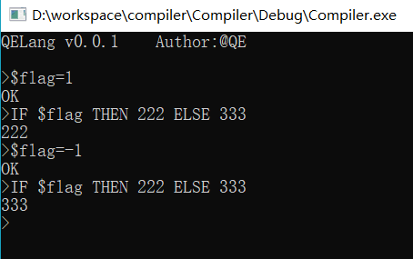

# lex和yacc的使用

起因是编译原理老师要求用这两个东西做做实验。做自己的编译器也是很好玩的事，动手搞一搞。

## 环境

我是win10环境，用gnu版的flex和bison(分别对应lex和yacc):

- [bison库](http://gnuwin32.sourceforge.net/packages/flex.htm)
- [flex库](http://gnuwin32.sourceforge.net/packages/bison.htm)
- [编译好的exe](http://sourceforge.net/projects/winflexbison/ )

有setup就装setup，然后将俩exe添加到$env:Path方便用。

## 编写.l和.y文件

lex和yacc语法可以参考IBM的教程：<https://www.ibm.com/developerworks/cn/linux/sdk/lex/>

## 生成c语言源文件和头文件

```powershell
win_bison -d filename.y
win_flex --wincompat filename.l
```

这些参数主要作用是为了生成不依赖`<unistd.h>`的代码，否则在win上无法编译。

## VS工程

把所有生成的.h文件和.c的文件添加到项目中。然后添加第一步下载的静态库依赖，主要是`GnuWin32`文件夹下的`libfl.a`

修改地方：

- 项目属性->链接器->常规->附加库目录->添加`GnuWin32`文件夹
- 项目属性->链接器->输入->附加依赖项->添加`libfl.a`

## build



嗯，还是很好玩的。

## 我的代码

```
%{
 
# include"myyacc.tab.h"
# include"opt.h"

%}
number ([0-9])+
chars [A-Za-z]
variable ${chars}+{number}*{chars}*{number}*

%%
 
"+" { return ADD; }
"-" { return SUB; }
"*" { return MUL; }
"/" { return DIV; }
"|" { return ABS; }
"(" { return OP; }
")" { return CP; }
"=" { return ASSIGN; }
"<" { return LT; }
">" { return GT; }
"#=" { return EQ; } 
"IF" { return IF; }
"if" { return IF;}
"THEN" { return THEN; }
"then" { return THEN; }
"ELSE" { return ELSE; }
"else" { return ELSE; }
 
{number} { yylval = atoi(yytext); return NUMBER; }
{variable} { yylval=hash(yytext);return VAR; }
 
\n { return EOL; }
"//".*
[ \t] { /* ignore white space */ }
. { yyerror("Unrecognized character : %c\n", *yytext); }
%%

//这个hash函数事为了做symboltable用的
int hash(char *str)
{
	int hash = 5381;
	int c;
	while (c = *str++)
	hash = ((hash << 5) + hash) + c; /* hash * 33 + c */
	if(hash<0)
	{
		hash=-hash;
	}
	return hash%SYMTABLE_SIZE;
}
```

```
%{
 
# include <stdio.h>
# include"opt.h"
int symboltable[SYMTABLE_SIZE];	//简单起见就用数组作为符号表，哈希函数在mylex文件中
# define INTMAX 2147483647

%}
 
/* declare tokens*/
%token NUMBER
%token ADD SUB MUL DIV ABS
%token OP CP
%token EOL
%token VAR
%token ASSIGN
%token IF ELSE THEN
%token LT GT EQ
 
%%
 
line:
| line exp EOL { if($2!=INTMAX)printf("%d\n>", $2);else printf("OK\n>"); }
| line EOL { printf(">"); }
;
 
exp: factor
| exp ADD exp { $$ = $1 + $3; }
| exp SUB factor { $$ = $1 - $3; }
| exp ABS factor { $$ = $1 | $3; }
| VAR ASSIGN exp {symboltable[$1]=$3;$$=INTMAX;}
| VAR {$$=symboltable[$1];}
| IF exp THEN exp ELSE exp { if($2>0) $$=$4;else $$=$6;}
| exp LT exp {if($1<$3) $$=1; else $$=0;}
| exp GT exp {if($1>$3) $$=1; else $$=0;}
| exp EQ exp {if($1==$3) $$=1; else $$=0;}
;
 
factor: term
| factor MUL term { $$ = $1 * $3; }
| factor DIV term { $$ = $1 / $3; }
;
 
term: NUMBER
| ABS term { $$ = $2 >= 0? $2 : - $2; }
| OP exp CP { $$ = $2; }
| SUB NUMBER { $$ = -$2;}
;
 
%%
 
main()
{
	//initalize the symbol table
	for(int i=0;i<SYMTABLE_SIZE;i++)
		symboltable[i]=0;

	printf("QELang v0.0.1\t Author:@QE \n\n");
    printf(">");
    yyparse();
}
 
yyerror(char *s)
{
    fprintf(stderr, "error: %s\n", s);
	return 0;
}
```

