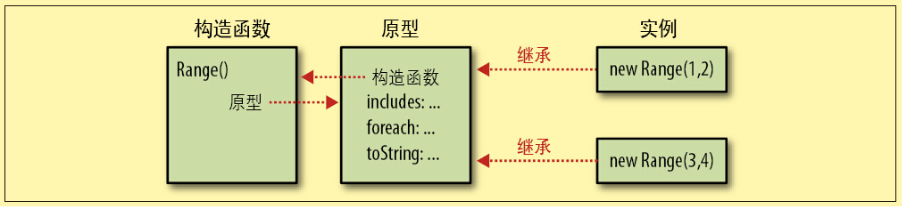

# 对象

## 综述

> 然而对象不仅仅是字符串到值的映射，除了可以保持自有的属性，JavaScript对象还可以从一个称为原型的对象继承属性。对象的方法通常是继承的属性。这种“原型式继承”（prototypal inheritance）是JavaScript的核心特征。

JS中，对象是属性`key:value`的集合，对象通过原型对象`__proto__`或`prototype`继承属性。JS中的值大部分是对象，字符串、数字本身不是对象，但通过包装对象的方法拥有对象的行为。 

> 其实\__proto__在ES2015才有的

属性的值可以是任意JavaScript值(包括函数值)，或者（在ECMAScript 5中）可以是一个getter或setter函数（或两者都有）。

### 属性的属性

属性的元属性：

- 可写（writable attribute），表明是否可以设置该属性的值。 
- 可枚举（enumerable attribute），表明是否可以通过for/in循环返回该属性。 
- 可配置（configurable attribute），表明是否可以删除或修改该属性。

可以使用`defineProperties()`方法定义元属性和属性值（ES5）

### 对象的特性

对象的特性：

- 对象的原型（prototype）指向另外一个对象，本对象的属性继承自它的原型对象。 

- 对象的类（class）是一个标识对象类型的字符串。

  使用`toString()`可以访问这个字符串

  ```js
  Object.prototype.toString().call(o).slice(8,-1);
  ```

- 对象的扩展标记（extensible flag）指明了（在ECMAScript 5中）是否可以向该对象添加新属性。

### 对象的类型

对象的类型：

- 内置对象（native object）是由ECMAScript规范定义的对象或类。例如，数组、函数、日期和正则表达式都是内置对象。
- 宿主对象（host object）是由JavaScript解释器所嵌入的宿主环境（比如Web浏览器）定义的。
- 自定义对象（user-defined object）是由运行中的JavaScript代码创建的对象。

## 原型

对象从原型中继承属性。

所有直接量或者`new Object`创建的对象都具有`__proto__`属性，指向其原型`Object.prototype`

构造函数(实际上任何函数都可以做构造函数)也拥有一个`prototype`，这个属性是使用`new`运算符创建新对象时新对象的`__proto__`属性

> 没有原型的对象为数不多，Object.prototype就是其中之一。它不继承任何属性。其他原型对象都是普通对象，普通对象都具有原型。

### Object.create()

ES5中：`Object.create()`的作用是使用一个传入参数作为原型创建新对象，如果传入`null`，则创建的对象没有任何原型，甚至不包括基础方法`toString()`等。

通过对象直接量创建对象相当于

```js
var o = Object.create(Object.prototype)
```

在低版本解释器中可以模拟`Object.create()`。

```js
function inherit(p) { 
    if (p == null) throw TypeError(); // p不能是null 
    if (Object.create) // 如果Object.create()存在 
        return Object.create(p); // 直接使用它 
    var t = typeof p; // 否则进行进一步检测 
    if (t !== "object" && t !== "function") 
        throw TypeError(); 
    function f() {}; // 定义一个空构造函数 
    f.prototype = p; //将其原型属性设置为p 
    return new f(); //使用f()创建p的继承对象 
}
```

解释：使用`new`运算符创建的对象的原型属性`__proto__`是构造函数的`prototype`属性，任何函数都隐含一个`prototype`属性，无特殊定义的情况下是一个继承自`Object.prototype`的对象，即

```js
function foo(){};
foo.prototype.__proto__===Object.prototype;	//true
var o = new foo;	//可以省略括号
o.__proto__===foo.prototype	//true
```

## 继承

一个对象`o1`继承另一个对象`o2`指：

- `o1`的`__proto__`属性是指向`o2`的引用

- `o1`"具有"`o2`的所有属性和方法，具体实现是：

  > 假设要查询对象o的属性x，如果o中不存在x，那么将会继续在o的原型对象中查询属性x。如果原型对象中也没有x，但这个原型对象也有原型，那么继续在这个原型对象的原型上执行查询，直到找到x或者查找到一个原型是null的对象(一般是Object.protype)为止。

这种连续向上查询的行为就被称为**原型链**。

当然可以像其他语言一样**重载**父类的方法：

> 现在假设给对象o的属性x赋值，如果o中已经有属性x（这个属性不是继承来的），那么这个赋值操作只改变这个已有属性x的值。如果o中不存在属性x，那么赋值操作给o添加一个新属性x。如果之前o继承自属性x，那么这个继承的属性就被新创建的同名属性覆盖了。

## 访问属性

不是继承来的属性称为**自有属性(own property)**。对于自有属性和继承属性有很多操作是不一样的。

### 查询属性

查询属性使用`.`或`[]`运算符都可以，需要注意`.`不能使用动态的字符串进行属性访问。

### 设置属性

如下情况会造成设置属性`o.p`会报错：

- p是自有属性但只读，只能用`defineProperty()`进行赋值操作
- p是继承属性且只读，也不能尝试覆盖
- p是用`getter`定义的，且没有定义`setter`

### 删除属性

删除属性使用`delete`操作符，这个操作符只能删除自有属性，不能操作原型链上的属性。

### 检测属性

- `in`操作符，对象或对象原型链上有此属性则true
- `hasOwnProperty()`函数，对象具有自有属性才返回true
- `protertyIsEnumerable()`函数，对象具有自有属性且可枚举才返回true

### 枚举属性

使用`for/in`循环可以枚举所有可枚举的属性，包括自由和继承。很多时候需要配合`hasOwnProperty()`函数来检测是否是自有属性

```js
function logOwnProp(o)
{
    for(prop in o)
    {
        if(o.hasOwnProperty[prop]) continue;
        console.log(o[prop]);
    }
}
```

### 使用getter和setter访问属性

getter和setter可以模拟一个属性，并通过setter的有无控制只读性

```js
var o = { 
    // 普通的数据属性 
    data_prop: value, 
    // 存取器属性都是成对定义的函数 
    get accessor_prop() { /*这里是函数体 */ },
    set accessor_prop(value) { /* 这里是函数体*/ } };
```

### 访问原型属性

- `Object.getPrototypeOf()`在ES5中定义

- `object.__proto__`

  > 其实是ES2015中的实现，还很新，为了兼容低版本推荐使用其他两种方法。

- `object.constructor.prototype`在更低ES版本中基本使用这种方法

## Object.prototype方法

前面说过，普通的对象都会从`Object.prototype`上继承属性，意味着这个对象上的方法几乎可以在任何js对象中调用

- toString() 获得字符串，一般来说是需要自己实现
- toLocaleString() 获得本地化字符串
- toJSON() 获得JSON字符串，一般来说不需要自己实现
- valueOf()方法，获得原始值，在比较操作符`>=<`中默认是使用这个方法来获得原始值进行比较。如果想使用比较擦欧总夫，大部分对象需要自己实现这个方法。

# 类

> 在JavaScript中，类的所有实例对象都从同一个原型对象上继承属性。因此，原型对象是类的核心。

在JS中，可以理解为，对象的原型对象是什么，对象就是什么类。

 意为着：如果o继承自c.prototype，那么`o instanceof c`为真。

因为Javascript中类也是对象，和静态语言有些不一样。

## 构造函数

一个构造函数可以概括为做了三件事：

- 将自己的`prototype`属性作为原型创建一个新对象
- 将这个新对象设置为当前函数上下文，意为着可以使用`this`来访问这个新对象
- 自动返回这个新对象，不需要`return`

大部分对象都有`constructor`属性，指向其构造函数。由于原型对象也是对象，也有`constructor`属性，且指向其构造函数，在自己定义`prototype`属性时需要注意这一点。

构造函数、原型、类的实例对象关系可以用下图表示：



## 类JAVA式继承

JS模仿类似JAVA这类静态面向对象语言的方法如下：

| JAVA中   | JS中         |
| -------- | ------------ |
| 实例字段 | 实例属性     |
| 实例方法 | 实例属性     |
| 类字段   | 构造函数属性 |
| 类方法   | 构造函数属性 |
| 私有状态 | 闭包         |

## 扩充类

> 对象从其原型继承属性，如果创建对象之后原型的属性发生改变，也会影响到继承这个原型的所有实例对象。这意味着我们可以通过给原型对象添加新方法来扩充JavaScript类。

理论上，修改一个对象的原型就可以扩充这个类，但是这样做会造成性能不佳，因为修改一个对象的原型时会影响到所有这个类的实例

> **警告:** 通过现代浏览器的操作属性的便利性，可以改变一个对象的 `[[Prototype]]` 属性, 这种行为在每一个JavaScript引擎和浏览器中都是一个非常慢且影响性能的操作，使用这种方式来改变和继承属性是对性能影响非常严重的，并且性能消耗的时间也不是简单的花费在 `obj.__proto__ = ...` 语句上, 它还会影响到所有继承来自该 `[[Prototype]]` 的对象，如果你关心性能，你就不应该在一个对象中修改它的 [[Prototype]].。相反, 创建一个新的且可以继承 `[[Prototype]]` 的对象，推荐使用 [`Object.create()`](https://developer.mozilla.org/zh-CN/docs/Web/JavaScript/Reference/Global_Objects/Object/create)。
>
> ——摘自MDN

## 鸭式辩型

严格来说这不是Javascript语言范畴，只是一种检验对象是否是某个类的最佳实践。

> instanceof运算符和isPrototypeOf（）方法的缺点是，我们无法通过对象来获得类名，只能检测对象是否属于指定的类名。在客户端JavaScript中还有一个比较严重的不足，就是在多窗口和多框架子页面的Web应用中兼容性不佳。每个窗口和框架子页面都具有单独的执行上下文，每个上下文都包含独有的全局变量和一组构造函数。

为了避免这种问题，我们采用这样的思想：

> 像鸭子一样走路、游泳且嘎嘎叫的鸟就是鸭子

具体方法：遍历所有属性，如果含有所有类的要求属性，那么这个对象就是那个类

## 子类

推荐的子类创建方法：

```js
function Fatherclass(){};
Fatherclass.prototype.foo=function(){
    console.log("I am your father.")
}
function Subclass(){};

//使用一个父类的对象作为原型，就是创建子类
Subclass.prototype = Object.create(Fatherclass.prototype);

//实现中最好使prototype的constructor属性指回来
//避免一些意想不到的问题
Subclass.prototype.constructor =Subclass;

//定义子类方法，调用父类方法
Subclass.prototype.foo = function(){
    console.log("I am your son.");
    Fatherclass.prototype.foo.apply(this,arguments);
}
```

特别的是这个例子里说明了如何调用父类方法

## 类工厂

JavaScript可以动态创建对象，类也是对象，就说明了JavaScript可以动态创建类。而不是像静态语言一样，创建类必须硬编码。

这种行为在实践中一般被封装进称为**类工厂**的函数中。做法如下

- 使用父类的对象作为原型，创建一个子类
- 定义子类的方法，可以使用闭包等方法

## 抽象类

JavaScript模拟抽象类的方法主要是将父类方法定义为抛出异常，必须让程序员自定义子类。但我觉得这种方法不太使用，因为JS并没有严格的Type Check，意义不是很大。

## 封装

OOP的一个特别的思想就是封装，JS要可以做到如下的封装：

- 属性只读性，可枚举性，主要使用`Object.defineProperties()`来实现
- 防止拓展。使用`Object.seal()`或`Object.preventExtensions()`来实现（ES5）


