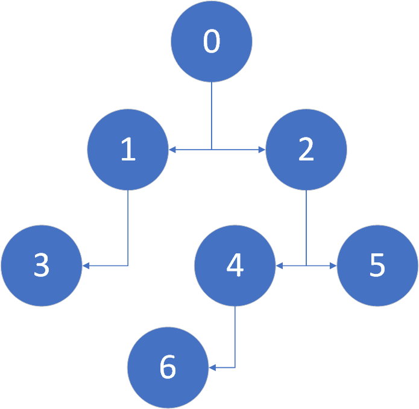

# JS实现树遍历的六种算法

所谓六种算法，就是前序、中序、后序的迭代和递归方法。递归都很简单，迭代中只有后序的方法比较奇特，需要“倒序输出”。

树的图形化表示：



代码：

```js
//辅助函数

Array.prototype.top = function () {
  return this[this.length-1]
}

function output(value) {
  console.log(value);
}

//节点和树的定义

function Node(value,leftchild,rightchild){
  this.leftchild = leftchild || null;
  this.rightchild = rightchild || null;
  this.value = value;
}

var n0 = new Node(0);
var n1 = new Node(1);
var n2 = new Node(2);
var n3 = new Node(3);
var n4 = new Node(4);
var n5 = new Node(5);
var n6 = new Node(6);

n0.leftchild = n1;
n0.rightchild = n2;
n1.leftchild = n3;
n2.leftchild = n4;
n2.rightchild = n5;
n4.leftchild = n6;

//实现

function recursionPreorder(root){
  output(root.value);
  if(root.leftchild){
    recursionPreorder(root.leftchild);
  }
  if(root.rightchild){
    recursionPreorder(root.rightchild);
  }
}

function iterationPreorder(root) {
  if(!root) return;
  let stack = new Array();
  let p = root;

  while(stack.top()|| p){
    if(p){
      output(p.value);
      stack.push(p);
      p = p.leftchild;
    }else{
      p = stack.pop().rightchild;
    }
  }
}

function recrusionInorder(root) {
  if(root.leftchild){
    recrusionInorder(root.leftchild);
  }
  console.log(root.value);
  if(root.rightchild){
    recrusionInorder(root.rightchild);
  }
}

function iterationInorder(root) {
  if(!root) return;
  let p = root;
  let stack = new Array();
  while(stack.top() || p){
    if(p){
      stack.push(p);
      p = p.leftchild;
    }else{
      p = stack.pop();
      output(p.value);
      p = p.rightchild;
    }
  }
}

function recrusionPostorder(root){
  if(root.leftchild){
    recrusionInorder(root.leftchild);
  }
  if(root.rightchild){
    recrusionInorder(root.rightchild);
  }
  console.log(root.value);
}


//后续的办法是“倒序输出”
function iterationPostorder(root) {
  if(!root) return;
  let p =root ;
  let stack = new Array();
  let outputStack = new Array();

  while(stack.top()||p){
    if(p.leftchild){
      stack.push(p.leftchild);
    }
    if(p.rightchild){
      stack.push(p.rightchild);
    }
    outputStack.push(p);
    p = stack.pop();
  }

  while(outputStack.top()){
    output(outputStack.pop().value);
  }
}

//测试代码
recrusionPostorder(n0)
iterationPostorder(n0);
```

