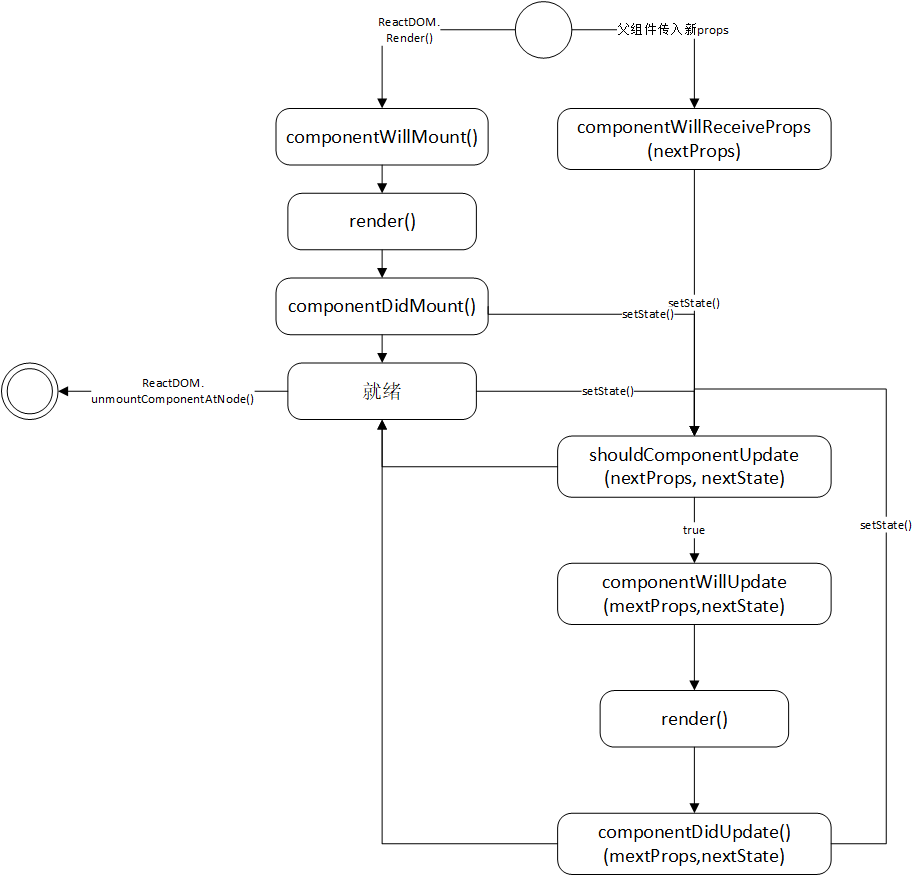

# React组件生命周期方法

> 最近在读陈屹老师的《深入React技术栈》一书，讲得确实很深入，喜欢引导读者从源码上解读React的行为，喜欢这种风格😀，本文也是读书间作的笔记的整理。

在看生命周期之前，首先提一下和生命周期相关的概念：

- **state**  

  React组件的内部状态，也是组件和虚拟DOM树关联的属性，因为组件state变化会执行相应的生命周期方法，可能导致重新渲染，使虚拟DOM树变化。

  只有`constructor`中可以直接设置state，其他方法中都需要使用`setState()`来使state变化。

- **props**

  React组件之间关联的方式，React的数据流是自顶向下单向流动的，也就是父元素通过设置子元素的props来向子元素传递数据（一般来说是用JSX的拓展语法来直接在标签上设置）。

- **虚拟DOM树**

  React不是直接操作文档的DOM，而是通过先在内存中维护虚拟DOM树，使用批量更新的方式更新到真实DOM树的。相当于多了一个“中间层”。如果组件仅仅是props发生了变化，那么通过一定的比较算法，React可以决定不需要重新卸载-装载整个DOM树，而是只传入新的props给子组件。也为React移植到其他平台提供了可能。

声明周期方法与上面三个概念都很有关系，具体看一个组件的例子：

```react
import React, { Component, PropTypes } from 'react';

class App extends Component {
  static propTypes = {};
  static defaultProps = {};

  //唯一可以直接设定state的地方
  constructor(props) {
    super(props);
    this.state = {}
  };

  //关于挂载和卸载的生命周期方法顺序
  componentWillMount() { };
  componentDidMount() { };
  render() {
    return <div>demo</div>
  }//不能setState()
  componentWillUnmount() { }

  //关于数据更新的生命周期方法顺序
  componentWillReceiveProps(nextProps) { };
  shouldComponentUpdate(nextProps, nextState) {
    //不能setstate
    //如果返回false中止数据更新
    return true;
  }
  componentWillUpdate(nextProps, nextState) { }
  //这里执行render()
  componentDidUpdate(nextProps, nextState) { }
}
```

其中各个生命周期方法的顺序已标出，我还画了一个活动图来表示生命周期方法的关系：



由图知有以下特点:

- 除了组件第一次装载(mount)时，所有重新渲染都是由setState()触发的。
- 所有由setState()触发的重新渲染，都可以用`shouldComponentUpdate`方法拒绝掉(return false)。
- 父组件传入新的props时，可以通过`componentWillReceiveProps`方法来决定是否要使用新的props重新渲染。

