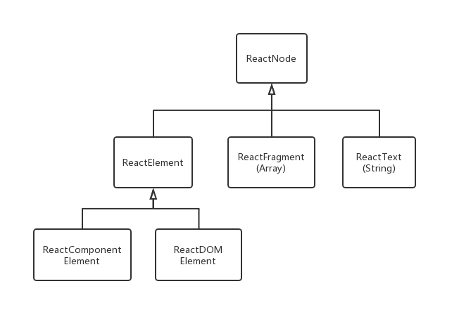

# React Virtual DOM

在Web开发中，频繁的DOM操作是经常造成性能瓶颈的地方。React最核心的设计就是引入了虚拟DOM。

VirualDOM是React用浏览器端JavaScript实现的一套DOM API，包括一整套CRUD，声明周期方法，diff算法，将Virtual DOM转换为原生DOM的Patch方法。

特性：

- DOM操作后，**DOM diff**算法能够精确地找到需要变更的DOM节点，只需要对DOM树变化的节点进行实际的浏览器DOM更新，而不需要重新渲染整颗浏览器DOM树。
- Virtual DOM实现了对DOM操作的批处理更新，即在一个**事件循环**内所做的所有数据更新进行合并，结束后进行一次diff操作来判断哪些DOM节点需要更新。而不是每次直接无脑更新浏览器DOM。
- 每次DOM操作确实需要构造完整的Virtual DOM树，但因为是用JavaScript对象实现的，性能很高，而对原生DOM进行操作的仅仅是diff，相当于提高了性能。

## Virtual DOM 类图



其中，`ReactDOMElement`就是最基本的虚拟DOM元素，主要属性有：

```js
{
  type: string,
  props:{
      className: string,
      ...
  }
  key: string,
  ref: string
}
```

## 创建虚拟DOM元素

我们知道可以用JSX语法来写React组件，而JSX可以直接编译成虚拟DOM元素：

```jsx
import SubComponent from './sub';

//jsx
const app = <Div color='yellow'><SubComponent>Hello!</SubComponent></Div>
      
//编译后的JS, 返回一个ReactElement
const app = React.createElement(
  div,//type
  {color:'yellow'},//config (props)
  React.createElement(SubComponent, null, "Hello!")//Child
)
```

## 自定义组件

使用`React.createClass`或者es6 classes编写自定义组件。自定义组件与虚拟DOM的主要关联是在MOUNTING期调用的instantiateReactComponent方法，这个方法通过判断组件元素类型创建元素实例。有以下的node type:

- `node===null`空组件

  ReactEmptyComponent

- `typeof node==='object'`内置标签组件或自定义组件

  ReactDOMComponent

  ReactCompositeComponent

- `typeof node=== 'string' || typeof node==='number'`文本组件

  ReactDOMTextComponent

### 组件生命周期

组件最重要的生命周期状态是MOUNTING, RECEIVE_PROPS, UNMOUNTING。每个周期对应一种方法。每个方法负责管理（就是在内部逻辑中调用）几个声明周期方法，比如will和did方法。

1. MOUNTING

   对应方法是mountComponent，负责管理生命周期中的getInitialState, componentWillMount, render和componentDidMount。这个阶段组件完成依据类型的实例化并加入到虚拟DOM树中，主要通过instantiateReactComponent方法和递归渲染。

2. RECEIVE_PROPS

   对应方法是updateComponent，负责管理生命周期中的componentWillReceiveProps, shouldComponentUpdate, componentWillUpdate, render和ComponentDidUpdate。这个阶段组件完成状态更新重新渲染，主要通过递归渲染。

3. UNMOUNTING

   对应方法是unmountComponent，负责管理生命周期中的componentWillUnmount。卸载组件。

对于无状态组件，没生命周期，单纯用来渲染。