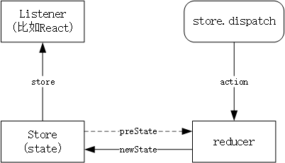

# Redux设计模式

Redux是与Flux思想比较类似的设计模式，也是以action dispatch为主要的事件和数据传递方式。

Redux自称为Predictable state container for JavaScript apps。

## 设计原则

- 单一数据源

  一个Redux应用只有一个数据源，统一管理。

- 状态只读

  和Flux相同，store中的数据只能通过action触发的reducer函数修改。

- reducer是pure function(纯函数)

  所有状态修改的操作均由无状态reducer函数完成，意思是一定的输入对应一定的输出，不会受到函数内部的状态的影响。所以Redux自称为Predictable。

## Redux和Redux应用

- Redux指npm库Redux
- Redux应用指使用了Redux和一些前端组件，比如React实现的Web应用。

## 数据流图

和Flux的设计思想一样，数据流动依然是单向的，黑色实线为数据流动方向。通过调用`store.dispatch()`在`store`上创建一个action，这个action和store中旧的state作为输入给一个纯函数reducer。reducer输出新的state，Store利用这个新的state来更新自己的状态，并通知所有的listener自己的变化。listener是一个回调函数，可以用store的`getState()`方法来获得此时的新状态，并做一些事（比如React 渲染）。



别急，看了API和例子就理解的更多了！

## API

Redux最核心的API就是数据容器`store`及其相关方法，创建一个`store`需要有一个对应的`reducer`。所有Redux的行为都是围绕store和reducer展开的。

### reducer

- reducer是一个签名为`(previousState, action) => state`的纯函数，描述在旧state和一定的action的共同作用下如何确定新状态。
- reducer自己不保存状态，仅仅是一个pure function。
- state可以是任意类型，比如js object, string, number等待。
- reducer不应该去改变旧state，而是返回一个新state。
- reducer每次被调用，其返回值都作为store新的状态。

一个reducer示例：

```js
function reducer(state, action) {
  switch (action.type) {
    case 'inc':
      return {
        counter: ++state.counter,
        value: ++state.value
      }
    case 'dec':
      return {
        counter: ++state.counter,
        value: --state.value
      }
    case 'add':
      return {
        counter: ++state.counter,
        value: state.value + action.value
      }
    default:
      return state;
  }
};
```

可以注意到是用纯原生js，没有使用任何框架，只是遵循reducer的设计模式。

### createStore

`createStore()`是Redux暴露出的创建`store`的方法，签名为:

```js
createStore(reducer[,initalState]):store
```

在Node环境下引入：

```js
const createStore = require('redux').createStore;
```

在es6环境下引入：

```js
import { createStore } from 'redux'
```
调用方法创建一个store，第一个参数为定义好的reducer；第二个参数为initalState，可选。

```js
const store = createStore(reducer, {
  counter: 0,
  value: 0
});
```

可以调用store对象的`replaceReducer()`方法换一个新的reducer。

### dispatch()和subscripe()

在一个store上调用它的`dispatch`方法来传入一个`action`，从而调用其reducer产生新的状态。

在一个store上调用它的`subscripe()`方法来绑定监听函数，很多用来绑定React这种View层。绑定的监听函数会在reducer被调用后执行。

```js
store.subscribe(() => console.log(store.getState()))

store.dispatch({ type: 'inc' })
store.dispatch({ type: 'dec' })
store.dispatch({ type: 'add', value: 10 })
store.dispatch({ type: 'dum' })

// 运行结果：控制台打印：
// { counter: 1, value: 1 }
// { counter: 2, value: 0 }
// { counter: 3, value: 10 }
// { counter: 3, value: 10 }
```

Redux作为设计模式的部分就这么简单，还有与React结合创建React-Redux应用，使用middleware增强功能的部分。