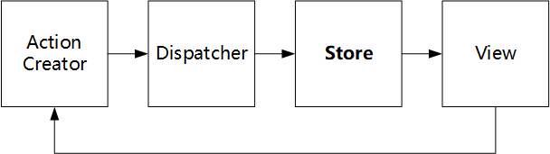

# Flux设计模式

Flux设计模式也是由Facebook工程师提出的一种前端工程化设计模式，目的也是将View和其他操作进行解耦。其核心思想是“数据单向流动”和事件机制，也是Flux得名的原因。一个Flex的架构可以用图表示：

- Dispatcher: ~~创建~~分发(emit)action，action中可以包含信号(type)和数据(value)，是Flux架构进行数据和消息传递的关键模块。

- ActionCreator: 创建"action"的模块，通过调用Dispatcher来进行事件分发

- Store: 监听Dispatcher分发的action，如果有合适的action就用来更新数据，是Flux存放数据的关键模块。

- View: 监听Store中的数据变化，根据Store中的数据绘制视图。同时在接收用户输入时通过ActionCreator来创建相应的Action。

  一般来说View还可以再分为controller-view和view，前者还是包含一些业务逻辑，比如去Store中注册监听，初始化逻辑等；后者基本上就是无业务逻辑的组件，只在接收用户输入的时候调用ActionCreator的相关方法。

Flux架构的特点如下：

- 所有的事件和数据都要经过Dispatcher来分发，而不是任意set和get。所有组件的逻辑业务写在ActionCreator中，避免了在组件内部写业务。
- 通过保证数据单向流动，当应用足够大，数据足够复杂的时候可以降低复杂度。而MVC的数据流动没有方向，model view controller之间数据任意流动，管理起来比较麻烦。
- 非常适合React这种单纯View的框架。
- 如果所有数据变化事无巨细都要经过flux数据流，写起来是有点麻烦。所以很多时候对一些无关紧要的数据变化在view内部实现了。

## 相关库

facebook官方出品的同名库[Flux](<https://facebook.github.io/flux/>)，只有Dispatcher和一些util方法的实现，因为其他的flux模块没必要，比如store和actioncreator可以方便地用原生js实现，view可以用react或者别的view库实现。

