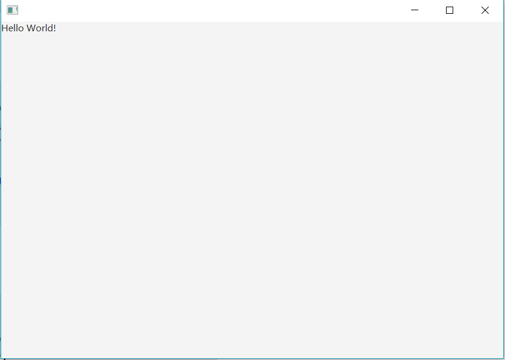

# JavaFX自定义组件实例

可以参考我的另外一篇文章[JavaFX自定义组件要点](<https://excitedspider.github.io//JavaFX%E8%87%AA%E5%AE%9A%E4%B9%89%E7%BB%84%E4%BB%B6%E8%A6%81%E7%82%B9/>)来看，这是一个实例。

文件结构

```
sample
--customcomponent
----CustomComponent.Java
----customcomponent.fxml
--Controller.java
--Main.java
--main.fxml
```

Main.fxml 主页面的布局

```xml
<?import javafx.scene.layout.BorderPane?>
<?import sample.processcontrol.ProcessControl?>
<BorderPane fx:controller="sample.Controller"
            xmlns:fx="http://javafx.com/fxml">
    <center>
      <CustomComponent message="Hello World!"/>
  </center>
</BorderPane>
```

Main.java 启动主类

```java
package sample;

import javafx.application.Application;
import javafx.fxml.FXMLLoader;
import javafx.scene.Parent;
import javafx.scene.Scene;
import javafx.stage.Stage;

public class Main extends Application {

    @Override
    public void start(Stage primaryStage) throws Exception{
        Parent root = FXMLLoader.load(getClass().getResource("main.fxml"));
        primaryStage.setTitle("");
        primaryStage.setScene(new Scene(root, 1600, 900));
        primaryStage.show();
    }


    public static void main(String[] args) {
        launch(args);
    }
}
```

Controller.java 空的主控制器类

```java
package sample;

public class Controller {
  
}
```

CustomComponent.fxml 自定义组件的布局

```xml
<?xml version="1.0" encoding="UTF-8"?>

<?import javafx.scene.control.*?>
<?import javafx.scene.layout.*?>

<fx:root type="javafx.scene.layout.GridPane"
         xmlns="http://javafx.com/javafx"
         xmlns:fx="http://javafx.com/fxml">
    <Label fx:id="message"/>
</fx:root>

```

CustomComponent.java 自定义组件的控制器类和Root类，实质上这两个职责可以分开，在构造函数中可以指定。

```java
package sample.CustomComponent;

import javafx.fxml.FXML;
import javafx.fxml.FXMLLoader;
import javafx.scene.control.Label;
import javafx.scene.layout.GridPane;

import java.io.IOException;

public class CustomComponent extends GridPane {

    @FXML
    Label message;

    public ProcessControl() throws IOException {
        FXMLLoader fxmlLoader = new FXMLLoader(getClass().getResource("customcomponent.fxml"));
        fxmlLoader.setRoot(this);
        fxmlLoader.setController(this);
        fxmlLoader.load();
    }

    public void setMessage(String message){
        this.message.setText(message);
    }

    public String getMessage(){
        return this.message.getText();
    }
}
```

运行效果：



这个例子可以注意的是用了一个自定义Prop`message`，通过定义getter setter实现。