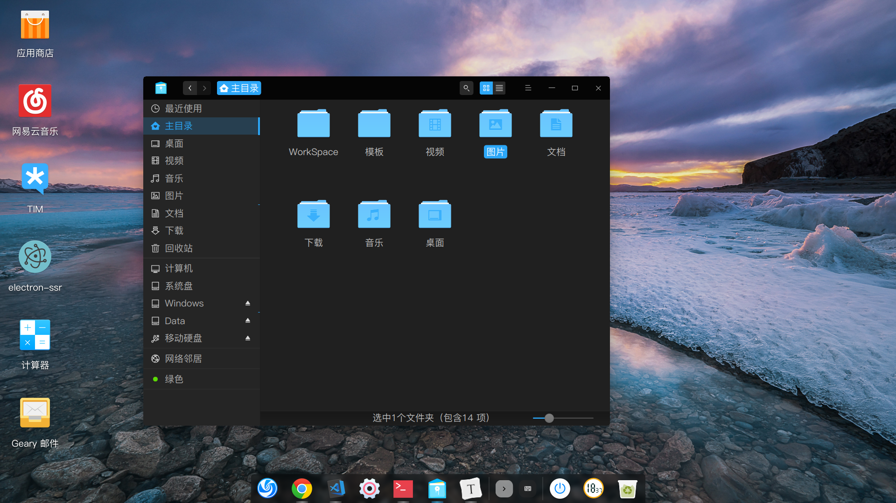

# Deepin上手记录

一直想要一个Linux环境很久了，之前一直使用的是WSL，但是还是不太方便，比如我想用Linux环境下去用GUI调试程序等等。也看了Deepin这个系统很久了，外观好看，功能符合国人需求，安装简单（甚至有exe的安装软件），所以就上手了。

## 配置

- 主力编辑器：VSCode
- Node环境：Node网站上只有压缩包，解压之后用`ln`命令把node和npm链接到`/usr/local/bin`就算装好了。
- g++：这个是我想换Linux系统的第二大动力，win上搞这玩意太麻烦了，而deepin直接`apt-get`就完事了。
- Nginx：这个是我想换Linux系统的第一大动力。有次像傻X一样在win下配了很久很久都出404，最后发现win下路径是用双斜杠`//`，当场自闭了。
- TIM：deepin人员把TIM的wine化直接做好了，在应用商店里点击下载就行，非常nice。
- Geary：挑来挑去终于有个好看实用的免费邮件客户端了。
- electron-ssr：SSR在linux下的GUI客户端
- typora：我最爱的markdown编辑器/阅读器
- powershell：在win下写了超级多的ps1脚本，特别是这个博客的管理都是脚本化了，一下子让我全用bash重写还是太难了。不过现在powershell开源之后，对linux做的支持也很足了，好用。


## 遇到的问题以及解决

- 装好了双系统进不去

  我的笔记本的BIOS选项有个secure-boot，把这个disable就好了，说起来比较简单但自己当时找了比较久的原因。

- 发热过高

  更新显卡驱动，好在Deepin有显卡驱动管理器，做起来比较方便。但是更新了之后还是达不到win10下桌面基本静音不发热的状态，可能还是桌面优化有些遗憾吧。

- 字体模糊

  Deepin默认用的开源字体，可以理解，但我还是装上了某自己习惯的字体。deepin自带的字体安装器非常好用，完美解决。

- wine应用字体和布局过小的问题

  使用wine-config完美解决。
  
  ```shell
  sudo INEPREFIX=~/.deepinwine/Deepin-TIM deepin-wine winecfg
  ```
  
- 改/etc/profile不生效

  看了一下社区，是修改/etc/bash.bashrc，好吧
  
- 笔记本指纹模块用不了

  这个无解，我的本本的指纹模块是国产厂商做的，根本没有linux驱动，可惜了。

