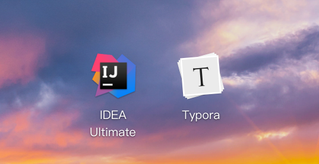

# 制作Deepin桌面启动器

Deepin桌面启动器的后缀为`.desktop`，这样就会被Deepin桌面识别。

例如我现在下载了IDEA的binary file，它只提供了`idea.sh`的运行脚本。

我可以在桌面上这样写：

```
[Desktop Entry]
Type=Application
Comment=IDEA Ultimate
Name=IDEA
Icon=/usr/local/idea-IU-191.6707.61/bin/idea.png
Exec=/usr/local/idea-IU-191.6707.61/bin/idea.sh
Terminal=false
Categories=Development;
```

然后丢到桌面'\home\xxx\Desktop'（xxx为登录用户名）上，就会被识别成一个启动器，拥有图标、运行、是否带有控制台等等选项。

那么，如何在启动器中被识别呢，答案是丢到`/usr/share/applications`，就可以被用户识别了。



嘻嘻

