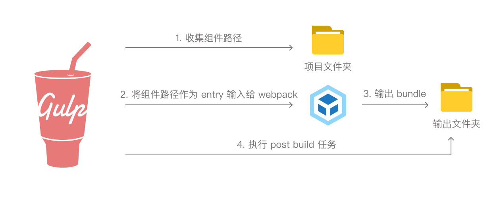

## 关于本文

本文主要是记录了自己在对小程序组件库项目开发进行工程化的一些实践经验总结。希望能够给做小程序组件和框架工具开发和前端工程化的同学的一些提示。适合对小程序开发有一定基础的同学阅读参考。

## 为什么需要工程化

首先小程序开发是可以不做工程化的，使用原本的小程序框架也可以进行开发。当然，web 开发也可以从原生html js一步一步写起。做工程化，肯定是想要一些更好的特性，能够优化我们的开发体验和项目可维护性。比如以下特性：

* S[AC]SS 支持
* 更好的 module-resolve （比如可以配置 alias）
* 更好的 TypeScript 支持
* 更好的发布管理
* 更好的代码规范 - stylelint，eslint 等等
* ...

在工程化改造现有项目，或者新的小程序项目选型时，就要考虑到为什么需要工程化，引入工程化带来的好处是有哪些，如果没有任何需求，原生开发也不是不行啦。

## 工程化开发流程概述

一图流表示开发流程：


这张图上，有两个重要的起点文件夹:

- `src` 组件的源代码文件
- `wxmp` 开发用的 Demo 页面源代码文件（类似 Web 组件库开发也会有的 devSever 页面），以及一些单元测试


我们希望组件库最后发布是以 npm package 的方式发布，让用户能够用 npm 管理依赖。将 src 中的组件源代码编译打包后，编译结果输出到 `lib` 文件夹来发布，`lib`只包含组件，不包含任何开发用的 demo 页面源代码。这样我们可以有效地减少包的大小、以及开发者引入小程序的开销。在这样到设计下，我们应该在 package.json 中这样写：

```json
  "miniprogram": "lib",
  "files": [
    "lib",
    "src"
  ],
```

> 小程序从 [2.2.1](https://developers.weixin.qq.com/miniprogram/dev/devtools/npm.html) 开始已经有了 npm 支持

其中 `miniprogram` 是小程序定义的私有字段，指定了小程序"构建NPM"指令时需要构建的部分，不在 npm 规范的 package.json 中。具体说明可以查看小程序官方文档 [npm 支持](https://developers.weixin.qq.com/miniprogram/dev/devtools/npm.html)

在开发过程中，开发者需要既开发 `src` 下的组件源代码，也需要在 `wxmp` 中编写一些 demo 页面和单元测试来调试组件。将`wxmp`编译打包后，可以直接导入到微信开发者工具中查看页面。

我们希望开发者在`wxmp` 中编写 demo 页面时，对于组件库对引用方法与发布后实际使用者一致，类似从 node_modules 中取引用：

```ts
import { Alert } from 'MyUI'
```

或者使用 json 引入组件:

```json
"useComponents":{
	"MyAlert": "my-ui/alert/alert"
}
```

> 对小程序组件注册方式，可以参考官方文档[自定义组件](https://developers.weixin.qq.com/miniprogram/dev/framework/custom-component/)

## 选型 —— Gulp meets Webpack

在实现这个工程化的过程中，我们采用了 Gulp + Webpack 这一个技术选型。

### Gulp & Webpack 比较

虽然 Gulp 和 Webpack 这两个工具经常被当作同一类来比较优劣。但其实在我看来是功能目标差别巨大的两个工具。

- [Gulp](https://gulpjs.com/docs/en/api/concepts): 基于文件流的 task runner，可以用非常函数式的写法来组织 task，轻松拥有漂亮的任务控制和console输出。gulp 并没有与 JS 编译打包强相关，而是处理文件的 task 都可以适用。经过多次重大改版之后，常用 API 简化到了十个以内，这种 Less is more 的 API 设计也是我比较欣赏的一点。
- [Webpack](https://www.webpackjs.com/concepts/): JavaScript 模块打包器(module bundler)。可以自动解析和收集模块依赖，最后打包为一个 bundle (或多个 chunk) 以提供给浏览器或 node 加载。虽然说是 JS 模块打包器，但使用一些 loader 就可以处理 `png` `css` 等等非 js 的文件。另外，webpack 5 也支持将非 JS 文件作为 entry

### why Webpack ？

当然也有其他方案可以选择，例如 tsc + babel-resolve 也可以实现打包编译。但是 webpack 能够提供的resolve 能力更加强大，tree-shacking 机制也很香。

### why Gulp ？

在这个技术选型中，最关键的打包器其实是 Webpack ，而 Gulp 其实是一个驱动 webpack 的runner。为什么我们不能只用 webpack 呢？这就是因为小程序的特殊性。

1. 小程序有很多隐式的文件关联。假设我们有一个组件 Alert，应该是在同一个文件夹下的四个文件隐式关联关联共同组成一个组件:

	```
	alert
	├── alert.js
	├── alert.wxml
	├── alert.json
	└── alert.wxss
	```

	而 webpack 是基于显式模块依赖进行打包的工具，在 webpack 中，就算引用一张图片也需要显式的`import`，这与小程序这种基于约定的隐式依赖不合，需要有其他工具来帮助 webpack 预处理。
	
2. 小程序有自己独立的框架，相比于编译到常规的 web 平台，需要一些额外的 postbuild 任务。比如，在demo的文件夹 `wxmp_dist` 打包后，例如需要运行 `npm i`安装依赖。在我的项目中，还需要 copy 一些其他打包好的非 npm 的库。这些额外的工作是 webpack 不太方便去处理的。 

3. 因为小程序组件隐式关联的约定，组件库是不能像 vue、react 一样有一个统一的 `exports` ，需要开发者去子目录下引用组件。而webpack 没有自动分析这些子目录结构的能力。

需要有一个工具来补充这些能力，我们选择 Gulp 的原因就是输出漂亮，函数式很香，相比用 nodejs API写脚本更简单。

### 组合两个工具



组合两个工具后具体工作流如图。其中一些关键路径：

- 收集组件路径可以使用 gulp 的 API [src()](https://gulpjs.com/docs/en/api/src) ，也可以使用一些其他的工具比如 [`glob`](https://www.npmjs.com/package/glob)。
- 将 gulp 的输出作为 webpack 的 entry，可以使用 [`webpack-stream`](https://www.npmjs.com/package/webpack-stream)，将webpack整个都包在 gulp 的流任务里，全自动处理；也可以就用常规的 [webpack nodejs api](https://webpack.js.org/api/node/)。我们采用了后者，因为可配置项更多。

## 一些细节处理

- 保持目录结构
  我们首先想的是 webpack 输出到 stream 中，具体 output 路径由 gulp 去控制。而 webpack 新的 5.0 版本支持了 [`advanced entry`](https://webpack.js.org/guides/entry-advanced/#root)，可以支持一个入口点配置多个文件，能够和真实的目录结构对应上，这样就可以完全由 webpack 去控制文件生成。
  ```js
  entry: {
    'components/home': ['./home.js', './home.scss'],
    'components/account': ['./account.js', './account.scss'],
  }
  output: {
	filename: '[name].js' // name 会被替换为 entry 中的 key，保持目录结构。
  }
  ```
  
  所以我们需要构建一个反应真实目录结构的 entry 对象。比较关键的代码:
  ```js
  // 使用 node path 模块构建解析出相对路径
  const key = join(relative(option.context, resolve(file.path)), file.name)
  // 设置 entry 对象
  entry[key] = file.path
  ```

- 编译缓存
  我们的组件库中有一些依赖非 npm 的第三方库，需要独立编译，因为每次打包都编译非常耗时间，所以我们为第三方库的编译做了缓存。
  1. 将所有编译配置放入一个 js 文件
  2. 计算编译配置文件内容的 md5 hash，作为文件名 vendor.[md5].js
  3. 查找缓存文件夹 node_modules/.cache 下是否有对应哈希的编译产物 vendor.[md5].js
  4. 如果有编译产物，就直接 copy
  5. 如果没有，则先编译到 node_modules/.cache 下再 copy

- console output
  一个可读的控制台输出对于编译打包工具来说是很加分的。我们在 [webpack compiler hooks](https://webpack.js.org/api/compiler-hooks/) 加了许多的提示
  
  ```js
  compiler.hooks.watchRun.tap('WatchRun', () => {
     log('Found changes, rebuiding...');
  });
  ```
  
- 关于 watch
  gulp 与 webpack 都提供了 watch 功能，而我们选择了 webpack。这是因为 webpack watch 可以分析模块依赖进行节流。

## 具体代码

我能分析出来的细节就是这样，如果还有对实现对困惑可以参考我们的项目[工蜂](https://git.code.oa.com/wxad/adui-charts/blob/refactor/project-build/build/wxmp/gulpfile.js)例子。