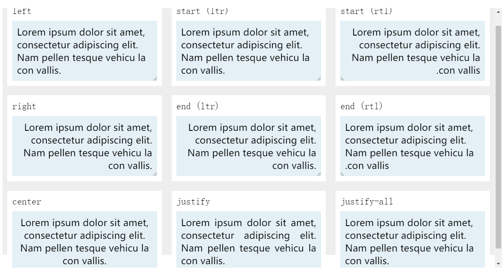
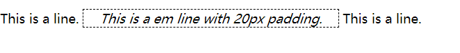

## 字体

设置字体是CSS中的一个常见需求。

一般来说，字体分类有：衬线字体、无衬线字体、等宽字体、草书字体等。

设置字体有一个缩写属性font：

```
font: font-style, font-variant, font-weight, font-stretch, font-size, line-height, font-family.
```

### font-family

设置字体最常用的属性是font-family，font-family属性可以接收通用字体或指定字体。

font-family属性可以接收多个值，**取第一个有效值**作为最后显示的字体。这意味着我们可以用降级的方式保证页面至少存在一种显示效果。

通用字体是只规定字体的类型，具体字体由浏览器选择，如：

* serif：衬线字体
* sans-serif：无衬线字体
* monospace：等宽字体

指定字体是假定用户代理中安装了某种字体，再指定用该种字体进行显示。显而易见使用这样的字体有显示上的风险，所以在实现中我们经常与通用字体结合使用：

```css
h1 {font-family: Georgia, serif; }
```

如果字体名称有空格或特殊符号，需要对字体名称加引号。

### @font-face

@font-face由CSS2定义，能够**为用户浏览器“安装”任意服务器上的字体**。有了@font-face，我们在使用指定字体时就可以更加放心大胆了。

```css
@font-face {
    font-family: "SwitzeraADF"; /* 定义字体名 */
    src: url("SwitzraADF-Regular.otf") /* 定义字体源 */
}

h1 {font-family: 'SwitzeraADF'}
```

@font-face是**惰性加载字型**的，仅当需要使用指定字型渲染文本时，才会加载字体。但其实字体下载是全部下载的。

@font-face的src属性具有**同源限制**。如果要跨域访问字体需要有CORS设置。

由于字体下载需要时间，使用@font-face可能导致字体重绘。

@font-face的src属性还可以指定字体解析格式，也可以指定本地来源，还可以接收多个源取第一个有效来源。

```css
@font-face{
    font-family: "SwitzeraADF";
    src: local("Switzera-Regular"),
         url("Switzera-Regular.otf") format("opentype")
}
```

@font-face属性还可以接收一些其他字体描述符。

```css
@font-face{
    font-family: "SwitzeraADF";
    font-weight: bold; /* 字重 */
    font-style: italic; /* 斜体 */
    font-stretch: condesed; /* 字宽 */
    src: url("SwitzraADF-Regular.otf");
}
```

### 字重

属性font-weight可以控制字体字重。常用取值：normal | bold | bolder | lighter。

常用取值是**相对于父元素来说，元素字体的字重更大或更小**。显然，这是一种相对单位，我们也可以使用绝对单位，CSS定义的字体绝对单位为100~900的整百倍数字，越大的数字对应越重的字重。

字重对应的是字体集本身提供的不同粗细的变体，例如字体Source Code Variable就提供了7种字重。这7种字重会映射到100~900 9级字重上，这就意味着可能有多个等级的字重表现出来是相同的。对于大多数字体来说，这是一个普遍的现象。

字重是一个可继承的值。

### 字号

属性font-size可以控制字体字号。

字号**绝对单位**有：xx-small，x-small，small，medium，large，x-large，xx-large。其中medium可以看作基准，其他单位是根据medium的大小和用户代理的设置放缩。medium在目前大多数无缩放用户代理中设置为16px。

字号**相对单位**比较复杂。其中larger和smaller和绝对单位的放缩倍数相等（如medium放缩到large）。百分数是根据父元素计算得到的字号。单位em定义为1em=100%。

字号还可以取距离单位如像素px，厘米cm等等，距离单位在我的*CSS权威指南学习笔记1*中有描述。

字号是一个可继承的值。其中的继承是继承绝对单位，也就是说如果使用了相对单位，其实是按照相对单位计算值继承的。

#### 自动调整字号

一个比较冷门的属性font-size-adjust可以自动调整字号。在介绍这个属性之前先介绍一个单位：**高宽比值**(aspect value)。

> 高宽比值 = x高度 / 字号

高宽比值是一个字体决定的属性，我们认为，在相同的字号下，高宽比值越大的字体越清晰。font-size-adjust可以根据字体的高宽比值自动调整字号，使得不同字体的清晰度达到一个相同的水平。计算方式为：

> 实际的font-size=设置的font-size *  (font-size-adjust/高宽比值) 

他会在已经设置的字号上再调整。若字体的高宽比为0.46：

```css
p {
    font-size: 10px;
    font-size-adjust: 0.58; /* 实际font-size = 10px * (0.58/0.46) = 12.6px*/
}
```

目前2020，这个属性只有在firefox中默认被支持，chrome等浏览器需要开启实验功能才能使用。

### 字形

属性font-style可以控制字体字型，这个属性较为简单，只有normal（常规体），italic（斜体），oblique（倾斜体）可选。

### 其他字体属性

* font-stretch：字体拉伸，用于某些提供瘦体和胖体的字体中，一般西文会有。
* font-kerning：字距调整
* font-variant：字体变形，例如一些字母连写等等。

## 文本

文本样式可以根据文本方向是以行内方向还是块级方向分成**行内文本样式**和**块级文本样式**。如果我们只关注西文和中文的从上到下、从左到右的书写顺序，行内方向和块级方向也可以被称为横向和纵向。

### 行内文本

#### 缩进文本

text-indent可以定义文本缩进方式

```css
p { text-indext: 3em } /* 向后缩进3em */
```

该属性也可以接收负值，形成文本悬挂的效果。

#### 对齐文本

text-align可以定义文本对齐方式

虽然text-align是定义行内方向文本的对齐方式，但其**只能用于块级元素**中。我们可以假设一下，如果我们对一个行内元素如span设置`text-align: center`（居中显示），显然是没有意义的，因为行内元素没有自身的宽高。

其不同取值的效果如下图：



text-align-last可以仅对齐文本最后一行，其取值与text-align相同。

#### 单词间距

word-spacing属性可以设置单词间距。属性接收一个长度量，可负可整，最后追加到单词的标准间距上。

#### 字符间距

letter-spacing属性可以设置字符间距，与word-spacing类似接收一个可负可正的长度量。

#### 文本装饰

text-decoration属性可以定义文本的装饰属性，装饰属性包括：下划线underline，上划线overline，删除线line-through等。

很多时候我们用这个属性去掉html默认的文本装饰，例如

```css
a {text-decoration: none}
```

可以去掉链接的下划线。

### 块级文本

#### 行高

行的组成在html中是比较复杂的，可以参考下图（引用自stackoverflow）


如图line-height指西文中的**基线最小距离**，基线的距离依然有可能比line-height大，与字号无关。

line-height的取值可以是长度量（如18px，2em），但多数情况下使用**纯数字**。纯数字意为行高设置为字号的相对大小。如行高1.5，字号16px，行高计算得1.5*16px=24px。而且，使用纯数字的好处还有：**继承时是将换算系数继承而非绝对值**。

#### 纵向对齐文本

vertical-align属性可以控制纵向对齐文本方式，其取值如下图所示（来自MDN）：

```html
<p>
Aligin the star:
</p>
```

```css
.align{
    vertical-align: <keywords>
}
```


这个属性用途一般是用来控制行内元素盒模型与其行内元素容器垂直对齐，例如对齐文本中的图片。

## 视觉格式化基础

本章是引入CSS视觉渲染模型的工作原理。

### 元素框

在CSS中，每个元素都会生成一个或多个矩形框，称之为**元素框**。目前在CSS中，还没有出现非矩形框。

**元素框的组成都包括：外边距margin，边框border，内边距padding，内容content**


元素框根据标签和CSS display属性的设置可以分为：

* 块级框block box
  * 盒子会在内联的方向上扩展并占据父容器在该方向上的所有可用空间，在绝大数情况下意味着盒子会和父容器一样宽
  * 每个盒子都会换行
  * [`width`](https://developer.mozilla.org/zh-CN/docs/Web/CSS/width) 和 [`height`](https://developer.mozilla.org/zh-CN/docs/Web/CSS/height) 属性可以发挥作用
  * 内边距（padding）, 外边距（margin） 和 边框（border） 会将其他元素从当前盒子周围“推开”
* 行内框inline box
  * 盒子不会产生换行。
  *  [`width`](https://developer.mozilla.org/zh-CN/docs/Web/CSS/width) 和 [`height`](https://developer.mozilla.org/zh-CN/docs/Web/CSS/height) 属性将不起作用。
  * 内边距、外边距以及边框会被应用但是不会把其他处于 `inline` 状态的盒子推开。
* 行内块级框
  * 对外表现出块级框的特征，对内表现出行内框的特征

元素框根据置换性可以分为置换元素和非置换元素。

另一个重要的概念是容纳块。元素框的**容纳块**是指离元素最近的**生成列表项目或块级框**。


### display属性

display属性是设置元素框视觉格式化的最常用的属性。这个属性的取值是非常多的，如下所示：

```
[ <display-outside> || <display-inside> ] | <display-listitem> | <display-internal> | <display-box> | <display-legacy>
where 
<display-outside> = block | inline | run-in
<display-inside> = flow | flow-root | table | flex | grid | ruby
<display-listitem> = <display-outside>? && [ flow | flow-root ]? && list-item
<display-internal> = table-row-group | table-header-group | table-footer-group | table-row | table-cell | table-column-group | table-column | table-caption | ruby-base | ruby-text | ruby-base-container | ruby-text-container
<display-box> = contents | none
<display-legacy> = inline-block | inline-list-item | inline-table | inline-flex | inline-grid
```

其中block、inline即是可以将元素设置为块级框或行内框。

### 块级框

由于块级框会发生外边距折叠，通常来说我们认为**padding  border content一起决定整个盒子的大小**。

#### box-sizing

在标准模型中，如果你给盒设置 `width` 和 `height`，实际设置的是 *content box*，即**宽高为content**。可以使用box-sizing属性来让其表现为其他盒模型。

```
box-sizing: content-box | padding-box | border-box
default: content-box
```

padding-box下，宽高为content+padding

border-box下，宽高为content+padding+border

#### 横向格式化

横向格式化属性包括margin-left、border-left、padding-left、width、padding-right、border-right、margin-right。这七个属性一起决定块级框的横向布局。

##### auto行为

七个属性中能够设置为auto的属性有：**width、margin-left、margin-right**。如果把这三个属性中的其中一个设置为auto，设置auto的那个属性具体长度会满足**元素框的宽度等于父元素的宽度**。即在横向上，CSS默认块级框是**填满整行**的。如果三个属性都不被设置为auto，那么CSS将**自动将margin-right设置为auto**以满足填满整行的行为。

如果两外边距设置为auto，CSS将会使两外边距相等并满足填满整行。在表现上会显示为对于父元素水平居中显示。这就是最常见的水平居中写法的原理：

```css
.pos {
    margin: 0 auto; /* 水平居中 */
}
```

##### 负外边距

七个属性中能够设置为负数的只有margin-left和margin-right。外边距设置为负之后，仍然需要在算式上满足元素框的宽度等于父元素的宽度，但由于其中存在一个负数，会导致**子元素表现出来的宽度大于父元素**。

##### 百分数值

七个属性中能够设置百分数的包括margin-left、padding-left、width、padding-right、margin-right。也就是说只有边框不能设置百分数。横向格式化中，百分数是**基于父元素宽度**而言的。

##### 置换元素

块级置换元素（如img）的横向格式化有一个附加规则：**width为auto时，置换元素的宽度等于自身内容宽度。**

#### 纵向格式化

纵向格式化涉及的属性除了与横向格式化类似的margin-top、border-top、padding-top、height、padding-bottom、border-bottom、margin-bottom，还有控制元素内容溢出显示的overflow属性。

##### overflow

在纵向格式化时，可能会遇到溢出问题：当给元素设置固定的高度后，如果元素的内容不能完全显示，那么元素框应该如何表现。其取值如下：

```css
/* 默认值。内容不会被修剪，会呈现在元素框之外 */
overflow: visible;

/* 内容会被修剪，并且其余内容不可见 */
overflow: hidden;

/* 内容会被修剪，浏览器会显示滚动条以便查看其余内容 */
overflow: scroll;

/* 由浏览器定夺，如果内容被修剪，就会显示滚动条 */
overflow: auto;

/* 规定从父元素继承overflow属性的值 */
overflow: inherit;
```

##### auto行为

与横向格式化类似，可以设置为auto的属性有**margin-top、height、margin-bottom**。将纵向margin设置为auto在非弹性盒元素容纳块中将会使得纵向边距为0，也就是说不能像横向布局中用auto将元素居中显示。

##### 百分数值

七个属性中能够设置百分数的包括margin-top、padding-top、height、padding-bottom、margin-bottom。也就是说只有边框不能设置百分数。纵向格式化中，百分数是**基于父元素高度**而言的。于是我们如果想要将元素对于父元素居中显示，可以将**上下外边距设置为25%减去元素高度的一半**。

##### 外边距折叠

相邻块级元素会发**生纵向外边距折叠**，导致仅显示两块级元素之中的最大外边距。

##### 负外边距和折叠

纵向上也可以使用负外边距，因为纵向外边距还要考虑折叠，负外边距变得比较复杂。而且负外边距很容易导致元素重叠，没有甚么特定的理由的话建议不要使用这个特性。

### 行内元素

常见的行内元素有em和a等非置换元素，以及置换元素img等（行内置换元素可以设置width/height，也就是类似inline-block）

#### 基本概念

不在任何行内元素中的字符串称之为**匿名文本**，例如`<p>I'm <em>so</em> happy!</p>`中的`I'm`和`happy!`都是匿名文本。匿名文本也是一种行内元素，符合行内元素的格式化规则。

**内容区**对非置换行内元素来说是指各字符的字体框（由字体和font-size决定）连在一起构成的方框。对于置换行内元素来说等于元素自身高度加内外边距和边框。

**行距**是指font-size和line-height之差。二者的差除以2之后分别听啊加到内容区的上部和下部。仅有非置换元素由行距的说法。

**行内框**是指内容区加行距后得到边框。

**行框**是所有行内框最高点和最低点组成的方框。也就是说，在只有单行内容的行内元素中，行内框和行框相等；在多行内容的行内元素中，行框高度等于第一行行内框的上边界到最后一行行内框的下边界。

行内元素的边框在**内容区外的内边距外侧**，而非行框外侧。这就导致为多行内容的行内元素添加边框实际上会出现多行边框，而不是一个大边框。并且，边框位置只由font-size决定（内容区高度），与line-height（行内框高度）无关。

行内元素的背景在**内容区和内边距**组成的区域内。

#### 行内格式化

行内格式化非常重要的属性是line-height，所有的元素都有line-height属性。对于非置换元素来说，**行内框的高度等于line-height的值**。虽然块级元素也有line-height属性，但块级元素的line-height是应用到其内部的行内元素上，对其本身的格式化没有影响。

行内元素一行的高度由其内部的元素（如img）以及其他内容的高度（如文本）的高度决定。

#### 行内非置换元素

我们先讨论行内非置换元素格式化的情况

##### 纵向对齐

非置换元素可以使用`vertical-align`属性改变内容区相对于行内框**纵向对齐**方式。除了接收关键字如`baseline`、`top`、`middle`等，还接收长度量（如em）。为该属性赋予长度量会导致**内容区和行内框一起移动**，即表现出来该行的高度发生了变化。

`vertical-align`属性还可以设置为百分数，此百分数是基于**line-height**

##### 控制行高

前面的说明已经提到，控制非置换元素行高最重要的属性就是line-height。然而line-height是继承的，如果提供了绝对量，那继承属性可能不会提供足够的空间，有时候会造成**文本重叠**的现象。所以，推荐**在设置大字体时同时将line-height重新设置为em单位或纯数字（如单倍行距1em）**。因为em单位是基于元素自身font-size而言的，跟父元素没有关系。所以可以避免出现文本重叠。

##### 基线对齐

在目前的标准中，基线对齐是一个非常困难的技艺。基线位置由字体本身、字号、行高一起决定，我们能做的就是把字号和行高设为一致，然后期待它能够对齐。所幸中文这个需求会比较少一些。

##### 盒模型属性

如前文所述，盒模型属性如内外边距和边框并不影响行内元素的高度。但可以影响行内元素背景大小、边框位置。并且，左右边距是起效的，会把左右的行内元素推开。

```html
<span>
	This is a line.
    <em style="padding-left: 20px; padding-right: 20px; border: 1px dashed black;">
        This is a em line with 20px padding.
    </em> 
    This is a line.
</span>
```

效果如下：



#### 行内置换元素

行内置换元素如img，虽然在定义上属于行内元素，但是有一定的特殊性。最明显的就是行内置换元素**存在宽高属性**。

行内置换元素的行内框包括内容、内外边距和边框。所以line-height不能决定含有行内置换元素行内框的高度。但**line-height属性仍然被继承**。

行内置换元素内容的下边**默认与基线**对齐。如果存在下内边距、外边距和基线，内容去将会上移。

#### 行内块级元素

行内块级元素是比较特殊的元素，它**对外和其它元素的关系按行内框处理**。也就是在一行中的布局方式和img一样。其内部的元素内容按照块级元素进行格式化，例如可以设置width、height、box-sizing等属性。

在实践中，我们经常用inline-block做横向排列多个宽度相等元素。但现在更多的使用flex布局去完成这样的工作了。

