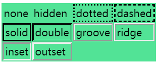
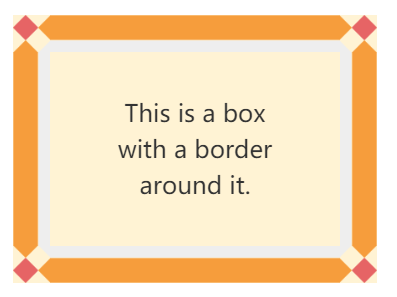
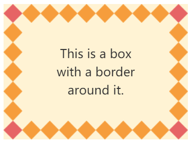
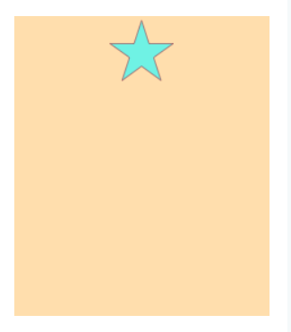
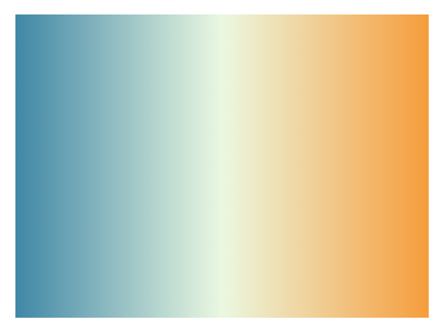
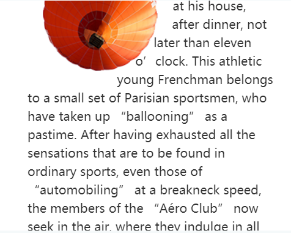

## 盒模型属性

盒模型属性包括宽高、内边距、边框、轮廓和外边距。宽高属性盒外边距在[上一节学习笔记](https://excitedspider.github.io/CSS%E6%9D%83%E5%A8%81%E6%8C%87%E5%8D%97%E5%AD%A6%E4%B9%A0%E7%AC%94%E8%AE%B02/#%E8%A7%86%E8%A7%89%E6%A0%BC%E5%BC%8F%E5%8C%96%E5%9F%BA%E7%A1%80)中已经有讨论，本章着重其他几个属性。几个属性的分布如下图所示（轮廓比较特殊，不在此图中）：


### 内边距

```css
padding: [<length>|<percentage>]{1,4}
```

可以看到内边距属性可以是任意长度值或百分数值。

在示意图中，我们可以看到padding部分也是灰色的，这是为了表示**元素背景会覆盖内边距区域**。

属性可以赋予1到4个值，按照**TRBL(Top Right Bottom Left)**的表示顺序依次赋予四个方向。边框、轮廓、外边距属性也是这样。

百分数值相对于**父元素的内容区的宽度**计算。

### 边框

边框相较于内边距和外边距来说较为复杂。边框的组成除了宽度，还包括样式和颜色。

CSS规定**元素背景会延伸到边框的外边界**。

border-style属性控制边框样式：



border-width属性控制边框宽度，由于CSS对于宽度关键字并没有严格规定，建议使用长度量保证一致的体验：

```css
border-width: [ thin | medium | thick |<length>]{1,4}
```

border-color属性控制边框颜色，接受1~4个颜色值：

```css
border-color: <color>{1,4}
```

简写属性border可以将以上三个属性写在一起：

```css
border: [<border-width> || <border-style> || <border-color>]
```

#### 圆角边框

border-radius属性可以定义圆角边框，该属性涉及几何运算，比较复杂：

```css
border-radius: <length-percentage>{1,4} [ / <length-percentage>{1,4} ]?
where
<length-percentage> = <length> | <percentage>
```

该属性同样按照**左上角到左下角顺时针**的方向可以赋予1~4个值，长度量或百分数值。

最简单的情况就是赋予一个长度量（如8px），会生成一个确定半径的**标准圆角**。

赋予一个百分数值比较特别，如果边框不是标准正方形，由于横向半径百分数值是基于宽度，纵向百分数值是基于高度，**会生成一个椭圆角**而不是标准圆角。

单个圆角可以提供两个值，用`/`符号分隔。两个值分表表示横向半径和纵向半径。用于**准确生成椭圆角**。

#### 图像边框

border-image-source属性可以指定图像边框来源。

border-image-slice属性可以指定边框裁剪给定的图像的方式。

```css
border-image-slice: <number-percentage>{1,4} && fill?
where 
<number-percentage> = <number> | <percentage>
```

如下图所示。一张图像在作为边框图像时会被切割为9个部分，其中9是默认被丢弃，1-8用于边框的八个部分（四个边+四个角）。border-image-slice属性控制的就是这四条切割线的位置。由于其默认值是100%，即默认**图像只出现在四个角上，而且是全部图像**。属性可以赋予四个值，声明顺序同样是**TRBL**。


border-image-repeat属性可以控制边框图像的重复出现。如下例子所示，若背景图像为如下，且slice为33%


默认行为是将图像拉伸以适应边框：



将该属性设置为repeat，可以将图像设置为重复出现:



边框图像存在一个简写属性border-image:

```css
border-image: <'border-image-source'> || <'border-image-slice'> [ / <'border-image-width'> | / <'border-image-width'>? / <'border-image-outset'> ]? || <'border-image-repeat'>
```

### 轮廓

轮廓是一种比较特殊的属性。根据规范，轮廓有以下特点：

+ 轮廓在盒模型中**不占据空间**，对布局没有影响
+ 轮廓可以不是矩形
+ 用户代理通常在`:focus`的时候渲染轮廓
+ 无法设置单边样式
+ 轮廓绘制在**外边框边缘**

属性outline-style可以修改轮廓样式。其可选值与border-style相同。但是**只能同时给四边设置轮廓样式**，而不能指定某一条边的样式。

属性outline-width可以指定轮廓宽度。

### 外边距

外边距在上一篇文章中已经有讨论到。主要内容复习提要：

* 使用`margin`简写属性设置外边距
* 外边距百分数值根据**元素宽度**计算
* 相邻元素**外边距折叠**
* 可以使用**负外边距**使得元素宽高超出父元素

## 颜色与背景

网页的主题配色在现在的用户界面设计中占有很高的地位，颜色、背景、渐变是CSS提供的能力。

### 颜色值

CSS中有效的颜色值包括：

* 具名颜色 如aqua gray
* RGB颜色 如rgb(75%, 50%, 50%) rgb(191,127,127)
* RGBa颜色 rgba(255,255,255,0.5)
* 十六进制RGB颜色 #FF0000
* 十六进制RGBa颜色 #000000FF
* HSL颜色

### 前景色

一般来说，前景色指元素文本的颜色、边框的颜色。

前景色使用color属性声明，接收一个颜色值。

**该属性也会影响到边框颜色**。使用border-color为边框指定颜色会覆盖该行为。

color属性将会被继承。

### 背景色

背景色使用background-color属性声明，接收一个颜色值。

背景会延伸到边框的外边界。使用background-clip属性可以改写该行为。

### 背景图片

背景图片的情况比简单背景色复杂，但也能做出更好的效果。

#### 使用图片

背景图片使用background-image属性声明。该属性的语法较为复杂。常用属性简写如下：

```css
background-image: [<image> # | none
where <image> = <url> | <image()> | <image-set()> | <element()> | <paint()> | <cross-fade()> | <gradient>
```

```css
body { background-image: url(bg.gif) }
```

CSS可以指定多个背景图。行内元素和块级元素都可以指定背景图片。

background-image属性不继承。

背景图片默认覆盖背景色。实践中可以为使用了背景图片的元素再指定一个颜色相近的背景色，避免图片加载不出来时很丑。

#### 定位背景图片

图片背景定位由属性background-position声明。

```css
background-position: <bg-position>
where 
<bg-position> = [ [ left | center | right | top | bottom | <length-percentage> ] | [ left | center | right | <length-percentage> ] [ top | center | bottom | <length-percentage> ] | [ center | [ left | right ] <length-percentage>? ] && [ center | [ top | bottom ] <length-percentage>? ] ]

where 
<length-percentage> = <length> | <percentage>
```

用的较多的就是关键字left | center | right | top | bottom，代表背景图片根据不同的边/中心对齐；

以及两个百分数，代表背景图片与元素框的对齐位置，类似数学中的坐标轴定位，原点在左上角；特别的是，**百分数同时应用到背景图片和元素框上**。比如50% 0代表定位点在元素框(50%,0)的位置，以及背景图片的(50%,0)的位置，如下图：



#### 改变定位框

背景图片默认行为的定位框是元素内边距的外边界。可以使用background-origin属性改变。

```css
backgound-origin: <box>
where <box> = border-box | padding-box | content-box
```

#### 改变重复方式

背景图片默认在填充时重复。可以使用background-repeat属性声明重复方式。

```css
background-repeat: <repeat-style>#
where 
<repeat-style> = repeat-x | repeat-y | [ repeat | space | round | no-repeat ]{1,2}
```

该属性接受的是双值语法，代表横向和纵向。也提供了单值的简写语法：

| **单值**    | **等价于双值**        |
| ----------- | --------------------- |
| `repeat-x`  | `repeat no-repeat`    |
| `repeat-y`  | `no-repeat repeat`    |
| `repeat`    | `repeat repeat`       |
| `space`     | `space space`         |
| `round`     | `round round`         |
| `no-repeat` | `no-repeat no-repeat` |

除了最基本的重复(repeat)和不重复(no-repeat)之外，还支持间排（space）和取整(round)

#### 背景黏附

使用`background-attachment`属性可以声明背景黏附方式，

```css
<attachment>#
where 
<attachment> = scroll | fixed | local
```

属性fixed可以将背景图像固定在视区内。

#### 背景图片尺寸控制

使用`background-size`属性可以控制背景图片尺寸（缩放）。该属性接收1-2个长度量或百分数值。

#### 缩写属性

属性`background`是背景的简写属性，可以以任意顺序书写以下属性：

* background-attachment
* background-clip
* background-origin
* background-color
* background-position
* background-repeat
* background-size

#### 多层背景

CSS可以为元素添加多个背景图层，写法就是以逗号隔开的多个值

```css
background-image: url(bg01.png), url(bg02.png)
```

### 渐变

渐变是只由CSS实现的属性。渐变不仅在背景上可以用到，实际上**在任何使用到图像的地方都可以替代图像**（svg，png，gif等）。

#### 线性渐变

```css
linear-gradient(
  [ <angle> | to <side-or-corner> ,]? <color-stop-list> )
```

其中第一个可选值定义角度或方向，第二个可选值定义颜色列表。由定义我们可以大概推测线性渐变的数学组成：


线性渐变即为沿着渐变线对称的均匀颜色渐变。颜色按渐变线方向梯度变化。多个颜色标均匀分布在渐变线上。

例子：

```css
background: linear-gradient(0.25turn, #3f87a6, #ebf8e1, #f69d3c);
```

效果如下：



#### 径向渐变

径向渐变的形式语法比较复杂，以以下例子代替形式语法：

```css
radial-gradient(circle at center, red 0, blue, green 100%)
```

径向渐变(Radial gradients)由其*中心点*、*边缘形状*轮廓及位置、*色值结束点*（color stops）定义而成。


径向渐变如其名称一样以圆（椭圆）方向向外发生颜色渐变

### Box Shadow

box-shadow属性可以为盒模型添加颜色投影。

```css
box-shadow: none | <shadow>#

where 
<shadow> = inset? && <length>{2,4} && <color>?
```

最多可以给予四个长度量，如以下例子：

```css
/* x偏移量 | y偏移量 | 阴影模糊半径 | 阴影扩散半径 | 阴影颜色 */
box-shadow: 2px 2px 2px 1px rgba(0, 0, 0, 0.2);
```

当给出两个、三个或四个 `<length>`值时。

- 如果只给出两个值, 那么这两个值将会被当作 `<offset-x><offset-y>` 来解释。
- 如果给出了第三个值, 那么第三个值将会被当作`<blur-radius>`解释。
- 如果给出了第四个值, 那么第四个值将会被当作`<spread-radius>`来解释。

## 浮动

浮动是一种非常常用的属性，它是一种令元素脱离正常文档流。

```css
float: left | right | none
```

**浮动的元素对布局仍有影响**。其他正常文档流内容将围绕它流动。

不论元素本身是什么类型，浮动后的元素都是块级元素。

### 容纳块

容纳块containing block对于理解浮动元素的行为非常重要。浮动元素的容纳快是指**最近的块级父辈元素**。

在容纳块中的浮动元素规则如下：

1. 浮动元素的左（右）外边界不能超过容纳快的左（右边界）。

2. **浮动元素不会相互覆盖**。

   这一条规则有许多子规则组成，例如左浮动元素的左边界不超过前面一个左浮动元素的右边界
   
3. 浮动元素**不会撑起容纳块的高度**。（清除浮动问题）

使用负外边距可以使浮动元素在视觉上超出容纳块，也会造成可能的元素重叠。

### 清除浮动

我们通常不喜欢浮动元素超出容纳块的默认行为，需要清除浮动。我们可以使用`clear`属性去控制元素左右不出现浮动元素，使得可能被浮动元素影响的元素尽量远离危险。

```css
clear: left | right | both | none
```

其次，CSS规定浮动元素内的浮动元素会撑起容纳快的高度。我们可以通过将父元素定义为浮动元素的方式来清除浮动。

### 浮动形状

实际上，我们可以创建非矩形的浮动形状。在CSS中，这是很少有的能力，大部分框都是矩形。属性`shape-outside`可以做到这一点。

```css
shape-outside: none | <shape-box> || <basic-shape> | <image>
```

该属性可以直接定义形状，也可以传入图片。如果图片是png或其他有透明通道的格式，将会自动创建出非透明区域的形状。



这个特性还有一些辅助属性：

* 使用透明通道图像时，默认是透明度1创建浮动形状。使用shape-image-threhold属性可以控制透明通道达到什么值的时候创建浮动形状。

    ```css
shape-image-threshold: <number of [0.0, 1.0]>
    ```
    
* 使用shape-margin可以为浮动形状添加外边距：

    ```css
    shape-margin: <length> | <percentage>
    ```

## 定位

另外一种控制元素脱离正常文档流的方法即是定位。定位有途中类型，由属性position指定：

```css
position: static | relative | sticky | absolute | fixed
```

* static：元素处于默认文档流中
* relative：元素相对于正常文档流位置定位
* absolute：元素相对于容纳块定位
* fixed：元素相对于视区定位
* sticky：未触发条件时元素留在默认文档流中，触发条件后相对于低于容纳块定位（类似absolute）

定位偏移量由属性top, right, bottom, left定义，可以接收长度量或百分数值。百分数值上下**相对于容纳块高度**计算，左右**相对于容纳块宽度**计算。

### 控制宽高

属性min-width和min-height可以控制最小宽高，max-width和max-height可以控制最大宽高。

### 溢出控制

溢出是指元素中的内容太多放不下的情况，用属性overflow控制。

```css
overflow: visible | hidden | scroll | auto
```

* visible：允许内部元素溢出
* hidden：将元素溢出部分隐藏
* scroll：为元素添加滚动条，用户需要自己控制滚动条查看溢出内容

### 可见性

属性visibility可以控制整个元素的可见性

```css
visibility: visible | hidden | collapse
```

设置为hidden的元素将会隐藏，但在文档流中会占据位置。

### z轴位置

在进行元素定位时，有时会遇到元素重叠的情况。属性z-index越大的元素处于“上面”。

```css
z-index: <integer> | auto
```

### 绝对定位

position: absolute的元素会从文档流中移除，位置相对容纳块确定。绝对定位元素的容纳快是**position不是static的最近祖辈元素或根元素**。

将bottom之外的偏移量设置为auto，将会导致元素该方向**处于定位为static时**的位置。

绝对定位会产生自动计算，算式是left+margin+border+padding+width+right=容纳块宽度。当全部属性都设置了值时，将会重新计算right属性。

### 相对定位

position: absolute的元素会基于静态位置产生偏移。但并未从文档流中移除，即文档流中还保留了元素的框。

### 粘滞定位

position: sticky的元素同样不会脱离文档流，当满足粘滞条件时将会产生偏移。