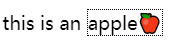

## 表格布局

表格布局是一种存在很久了的布局方式。说实话，因为有flex和grid，我是很少使用这种布局。在常见的前端组件库中表格组件也很少真的使用表格布局实现。而且，限制还很多，甚至有时候通过DOM访问一些特殊的单元格都是不可能的，这是一个巨大的缺陷。在CSS3时代，我们还在学习表格布局的原因，可能就是读老系统的代码，以及支持ie了。

要创建表格，可以使用`<table>`元素，也可以使用`display: table`或`display: inline-table`。

表格布局是行主导的。这意味着需要显式声明行，隐式声明列。例如：

```html
<table border="1">
    <tr>
        <td>row 1, cell 1</td>
        <td>row 1, cell 2</td>
    </tr>
    <tr>
        <td>row 2, cell 1</td>
        <td>row 2, cell 2</td>
    </tr>
</table>
```

行主导也意味着**行上下文的渲染在列之上**。例如仅当行是透明背景，才能显示列的背景。所以我们一般说设置表格的边框、背景，都是说设置行上下文。

事实上，表格中的图层按此顺序从上到下渲染：

* 单元格内容
* 行
* 行组
* 列
* 列组
* 表格底

这也符合HTML表格的声明方式，对子元素设置属性会自然而然地覆盖父元素已设置的属性，不用特别记忆就可以理解。

### 表题

表题元素`<caption>`在HTML规范中只能作为`<table>`的第一个元素，但可以通过CSS选择是显示在表格的顶部或底部：

```css
caption-side: top | bottom
```

### 边框

表格边框有两种表现模式：折叠或分离。这俩的区别类似普通文档流中发不发生外边距折叠。目前标准中默认是分离的。

```css
border-collapse: collapse | separate
```

类似普通元素的外边距，当使用分离边框时，可以设置单元格之间的间距。但此属性只能设置在`<table>`上，对整体布局做设置，而不能单独应用到某个单元格上：

```css
border-spacing: <length> <length>?
```

与普通盒模型可以设置边框样式类似，单元格也可以设置`border-style`、`border-width`、`border-color`和

### 空单元格

空单元格可以通过CSS设置显示与否：

```css
empty-cells: show | hide
```

### 固定宽度布局

默认表格的宽度是使用自动布局。使用`table-layout: fixed`可以使用固定宽度布局。

理论上固定布局的性能更高，因为用户代理不需要计算单元格内容。表格的宽度布局完全由表格第一行元素的`width`确定，当第一行各元素`width`为默认值`auto`时。仅会计算第一行的宽度，如该例子所示：[codepen](https://codepen.io/excitedqe/pen/YzwqaWq)。

### 内容对齐

单元格相当于一个块级框，横向对齐使用`text-align`属性即可，纵向对齐使用`vertical-align`即可。

## 列表布局和生成内容

### 列表布局

列表是一种使用比较广泛的布局形式。列表中的项目是简单的块级框，可以使用块级框属性对列表进行布局。除此之外，还可以定义列表特有的悬挂样式属性。

#### 列表记号

使用`list-style-type`可以改变列表记号类型为某种预设类型。其取值关键字很多，包括圆点、方点、数字序号、汉字序号等等。也可以使用自定的字符串记号（仅firefox）：

```css
list-style-type: "😊";
```

很多时候，用预设的记号不足以满足产品经理的需求，我们需要更加自定义的记号。使用`list-style-image`可以设置记号图像；

列表记号的位置可以通过`list-style-position`设置。不过可选值也就只有内部和外部两种。

```css
list-style-position: inside | outside
```

设置列表记号的属性可以简写为list-style：

```css
list-style: <'list-style-type'> || <'list-style-position'> || <'list-style-image'>
```

#### 列表布局

生成的列表项目是块级框，可以使用块级框的相关属性实现列表的布局。并且，列表记号是不影响布局的，它永远会出现在列表项旁边，类似一个`::before`伪元素的生成内容（下一小节描述生成内容的相关知识）。例如，可以使用外边距控制列表的缩进长度。相对于列表记号，CSS没有专门为列表布局提供特别的样式属性。

### 生成内容

生成内容是什么：**通过CSS插入的内容**，例如使用伪元素`::after`以及`content`属性插入的文本。前面提到的列表记号就是一个典型的生成内容，所以放在这里一起讲解。

除了列表记号，**生成内容都会放入元素框中**，影响元素的布局。例如这个[例子](https://codepen.io/excitedqe/pen/rNxevje)，可以看见为元素加的边框包括了生成内容。



生成内容会从依附的元素上继承属性值，就像子元素继承父元素那样，例如文本颜色、字号、字体等等。

#### content

生成内容最重要的属性就是`content`，它可以作用在伪元素上，我们已经演示过使用该属性插入字符串，也是最简单的用法。

* 图片：使用url函数或image函数可以插入图片，或创建[渐变图片](https://excitedspider.github.io/CSS%E6%9D%83%E5%A8%81%E6%8C%87%E5%8D%97%E5%AD%A6%E4%B9%A0%E7%AC%94%E8%AE%B03/#%E6%B8%90%E5%8F%98)

* 属性值：使用attr函数获取元素属性值，并拼接成字符串

* 引号：关键字quotes或open-quote可以生成引号

* **计数器**：使用countet函数生成计数器（类似列表序号），并拼接成字符串。计数器还有其他许多辅助属性，可以创建非常强大的计数序号，对比word或者其他排版工具创建自定义多级列表应该会对这些比较熟悉：

  * 设置counter-reset的元素是计数起点

  * counter-increment属性设置计数器每次递增的步长

    如该例子[codepen](https://codepen.io/excitedqe/pen/PoZNeEX)，就使用计数器创建了类似学术论文的多级标题模式

  * 除此之外，@counter-style块可以定义更复杂的计数模式，例如交替、符号等等。虽然是标准属性，但目前仅有firefox支持，就不记录了。

## 变形

CSS3变形为CSS提供了一些更图形学意义上的图像变换方式。变形针对CSS中的盒模型元素与SVG元素生效。


### 坐标系

和图形学一样，对图形进行变换最基础的是坐标系的设定。在CSS中，这个坐标系采用了三维表示：x轴（横轴）、y轴（纵轴）、z轴（深度轴）。这也代表了变形具有三维变换能力。如下图所示（来自微软azure文档）：


### tansform

变形使用的最主要的属性是`transform`:

```css
transform: none | <transform-list>
```

* 其百分数基于范围框计算
  * 对于盒模型元素，**范围框是border-box**
  * SVG元素范围框是SVG元素的对象范围框
* transform-list表示可以接收多个变换，中间以空格分隔，代表变换过程，这也与图形学很类似。需要注意的是，根据变换顺序的不同，可能最后得到的变换图像也不同。
* 不能用于行内框

### 变形函数

变形函数提供了图像变形能力。目前主要包含的变形函数包括：

* matrix()：提供最基本的图形学三维矩阵运算变形
* scale(), scaleX(), scaleY(), scaleZ(), scale3d()：提供缩放变形
* rotate(), rotateX(), rotateY(), rotateZ(), rotate3d(): 提供旋转变形
* skew(), skewX(), skewY()：提供拉伸或称倾斜变形
* perspective()：定义用户代理与Z=0平面距离，图形学一点的说法就是定义摄像机位置，或视域。

其中3d变换都需要提供一个三维向量，其他针对某一个轴上的变形可以提供一个百分数或者长度量即可。变形函数所使用的坐标系都如前文[坐标系](#坐标系)小节所述。

### 其他变形属性

除了最著名的transform之外，还有一些其他辅助属性：

* transform-origin 可以定义原点
* transform-style 设置子元素是处于独立的3d平面还是父元素平面中
* perspective 属性可以修改视域大小，可以用来做鱼眼效果


