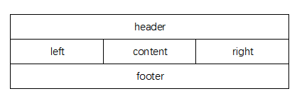

## 弹性盒布局

弹性盒布局是一种文档流布局方式，与常规文档流相比有更强大的布局能力。

弹性盒布局在实现多栏布局、纵向居中等布局场景时特别有效。

### 弹性容器

弹性盒模型依赖父子关系。在元素上声明`display: flex`或`display: inline-flex`便可以激活弹性盒布局。这个元素**随之成为弹性容器**，为其子元素生成弹性格式化上下文，前一个声明的所有**直接子元素**会生成为块级框，后一个会生成行内块级框。

有一些属性可以作用与弹性容器上：

#### flex-direction

```css
flex-direction: row | row-reverse | column | column-reverse
```

flex-direction属性指定弹性容器中如何摆放弹性元素，即定义弹性容器的**主轴**

主轴方向默认是`row`，值与语言书写方向一致。

[codepen](https://codepen.io/excitedqe/pen/gOPYJoB)

#### flex-wrap

```css
flex-wrap: nowrap | wrap | wrap-reverse
```

flex-wrap属性解决的是当弹性容器一行放不下所有元素的情况应该如何表现。

默认为`nowrap`，弹性容器将不换行，允许内容“溢出”。wrap和wrap-reverse即允许换行，区别是向前换行还是向后换行

简写属性flex-flow可以一起定义上述两弹性容器属性：

```css
flex-flow: flex-direction || flex-wrap
```

#### 两轴

弹性盒模型的布局围绕两轴展开：主轴main axis和垂直轴cross axis。元素是先在主轴方向上分布，再在垂直轴方向上分布，就像书写顺序一样。在从左至右书写模式下默认**主轴的方向是横向从左至右，纵轴为纵向从上到下**。


前文提到可以使用flex-direction属性定义主轴方向，那如何定义垂直轴方向呢？垂直轴方向一定是垂直于主轴，而使用flex-wrap本质上就是设置垂直轴方向。

#### justify-content

在默认行为中，如果弹性元素不能填满整个容器，弹性元素将统一向主轴起边靠紧。对弹性容器应用属性`justify-content`可以覆盖默认行为：

```css
justify-content:normal | <content-distribution> | <overflow-position>? [ <content-position> | left | right ]
where 
<content-distribution> = space-between | space-around | space-evenly | stretch
<overflow-position> = unsafe | safe
<content-position> = center | start | end | flex-start | flex-end
```

例如：center可以使元素居中排列，主要值的效果可以看我写的这个[codepen](https://codepen.io/excitedqe/pen/YzwzNRo)实例。

#### align-items

控制弹性容器内**每个元素对垂直轴上对齐方式**进行配置的属性是`align-items`，即元素垂直对齐方式。该属性较简单，一共就以下几种可选值：

```css
align-items: flex-start | flex-end | center | baseline | stretch
```

* **stretch**：默认属性，将元素拉伸为于该行最高/宽的元素高度。如果元素已设置了高度不允许拉伸，则会相对垂直轴起边对齐
* flex-start：相对垂直轴起边对齐
* flex-end：相对垂直轴终边对齐
* baseline：相对基线对齐
* center：相对中线对齐

在**单个弹性元素**上使用align-self属性可以覆盖弹性和容器设置的align-items属性：

```css
align-self: flex-start | flex-end | center | baseline | stretch
```

#### align-content

控制弹性容器内**垂直轴方向上弹性元素行对垂直轴对齐方式**进行配置的属性是`align-content`，其属性可选取值与align-items相同。从定义上可以看出align-content和align-items最大的区别就是**前者应用到每行，后者应用到每一个元素**。

可以查看我写的这个[codepen](https://codepen.io/excitedqe/pen/xxZxrgW)。注意到每个弹性容器中第二个弹性元素的高度被设置了行内样式，导致高度变高。虽然两个弹性盒中的两行元素都对弹性盒居中对齐，但使用`align-items:center`的元素还该元素对该行对齐，而使用`align-items`的元素并没有这样的行为：


### 弹性元素

前文提到，弹性容器内的**直接子元素**称为弹性元素。有一些属性是弹性元素专用的。

弹性元素相对于普通文档流元素也有一些不同的特性：

* 浮动float和清除浮动clear属性不生效
* 不发生外边距折叠
* min-wigth默认为auto，当不允许换行时元素将自动缩减宽度

简写属性flex，以及构成它的flex-grow、flex-shrink、flex-basis用于控制弹性元素的弹性行为。

``` css
flex: [<flex-grow> <flex-shrink>? || <flex-basis>] | none
```

规范推荐使用flex属性去定义弹性元素的弹性行为，而不使用子属性。

#### flex-grow

flex-grow属性控制当有多余空间时是否允许弹性元素增大。该属性始终是一个非负数数字，如果有多余的空间，将会按flex-grow的比例分配个各个弹性元素。只适用于**未显式设置宽度**的弹性元素。如果值为0，则不表现弹性。

#### flex-shrink

flex-shrink属性控制当元素溢出时是否允许弹性元素缩减尺寸。该属性始终是一个非负数数字，如果有弹性元素溢出，将会按flex-shrink的比例将个元素尺寸缩减。只适用于**未显式设置宽度**的弹性元素。如果值为0，则不表现弹性。

#### flex-basis

flex的第三个属性flex-basis是定义弹性元素的默认或初始尺寸。这个属性和width、min-width等强制声明宽度（最大最小宽度）的属性相比，可以使得弹性元素**在设置默认宽度的前提下用有弹性**。

#### 弹性元素与响应式布局

flex-grow属性和flex-shrink属性使得弹性元素能够响应不同的宽度做出行为，**常用于响应式布局中**，而无需使用媒体查询。

如我写的这个实例：[codepen](https://codepen.io/excitedqe/pen/JjGjyPz)，这是一个典型的2行3栏布局。中间的文章article部分会随着浏览器宽度缩放。

#### order

order属性可以控制弹性元素的实际显示顺序。

```css
order: <interger>
```

该属性较为简单，值越大的元素显示顺序越前，值越小的元素显示越后。

## 栅格布局

栅格布局是一类更加普适的布局系统。在栅格布局没有在CSS中出现之前，很多第三方CSS框架和工具都实现了栅格。某种意义上来说，栅格真的是广大CSS开发者翘首以盼的系统了。

### 栅格容器

使用栅格布局的第一步即是创建栅格容器。与弹性容器类似，栅格容器内的直接子元素（包括匿名元素）称为栅格元素。

```css
display: grid | inline-grid
```

前一种声明创建的栅格元素是块级元素，后一种声明创建的栅格元素是行内块状元素

栅格容器有以下特征：

* 栅格不会与浮动元素重合，类似设置了`clear: both`的情况
* 外边距不会把相邻栅格元素推开，而是作用到栅格中，所以也不存在外边距折叠
* 不接受`::first-line`、`::first-letter`等伪元素
* 栅格元素不能设置浮动属性
* `vertical-align`对栅格布局不生效（但可以被继承到栅格元素内部）

栅格布局中重要的组件和定义包括：

* 栅格线：分隔栅格单元的线
* 栅格轨道：两条栅格线之间的整个区域
* 栅格单元：四条栅格先限定的一块区域，内部没有被其他栅格线贯穿
* 栅格区域：由相邻多个栅格单元组成的组成的区域

### 放置栅格线

从前面的定义可以看出，栅格线是组成栅格布局的基础。放置栅格线则是在栅格布局中最重要的一件事。

#### 定义栅格模板

属性`grid-template-rows`和属性`grid-template-colums`可以定义栅格模板，或称显式网格（explicit gird）。两属性语法相同，只是一个作用在横向，一个作用在纵向。

```css
grid-template-rows: none | <track-list> | <auto-track-list>
```

最简单的语法是定义`位置[名称]`的列表，如下：

```css
grid-template-columns: [start col-a] 200px [col-b] 50% 100px
```

该例子会放置4条栅格线，位置为0，200px，200px+50%，200px+50%+100px。其中第一条栅格线有两个名字start col-a，第二条有一个名字col-b，第三条和第四条栅格线妹有名字。尽管妹有名字，可以通过**序号来索引这两条栅格线**。这里用到的单位都是绝对单位，百分比表示相对于栅格容器的宽度/高度。

栅格线的定义**允许超出栅格容器**本身宽度/高度。虽然这个行为常常是我们不想要的。使用minmax()函数可以定义一个区间，栅格布局会自动选取该区间内的一个值来使得栅格刚好填满，避免栅格线溢出栅格容器。例如：

 ```css
 grid-template-columns: minmax(max-content, 300px) minmax(200px, 1fr) 150px;
 ```


除了使用绝对单位，我们还可以使用弹性单位定义栅格线。单位`fr`可以用来以栅格轨道长度比例放置栅格线。

```css
grid-template-columns: 3fr 2fr 1fr
```

该声明将会放置4条栅格线，位置为0，容器宽度的3/6，容器宽度的5/6，容器宽度的100%。除了用来做比例放置，还可以用来做n-1块宽度固定，1块宽度弹性的布局。

关于此，我写了一个[codepen](https://codepen.io/excitedqe/pen/Bajyjjz)可以做一些实验（比如调整浏览器宽度来看看弹性变化）。


另一个弹性定义栅格线的方法是使用关键字max-content和min-content，称为**根据内容设定轨道尺寸**。这是一种很少见的特性，在CSS中，我们通常都是让内容去适应容器而非相反。min-content意为该栅格轨道大小为占据能够显示内容的最小宽度（高度）；max-content意味该栅格轨尽可能做大，防止内容换行。


还有一个根据内容适配轨道尺寸的函数是fit-content，其表达式为：

```
fit-content(arg) = min(max-content, max(min-content, arg))
```

表达式意思很明确，但其意义不太好理解。考虑arg为小于min-content的情况，fit-content可以退化成minmax(min-content, max-content)，这个区间的上界妹有意义，所以只有下界有意义，相当于一种更加灵活的内容适应：**在保证内容能够放下的情况下自动调整宽度**。当arg为大于min-content的情况，fit-content可以退化称minmax(arg, max-content)，我们提供的arg替代了元素本身的min-content值。在本节的[codepen](https://codepen.io/excitedqe/pen/Bajyjjz)中也有演示。


创建栅格线很多的情况下一条一条手写很痛苦，可以使用`repeat()`来创建重复的栅格线定义。

```css
grid-template-columns: repeat(3, 2em, 1fr, 1fr)
```

第一个纯数字表示重复次数，后面可以接任意数量的参数，表示每次重复创建的栅格线位置。该示例创建了10条栅格线。也可以将重复次数的纯数字换位关键字auto-fill，表示要一直重复该模式直到栅格容器填满。

```css
grid-template-columns: repeat(auto-fill, 2em, 1fr, 1fr)
```

### 绘制栅格区域

相比放置栅格线非常数学的方法，我们可以用更加视觉的方法去放置栅格线：

```css
grid-template-area:
"header header header"
"left content right"
"footer footer footer"
```

就可以绘制出一个相应的栅格区域：



绘制出的栅格区域必须是矩形。绘制栅格区域将会隐式创建栅格线别名，例如header区域左边和上边栅格线会创建别名header-start，右边和下边栅格线会创建一个别名header-end。创建的别名将会在附加元素到栅格线时有用处。

### 附加元素到栅格区域内

之前我们放置了栅格线，也绘制了栅格区域，接下来我们就可以往栅格区域内附加元素啦。除了根据顺序依次附加元素到栅格内，我们也可以指定元素到某一个栅格或栅格区域。

##### 行线和列线

在栅格元素上声明grid-row（grid-column）属性可以用来简单的把元素按照栅格线按照行线（列线）附加到某个栅格区域内。

行线可以使用数字，代表第几条行线；也可以使用行线的别名；也可以引用栅格区域。**引用栅格区域将会自动添加-start或-end后缀来找到栅格线**，这就是前文说的绘制栅格区域时创建栅格线别名的用处。

```css
.one {
    grid-row: 2 / 4;
    gird-column: 2 / 4;
```

该例子非常简单，将会绘制出一个矩形，左上角(2,2)，右上角(4,2)，右下角(4,4)。

使用span后加数字表示占用多少栅格，所以上例也可以写成

```css
.one {
    grid-row: 2 / span 2;
    gird-column: 2 / span 2;
}
```

-1是有意义的行索引，表示最后(最下)一行。列类似。

其实grid-row（grid-column）属性是 grid-row-start 和 grid-row-end（ grid-column-start 和 grid-column-end ）的缩写，但一般不使用子属性来定义，看起来太难看了。

不带第二个值将会使得第二个值为auto，当引用的是名称时，auto是相同的名称引用。当引用栅格区域时，因为浏览器会自动添加后缀，所以两个值就代表着该区域的-start和-end。这样写起来比较简单。

##### 隐式栅格

当元素占用了显式栅格（由栅格模板定义的栅格）之后还不足以放下元素，浏览器会创建隐式栅格以放下元素。自动增加的栅格轨道尺寸是为了放下元素所需的最小尺寸。很明显这是一个边界问题，具体机制本文不细致提及。

##### 附加到区域

如果需求是附加到栅格区域内，将可以使用一种更简单的属性grid-area，直接指定栅格区域即可。

```css
div.footer {
    gird-area: footer;
}
```

##### 栅格流

刚才我们讨论的是显式附加元素到栅格和栅格区域内。在栅格容器内的元素也可以不显示指定，让其**自动进入栅格排列**中，称位栅格流。栅格流有两种模式：行优先和列优先。

```css
grid-auto-flow: [row | column] || dense
```

很好理解，可以看这个[例子](https://codepen.io/excitedqe/pen/abdzZjY)

在栅格流中，也可以使用跨多个栅格的栅格区域，诀窍是将grid-row和gird-column第一个值设置为auto：

```css
grid-row: auto / span 2
```

设置为auto使得栅格元素进入栅格流中排列，而span 2说明该元素占用跨度为2的栅格区域。

栅格元素具有跨度会导致栅格容器可能填不满。添加dense可以使得栅格元素的排列不再严格按照行优先或列优先，而是在行优先或列优先的基础上尽量填满栅格容器。

### 简写属性grid

grid是一个集大成的简写属性，其正规语法是：

```css
grid: <'grid-template'> | <'grid-template-rows'> / [ auto-flow && dense? ] <'grid-auto-columns'>? | [ auto-flow && dense? ] <'grid-auto-rows'>? / <'grid-template-columns'>
```

因为集成了很多前面讲的属性，看起来很乱，据一些例子：

```css
grid: repeat(3, [line1 line2 line3] 200px) / auto-flow 300px;
grid: [line1] minmax(20em, max-content) / auto-flow dense 40%;
```

确实是非常复杂，可能看半天都可能百思不得其解，只能多看看实例了。我感觉简单的栅格用用这个属性还行，复杂栅格就真的可读性很差了，没内水平还是别动这个简写属性吧。

### 释放栅格空间

我们先前定义的栅格元素大多挤在一起，而且我们知道外边距对于栅格元素在栅格容器中的排列是无效的。常常需求中需要将元素之间拉开距离，有多种方法可以做到这一点。

#### 栏距

栏距由属性`row-gap`和`column-gap`定义，较为简单

```css
row-gap: <length> | <percentage>
```

栏距有一个简写属性`grid-gap`

#### 盒模型属性

我们前面提过栅格元素的**外边距是作用到栅格**上，而不与其他栅格内的元素产生反应。这就导致了一个特性：我们可以通过将外边距设置为auto来让栅格元素相对于栅格居中对齐（横向和纵向都可以）

当我们使用绝对定位，**栅格区域**将作为定位上下文。通过绝对定位和偏移属性（如top）也可以将栅格之间的空间释放出来。

### 对齐栅格

和弹性布局类似，栅格布局也有一些指定对齐方式的属性。`justify-*`前缀的属性都是定义行内方向（横向）对齐方式，`align-*`前缀的属性都是定义块级方向（纵向）对齐方式。取值和值的意义也与弹性布局中的对齐方式类似：

```css
auto | normal | stretch | <baseline-position> | <overflow-position>? <self-position>
where 
<baseline-position> = [ first | last ]? baseline
<overflow-position> = unsafe | safe
<self-position> = center | start | end | self-start | self-end | flex-start | flex-end
```

`justify-self`和`align-self`在栅格元素上声明，定义该**栅格元素相对于容纳自身的栅格**的对齐方式。

`justify-items`和`align-items`在栅格容器上声明，定义**该栅格容器内的所有栅格元素相对于容纳自身的栅格**的对齐方式。可以理解为将`justify-self`和`align-self`应用到栅格容器内的所有栅格元素上。

`justify-content`和`align-content`在栅格容器上声明，定义**全部栅格相对于栅格容器**的对齐方式。就比较类似弹性布局中的`justify-content`和`justify-content`，也保持了语义的一致。

### 分层

栅格元素是允许重叠的。在栅格元素大于栅格区域大小时就很容易发生重叠。分层的方法可以使用我们最熟悉的`z-index`属性。同时，`order`属性在栅格布局中语义变成了层次序号（弹性布局中`order`表示显示顺序），我们也可以使用`order`来排列层次。但就我的观点而言，为了可读性起见，最好不要用容易引起歧义的`order`，而是用大家都熟悉的`z-index`。


#### 