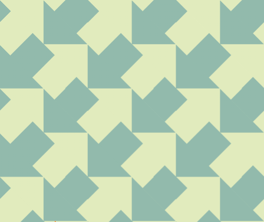
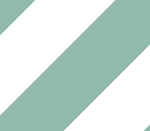
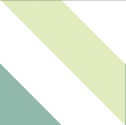
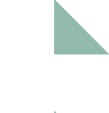
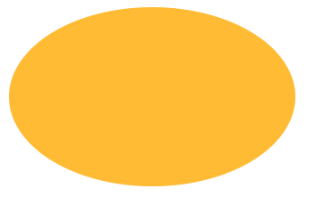
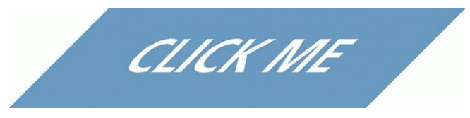
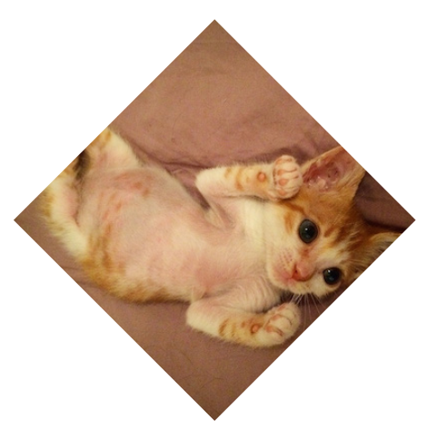

## 背景与边框

### 创建更复杂的背景图案

[上一篇笔记](https://excitedspider.github.io/CSS揭秘读书笔记1/)使用了CSS渐变来创建条纹图案。其实，CSS渐变是非常强大的，除此之外还可以创建许多其他图形。

作者维护了一个纯CSS渐变创建背景图案的示例网站，非常惊艳：https://leaverou.github.io/css3patterns/

例如以下背景图案：



它是如何使用CSS渐变创建的呢，其实是由三个渐变条纹图案的叠加（其中白色部分表示的是透明），再加上底色就完成了：







这三个部分使用上节的CSS渐变条纹很容易创建。我觉得，做这种工作主要是靠图形想象力了。拆开来看根本看不出来这三个图案可以拼出来可重复的箭头图案。

### 伪随机背景图案

CSS并没有提供随机生成图案的能力，但我们可以通过设置多重背景的方式的方式来模拟随机背景

[Playground](https://dabblet.com/gist/4b4ad05f4c1b5259066f)

### 连续图像边框

我们知道CSS3中提供了一个图像边框属性border-image。但是，这个属性是根据九宫格切割图像形成图像边框的，会造成四边的图像拉伸或重复，而不是连续线性的切割。当我们想要实现连续的图像边框时，我们还是使用到背景图案的方法。当然，使用两个元素分别设置背景是最简单的的，但使用一个元素同样可以：

```css
background: linear-gradient(white, white), url(stone-art.jpg)
```

[Playground](https://dabblet.com/gist/55b5f131c45702a55684)

为什么这里要使用纯色渐变呢？因为只有**图像背景才能叠加在图像背景上，颜色背景一定被图像背景覆盖**。因为渐变创造出来的不是颜色而是图像，所以可以这样用。

## 形状

### 自适应椭圆

自适应椭圆是一个元素，当任意设置其宽高时其content都在视觉上是椭圆形状。很容易想到想实现这种效果是使用border-radius属性。而且，border-radius有一个鲜为人知的特性：可以单独指定水平和垂直半径，使用斜杠符号(/)分隔。这样我们就可以创建一个椭圆：

```css
width: 200px;
height: 150px;
border-radius: 100px / 75px;
```

那我们如果要获取自适应椭圆呢？其实，border-radius还有一个鲜为人知的特性是可以设置百分比，水平和垂直半径正好对应长宽的百分比，如下即可：

```css
border-radius: 50% / 50%;
border-radius: 50%; /* 或者直接给50%，等价于上面的写法 */
```

[Playground](https://dabblet.com/gist/aada0b96b21ae3e45c1b)



### 平行四边形

平行四边形也是一类很常见的图形。因为CSS盒模型都是矩形，而CSS3提供了变形(transform)可以将元素进行斜向拉伸，我们可以轻松地使用纯CSS创建平行四边形：

```css
transform: skew(-45deg);
```

然而，这会导致内部内容也斜向拉伸：



解决方案可以是简单地对内容元素再应用一次反向的`skew()`变形，这不必多说，是最简单的解决方案。

另外一种比较取巧的解决方案是将所有的背景相关样式（包括背景颜色、变形、边框等等）都用在伪元素上，而不影响内容样式的排版，也不会产生多一次反向变形的代码冗余，比较巧妙：

```css
.button{
    /*内容样式*/
}
.button:: before{
    content: '';/*创建一个空的伪元素*/
    position: absolute; /*让其从文档流中脱离，不影响内容排版*/
    z-index: -1; /*放在内容下方*/
    top: 0; right: 0; bottom: 0; left: 0; /* 自动拉伸到和元素本身一样大*/
    background: #58a;
	transform: skew(45deg); /* 斜向拉伸 */
}
```

这个技巧对于其他需要使用变形创建的背景图案同样适用。

[Playground](https://dabblet.com/gist/f2d98791ab1f0b238aa9)

### 菱形图片

如何把图片裁切为菱形呢



#### 变形方案

我们可以用类似创建平行四边形的方法，对容器进行旋转，再对内容进行反向旋转。

```css
.diamond {
	width: 250px;
	height: 250px;
	transform: rotate(45deg);
	overflow: hidden;
	margin: 100px;
}

.diamond img {
	max-width: 100%;
	transform: rotate(-45deg) scale(1.42);
	z-index: -1;
	position: relative;
}
```

这里有个比较特别的`scale(1.42)`如何理解呢？是因为max-width设置的百分比宽度是指图片大小与容器宽高一致，而菱形图片的宽高应该是与容器对角线一致。所以这里使用一个`scale(1.42)`，也就是根号2来实现这一点。

[Playground](https://dabblet.com/gist/7563400)

#### clip-path方案

上面的变形方案只能对正方形图片生效，而且有一种hack的味道。而CSS3提供了一个正式的图片裁切属性`clip-path`，使用这个属性制作菱形或者其他多边形、椭圆裁切的图片非常方便，而且不管图片本身是什么形状都不会影响表现：

```css
clip-path: polygon(50% 0, 100% 50%, 50% 100%, 0 50%)
```

就是这么简单可以实现相同的效果。但可惜的是，并不是所有浏览器都支持这个属性

[Playground](https://dabblet.com/gist/c62456fed36a524b8273)

### 切角效果

扁平化设计中比较常见的一种设计是切角，在按钮和面包屑上非常普遍。

对于CSS来说，创建切角效果可以使用渐变方案：

```css
background: #58a; /* 退化样式 */
background: linear-gradient(-45deg, transparent 15px, #58a 0);
```

[Codepen](https://codepen.io/excitedqe/pen/yLevMvw)

这里使用了一个退化样式技巧，避免在线性渐变不能用的情况下也能显示无切角的背景，如果在支持线性渐变属性的浏览器中，会被后一条切角样式覆盖。


这里我们创建的是简单的直线切角，那如何创建弧形切角呢？很容易想到不使用线性渐变而是使用径向渐变。

```css
background:radial-gradient(circle at bottom right, transparent 15px, #58a 0) bottom right
```


[Playground](https://dabblet.com/gist/24484257bc6cf7076a8e)

