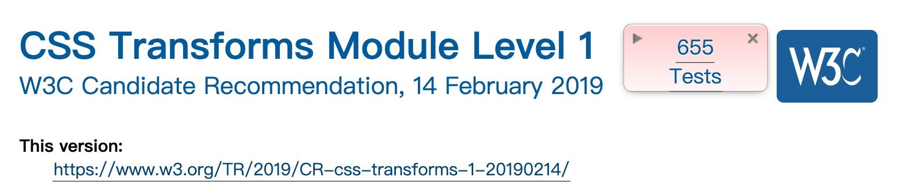
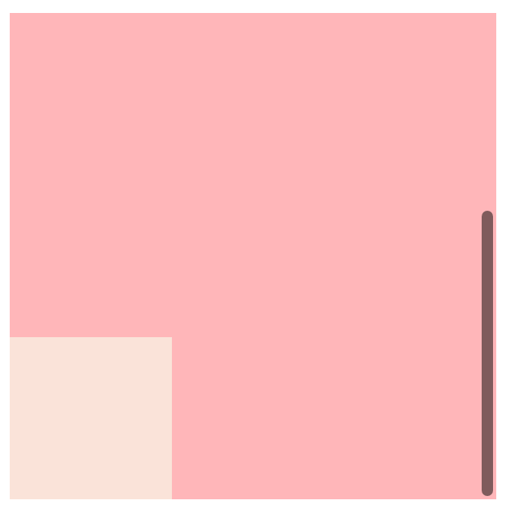

## 失效的 `position: fixed`

现在有很多设计都是做相对视口固定的效果，例如：阅读文章时有一个固定的返回顶部按钮、电商页面有一个获取帮助的固定按钮。


<center>
  <br>知乎上的固定悬浮按钮
</center>


人尽皆知的是 `position:fixed` 可以用来做这种相对视口固定的效果。但笔者在使用 `position:fixed` 时曾经遇到过问题：设置`fixed`的元素嵌套在一个使用了`transform`的祖先元素中，导致了`fixed`失效。简易的还原例子可以看这个[codepen](https://codepen.io/excitedqe/pen/abNWrNB)。

我们可以在[MDN](https://developer.mozilla.org/zh-CN/docs/Web/CSS/position)上看到关于这个问题的描述:

> 当元素祖先的 `transform`, `perspective` 或 `filter` 属性非 `none` 时，容器由视口改为该祖先。

那解决方案也十分明显了，有以下可以待选的方案：

* 将元素放置在`transform`的父元素之外。比如react就提供了[Portals API](https://zh-hans.reactjs.org/docs/portals.html)，提供了将子节点渲染到父组件之外的DOM节点之外的方法。不借助任何框架的情况下，也可以用DOM API去解决这个问题。
* 在运算`top`、`left`等定位属性时加上父元素造成的偏移。但是这就失去了`fixed`的特性，变得和`absolute`一样了。

## 深入一点

MDN 这里的描述显然是说的一个结果。那么是什么机制造成了这个结果呢？这时候就要翻出 w3c 的标准来看了。在CSS Transforms Module 标准的 [The Transform Rendering Model](https://www.w3.org/TR/css-transforms-1/#transform-rendering)章节详细介绍了这个现象的来源。标准中明确写出：

> For elements whose layout is governed by the CSS box model, the transform property does not affect the flow of the content surrounding the transformed element. However, the extent of the overflow area takes into account transformed elements. This behavior is similar to what happens when elements are offset via relative positioning. Therefore, if the value of the [overflow](https://www.w3.org/TR/css-overflow-3/#propdef-overflow) property is [scroll](https://www.w3.org/TR/css-overflow-3/#valdef-overflow-scroll) or [auto](https://www.w3.org/TR/css-overflow-3/#valdef-overflow-auto), scrollbars will appear as needed to see content that is transformed outside the visible area. Specifically, transforms can extend (but do not shrink) the size of the overflow area, which is computed as the union of the bounds of the elements before and after the application of transforms.
>
> For elements whose layout is governed by the CSS box model, any value other than none for the [transform](https://www.w3.org/TR/css-transforms-1/#propdef-transform) property results in the creation of a stacking context. Implementations must paint the layer it creates, within its parent stacking context, at the same stacking order that would be used if it were a positioned element with [z-index: 0](https://www.w3.org/TR/css3-positioning/#propdef-z-index). If an element with a transform is positioned, the z-index property applies as described in [[CSS2\]](https://www.w3.org/TR/css-transforms-1/#biblio-css2), except that [auto](https://www.w3.org/TR/css3-positioning/#valdef-z-index-auto) is treated as 0 since a new stacking context is always created.
>
> For elements whose layout is governed by the CSS box model, any value other than none for the [transform](https://www.w3.org/TR/css-transforms-1/#propdef-transform) property also causes the element to establish a containing block for all descendants. Its padding box will be used to layout for all of its absolute-position descendants, fixed-position descendants, and descendant fixed background attachments.

翻译和总结一下，transform 对其他元素渲染的副作用有：

* transform 的元素会影响**overflow area** (溢出区域)。也就是说，使用transform使得元素移出了父元素之外的话，在父元素上使用`overflow: scroll`和`overflow:auto`的情况下，父元素将会展示出滚动条。
* transform 的元素会创造一个**stack context** (层叠上下文)，造成内部和外部的z-index相互独立。
* transform 的元素将会创建一个 **containing block** (包含块)，所有的`position`为`absolute`和`fixed`的子元素、以及设置了`background-attachment`的背景将会相对于该元素的 padding box 布局。

> 这篇文章如果要找出一个最重要的地方，那就是这三个副作用了。



<center>当前的 CSS Transforms 标准</center>


第三个规则则是造成了`fixed`失效的直接原因。除了造成笔者遇到的问题的第三条之外，我们可以用例子来详细看看这其余的两个副作用：

### 🌰 overflow area


<center>
<br>
需要拖动滑动条才能看见的子元素
</center>

```html
<div class="container">
  <div class="transformed-item"></div>
</div>
```

```css
.container{
  height: 300px;
  background: #ffb6b9;
  overflow: scroll;
}

.transformed-item{
  height: 100px;
  width: 100px;
  background-color: rgba(250,227,217,1);
  transform: translateY(400px);
}
```

你可以点击这个 [codepen](https://codepen.io/excitedqe/pen/mdPmNEO) 看看实际效果

### **🌰 stack context** 

stack context(层叠上下文)内部元素的z-index才能有互相作用。对于外部则不起作用，而是以层叠上下文整体的z-index（也就是根元素z-index）去相互比较。


<center><br>z-index为10的元素叠在了z-index100 的元素之上</center>

```html
<div class="normal_container">
  <div class="normal">z-index:100</div>
</div>
<div class="transform_container">
  <div class="transformed">z-index:10</div>
</div>
```

```css
div{
  height: 200px;
  width: 200px;
  padding: 16px;
  color: white;
}

.normal_container{
  z-index:0;
}

.normal{
  background: #ffb6b9;
  z-index:100;
}

.transform_container{
  z-index: 1;
  transform: translate(100px,-100px);
}

.transformed{
  background: #fae3d9;
  z-index:10;
}
```

你可以点击这个 [codepen](https://codepen.io/excitedqe/pen/OJNmKpj) 看看实际效果

## containing block 包含块

为了更加完整地理解我们遇到的这个问题，需要解释另一个概念**containing block**(包含块)。

### 包含块可以做什么

这个概念在 CSS2 被提出，是作为元素渲染的非常基本的概念。一些属性如`width`, `height`, `padding`,`margin`, `top`, `left`, `right`, `bottom`等等与布局相关的属性被设置为百分比时，其实就是相比于包含块的相对单位。除此之外，包含块还决定了overflow (溢出)行为。当内部的元素超出了其包含块的范围，就会造成溢出。

### 包含块如何确定

大多数情况下，包含块就是这个元素最近的祖先[块元素](https://developer.mozilla.org/zh-CN/docs/Web/HTML/Block-level_elements)的[内容区](https://developer.mozilla.org/zh-CN/docs/Web/CSS/CSS_Box_Model/Introduction_to_the_CSS_box_model#content-area)。但是对于position 不为`static`的元素来说，规则有所变化：

* 如果 position 属性为 `absolute`，包含块就是由它的最近的 position 的值不是 `static` 的祖先元素的内边距区的边缘组成。
* 如果 position 属性是 `fixed`，在连续媒体的情况下(continuous media)包含块是 [viewport](https://developer.mozilla.org/zh-CN/docs/Glossary/Viewport) ,在分页媒体(paged media)下的情况下包含块是分页区域(page area)。
* 如果 position 属性是 `absolute` 或 `fixed`，包含块也可能是由满足以下条件的最近父级元素的内边距区的边缘组成的：
  * `transform`或`perspective` 不为`none`
  * `filter`不为`none`
  * `will-change`为`transform`或`perspective`
  * `contain` 为`paint` (这个属性虽然冷门很有意思，希望大家都看看)

也就是说，不光光是`position:fixed`，连`position:absolute`也会被`transform`生成的包含块所影响。

## 一点思考

为什么w3c会为了transform单独这样设计呢？我觉得最大的考虑点还是w3c委员会认为transform的元素及其子元素应该是一个整体。这个设计的好处其一是更符合逻辑，可以类比一下ppt、figma、sketch中已组合的元素，他们的缩放、位移、动画等等变换都是一起的；其二是这样设计可以尽量减少对外部布局的影响，也减少外部对transform内部布局的影响，这样的话，浏览器引擎可以减少很多计算量。

当然我也没有看 w3c 会议的相关邮件，这仅仅是我的猜测～

