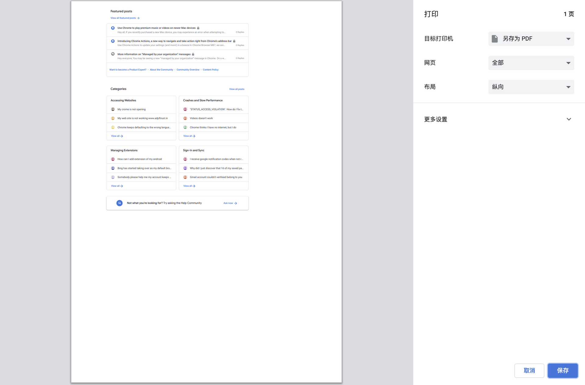

## 背景

在一些数据报表类型的项目中，用户一般会希望能够将数据保存下来。除了常规的下载 excel 文件之外，也可以尝试生成 PDF 文件。相比于 excel，PDF 最大的优点是能够附带复杂的样式，而且方便用户打印。

## 前端？后端？

在项目中 Excel 生成一般由后端承担，因为有许多很方便的 SQL 结果直接导出生成 Excel 文件的工具库，开发成本比较低。那么 PDF 呢？

在我们的项目中，选择了**前端生成**的方案，why？
- PDF 带有大量的排版样式，属于前端的关注点
- 相较于在后端命令式的绘制，基于前端网页样式“打印” PDF 开发成本更低

## 技术方案对比

### 浏览器打印

这是能够直接想到的方案，也是最符合浏览器标准的。简单描述步骤为: 调用浏览器打印机，选择 PDF 打印机，将页面打印保存即可。

对于 PDF 样式，可以使用媒体查询调整，例如：
```css
@media print {
  body { font-size: 10pt; }
}

```

浏览器打印的方案看起来很理想，实际很难用。最麻烦的是，没有浏览器接口来配置打印机。在标准中，调用浏览器打印就一个方法:

```js
window.print()
```

对，在[w3c标准](https://html.spec.whatwg.org/multipage/timers-and-user-prompts.html#printing)中这个方法就没有任何配置项，调用这个方法，会直接调用浏览器的打印对话框。



这就需要用户手动配置打印机，体验比较差。而且不同的浏览器实现的打印对话框可能还不相同，这就很难搞了。如果对于 PDF 样式要求比较低，可以采用这种方案。

> 很多浏览器厂商也在推进更好的打印体验，比如 firefox 和 chrome 都推出了 [silent print](https://bugs.chromium.org/p/chromium/issues/detail?id=31395#c4) 功能，不过目前属于需要用户手动配置开启的实验功能，没法在生产环境使用。可以期待今后的发展。


### 使用 PDF 开源库

相比于不可控的浏览器打印，手动控制 PDF 生成可以达到对样式更精准控制。也可以做到静默生成，不会像浏览器打印一样弹出打印对话框。

有很多 JavaScript 开源库可以用来操作 PDF，其中比较热门的一个是 [JsPDF](https://artskydj.github.io/jsPDF/docs/index.html)，在 Github 上拥有 20k starts，我们的项目中就采用了他。使用起来比较类似 Canvas 的命令式绘制:

```js
var doc = new jsPDF();

doc.text('Hello world!', 10, 10);
doc.line(0,0,10,0,'S');

doc.save('a4.pdf');
```

另外还有 [html2pdf](https://github.com/spipu/html2pdf)这个库，基于 JsPDF 开发，据作者描述是可以用来直接将页面转化为 pdf 文件。但在本文编写时已经有1年没有更新，issues 也都没有回复，看起来是弃坑了。

## 代码实现

首先需要介绍另外一个开源库 [html2canvas](https://github.com/niklasvh/html2canvas)，这是一个基于 Canvas 实现的 html 渲染器。

实现思路可以简单地描述为: html -> canvas -> image -> pdf，其中每一步:
- 使用 html2canvas 将页面 HTML 结构绘制到一个 canvas 上
- [CanvasElement.toDataURL()](https://developer.mozilla.org/zh-CN/docs/Web/API/HTMLCanvasElement/toDataURL) 可以将 canvas 导出为图片数据
- 使用 js2pdf 将图片添加到 PDF 文件中，并按业务调整 PDF 分页
- 保存文件

大体思路就是这样，如果你还有时间，我们还有很多实现细节优化可以谈谈。

### with React

集成在 React 组件中是一个常见的需求。我们为页面根组件添加一个新的 prop `onGeneratePDF` 和新的副作用:

```jsx
const { onGeneratePDF } = props;

/**
* effect: 在pdf模式下且页面已经加载完成，构造 canvas generator
*
* 其他 dependencies: 
* loadComplete 页面加载的标志state
* containerRef 页面根组件的 ref
*/
React.useEffect(() => {
    if (loadComplete && onGeneratePDF && containerRef.current) {
      const canvasNode = html2canvas(containterRef.current)
	  onGeneratePDF(new JsPDF(canavsNode))
    }
}, [loadComplete, onGeneratePDF, containerRef]);
```

当用户点击下载按钮:

```jsx
const onClickDownload = async () => {
  const pdf = await new Promise((res) => {
  ReactDOM.render(
    /** 页面组件 */
    <MyPage onGeneratePDF={res}></MyPage>,
    /** 一个隐藏节点 */
    rootDiv,
  );
		
  pdf.save('数据报告.pdf');
  });
}
```

这里的代码经过了大量简化，真实实现可以参考文章末尾的链接。

### 避免过大 Canvas 绘制导致卡顿

由于 html2canvas 依赖浏览器 canvas 实现，如果一次绘制大量内容，可能会导致页面帧数突然降低。为了避免这种情况，我们可以采用将页面的子元素串行绘制，一次只画一小块内容，最后拼接到一起。

我写了一个小的实用类来做这件事:
```typescript
export class CanvasGenerator {
  private elementsToPaint: HTMLElement[] = [];
  private currentPaint = 0;

  constructor(generateRoot: HTMLElement) {
    this.elementsToPaint = Array.from(generateRoot.children)
  }

  public *generateSlice() {
    while (this.elementsToPaint.length > this.currentPaint) {
      yield {
        canvasNode: html2canvas(this.elementsToPaint[this.currentPaint]),
        index: this.currentPaint,
        total: this.elementsToPaint.length,
      };
      this.currentPaint = this.currentPaint + 1;
    }
  }

  public getNumOfSlices() {
    return this.elementsToPaint.length;
  }
}

```

这个类接受页面的根元素，构造一个 generator 函数，让开发者可以手动控制。

🌰
```js
// 使用页面跟组件构造 generator
const generator = new CanavsGenerator(pageRoot).generateSlice();
const slices = [];

let slice = generator.next();

while (!slice.done) {
    const canvasNode = await slice.value.canvasNode;
    slices.push({
      width: canvasNode.width,
      height: canvasNode.height,
      datauri: canvasNode.toDataURL('image/png'),
    });

    slice = generator.next();
  }

console.log(slices) // 一个图片数组，下文还有用
```

这样手动控制串行生成还有一个好处：能够获取当前绘制进度信息。有了这个信息，我们就可以画一个进度条，具体细节后文讨论。

### with Webworker

将 PDF 生成的任务放进 Webworker 中，可以避免浏览器主线程阻塞。

> 如果不了解 webworker，可以参考 [MDN 使用 WebWorker](https://developer.mozilla.org/zh-CN/docs/Web/API/Web_Workers_API/Using_web_workers)

> 我们用了[workerize-loader](https://github.com/developit/workerize-loader)这个webpack loader 来简化 worker 开发。这个库非常赞，作者是 preact 的作者 developit，大神出品 👍

worker 进程:

```js
// pdf.worker.js

/*
* @params slices 上一小结生成的图片数组
*/
export function generatePDF(slices) {
  const pdf = new Jspdf('portrait', 'px');

  for (let index = 0; index < slices.length; index = index + 1) {
    const slice = slices[index];
    // 将每个子元素作为 pdf 的一页内容
    pdf.addPage([slice.width, slice.height]);
    pdf.addImage(slice.datauri, 'PNG', 0, 0, slice.width, slice.height);
  }

  // 将 pdf 转为字符串输出，因为 worker 和主线程之间传递消息 postMessage 只能接受字符串
  return pdf.output('datauristring');
}

```
在页面进程中，构造 worker 并等待完成后下载：

```jsx
// page.tsx

import PDFWorker from 'workerize-loader!./pdf-utils/pdf.worker.js'; 

const dataUri = await PDFWorker().generatePDF(slices)
const a = document.createElement('a');
a.href = dataUri;
a.download = 'file_output.pdf';
a.click();
```

### 漂亮的进度条

与普通的下载不同，这样前端生成 PDF 可能会消耗更多的时间在绘制，并不会直接将文件加入浏览器下载列表。如果时间过长，用户可能会觉得页面没反应卡住了。

在这样的场景下，如果有一个进度条，指示当前进度，可以大大提升用户体验。

前文提到，在 Canvas 绘制中，我们用了一个 Generator 函数，在循环中可以很方便地获取当前绘制进度:

```js
let paintIndex = 0;

/** 一共需要绘制的元素数量 */
const totalElementToPaint = root.children.length;

while(!slice.done){
  await slice.canvas;
  paintIndex = paintIndex + 1;
  // 计算得到当前绘制进度
  console.log(paintIndex / totalElementToPaint);
  slice = generator.next()
}
```
在生成 PDF 的 worker中，我们也可以用 postMessage 机制来向主进程传递当前进度:
```js
// workder.js
for (let index = 0; index < slices.length; index = index + 1) {
    const slice = slices[index];
    pdf.addPage([slice.width, slice.height]);
    pdf.addImage(slice.datauri, 'PNG', 0, 0, slice.width, slice.height);
	
    self.postMessage({
      type: 'process-report',
      value: (index + 1) / slices.length,
    });
}
```

```tsx
// page.tsx
workder.addEventListener('message', msg => {
    if (msg.data.type !== 'process-report') {
      return;
    }
	
    // 从 worker 中获得当前进度消息
    console.log(msg.data.value);
})
```
这样进度信息就齐全了，剩下的就是调调动画，画一个好看的进度条，这里就是个人发挥了。


### html2canvas 中的坑

> 首先我必须说，这个项目还是非常厉害的，相当于作者用 canvas 实现了一个浏览器绘制引擎，能够解析 html 结构、css 样式等等。但是商业团队做的浏览器都可能有 bug，何况是个人的开源项目呢？

- 不能在页面未加载完成时生成 Canvas
	- 在 React 组件中添加一些 effect 和 hooks 来监控页面加载状态
- 关闭动画
- 避免使用一些 css hack，可能 html2canvas 并不能实现
- 注意浏览器的单个 canvas 是绘制像素数量上限的
- 在多个浏览器中测试

## 附