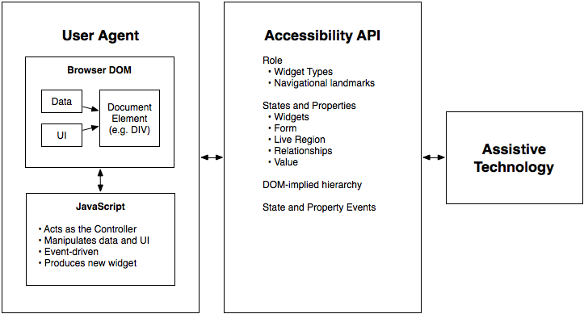
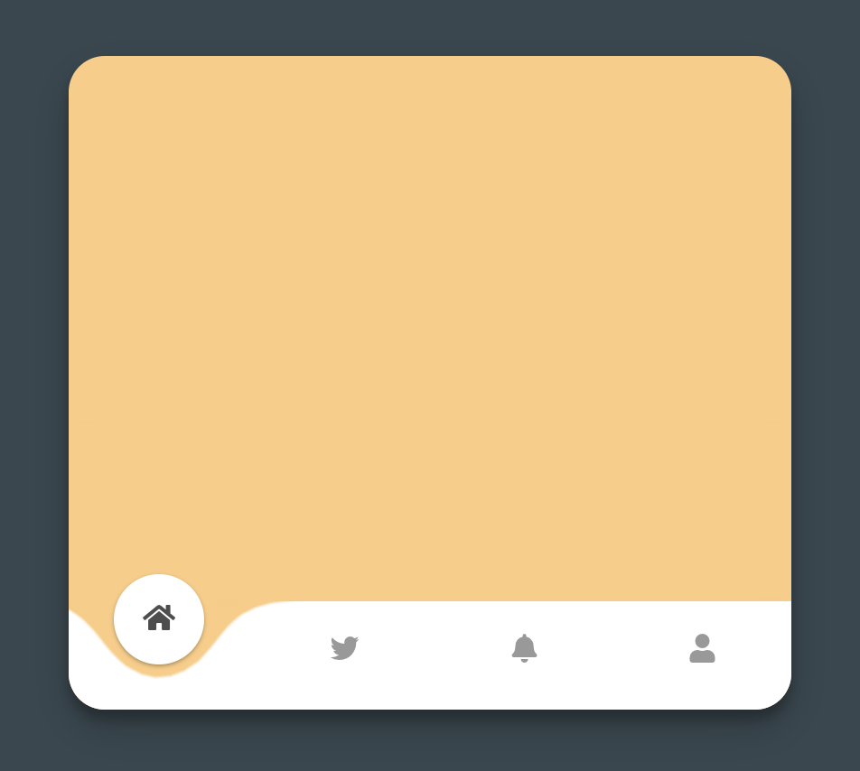
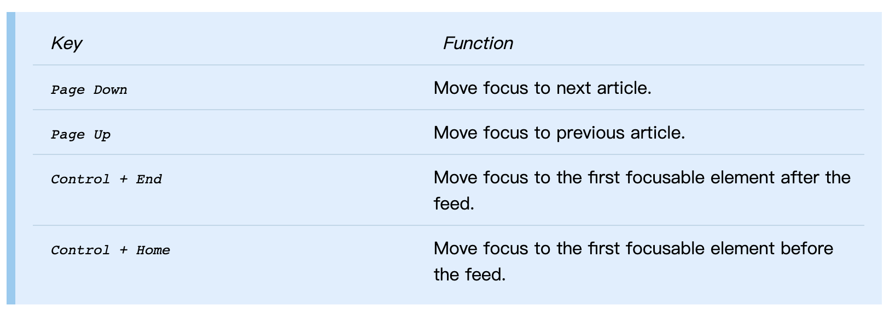

## WAI-ARIA 是什么？

> WAI-ARIA Authoring Practices 1.1 - The W3C Working Group Note： 
Functionally, ARIA roles, states, and properties are analogous to a CSS for assistive technologies.

ARIA，全称 Accessible Rich Internet Applications，是一项旨在提高 web 内容的可用性和互操作性的技术标准。

ARIA 标准可以让 HTML 的作者可以在确保语义不冲突的情况下，为元素添加 roles, states, properties 和键盘支持，来提升 web 应用的可用性。


可用性 API 的交互模型

## 为什么我们需要 ARIA？

我想用一个例子来回答这个问题。

现在的页面复杂度越来越高，有很多的功能不能由原生的 HTML 功能去实现，或者原生 HTML 标签的一些行为成为了开发的阻碍（比如 `<li>` 标签的浏览器自带样式经常造成困扰），web 开发者会使用`<div>`、`<span>` 等比较纯粹的 HTML 标签，配合大量的 JavaScript、CSS、SVG 来实现这些功能。比如一些复杂的选择器组件、HTML 没有的滑块组件等等。

例如下图这个fancy的卡片，他的底部有一个导航菜单。这个组件用了大量的 svg 和 css 来搭建。



它的底部菜单的 HTML 主要结构为：

```html
<div id="bubbleWrapper">
  <div class="bubble"><span class="icon"><i class="fas fa-home"></i></span></div>
  <div class="bubble"><span class="icon"><i class="fab fa-twitter"></i></span></div>
  <div class="bubble"><span class="icon"><i class="fas fa-bell"></i></span></div>
  <div class="bubble"><span class="icon"><i class="fas fa-user"></i></span></div>
</div>
```

这个 HTML 结构的问题是，如果我们没有看到这个菜单的视觉效果，就不知道这一段代码是做了一个菜单，这是因为`<div>` 本质上是没有任何语义的元素

如果我们用上 ARIA 属性标识，就能够给这一段代码添加语义：

```html
<div role="menubar" aria-label="Card Menu" id="bubbleWrapper">
  <div role="menuitem" aria-selected="true" aria-label="home" class="bubble"><span class="icon"><i class="fas fa-home"></i></span></div>
  <div role="menuitem" aria-selected="false" aria-label="tweet" class="bubble"><span class="icon"><i class="fab fa-twitter"></i></span></div>
  <div role="menuitem" aria-selected="false" aria-label="nofity" class="bubble"><span class="icon"><i class="fas fa-bell"></i></span></div>
  <div role="menuitem" aria-selected="false" aria-label="user" class="bubble"><span class="icon"><i class="fas fa-user"></i></span></div>
</div>
```

就算我们直接阅读页面源代码，我们也可以从最外层 `role="menubar"` 知道这是一个菜单选项，从 `aria-selected` 知道当前选中的选项，从 `aria-label` 知道当前选项代表的意义。

另外，在 ARIA 标准中也规定了一个菜单(`[role="menubar"]`)所需要支持的键盘操作：

> [WAI-ARIA-1.1](https://www.w3.org/TR/wai-aria-1.1/#menubar-0): To be keyboard accessible, authors SHOULD manage focus of descendants for all instances of this role (menubar), as described in Managing Focus.

我们可以为其添加 tabindex 来添加 focus 状态，使得我们的组件符合规范:

```html
<div role="menubar" aria-label="Card Menu" id="bubbleWrapper">
  <div role="menuitem" tabindex="0" aria-selected="true" aria-label="home" class="bubble"><span class="icon"><i class="fas fa-home"></i></span></div>
  <div role="menuitem" tabindex="-1" aria-selected="false" aria-label="tweet" class="bubble"><span class="icon"><i class="fab fa-twitter"></i></span></div>
  <div role="menuitem" tabindex="-1" aria-selected="false" aria-label="nofity" class="bubble"><span class="icon"><i class="fas fa-bell"></i></span></div>
  <div role="menuitem" tabindex="-1" aria-selected="false" aria-label="user" class="bubble"><span class="icon"><i class="fas fa-user"></i></span></div>
</div>
```

此外，我们还应该用 js 为元素添加处理键盘操作的功能，比如接收方向键来切换选中项。代码略。

我们也应该使用 [:focus-visible](https://developer.mozilla.org/zh-CN/docs/Web/CSS/:focus-visible)来为元素添加键盘选中时的视觉表现。

## 使用 ARIA 技术的原则

 [W3C ARIA in HTML](https://www.w3.org/TR/aria-in-html/#NOTES) 给出了 ARIA 的使用原则：

1. 如果可以使用 HTML5 语义元素给元素添加语义，那就不要用 ARIA。
2. 不要使用 ARIA 给已经有语义的 HTML 元素变更语义，比如:

    ```html
    <!-- h2 已经有“二级标题”的语义，加 role="tab" 会产生歧义 -->
    <h2 role="tab">heading tab</h2>
    ```

3. 所有可以交互的 ARIA 组件都需要支持键盘操作
4. 不要使用 `role="presentation"` 或者 `aria-hidden="true"` 给可聚焦的元素。

    `role="presentation"` 会移除元素语义。

    `aria-hidden="true"` 仅用于视觉上不可见，也不可聚焦的元素。

5. 所有可交互的元素都要有[可用性名称(accessible name)](https://www.w3.org/TR/accname-1.1/#dfn-accessible-name)

    比如，用 `<label>` 元素的 for 属性，或者 `aria-label` 属性

# 可视化解析

ARIA 规范内容比较多，以两个典型组件为例介绍 ARIA 组件

### Feed 组件

Feed 组件是一类卡片信息流组件，会给用户推荐一些内容。当用户滚动到卡片列表底部时，组件自动去加载新的内容卡片：

[https://www.w3.org/TR/wai-aria-practices-1.1/examples/feed/feedDisplay.html](https://www.w3.org/TR/wai-aria-practices-1.1/examples/feed/feedDisplay.html)

原生 HTML 中没有提供这样的组件，所以需要开发者使用 JavaScript 去实现加载功能，组件的行为都由开发者负责。

ARIA 指出，一个 Feed 组件需要在可用性上满足这些标准:

1. 支持键盘操作:



    键盘支持主要目的是提供无障碍操作

2. 交互上的可用性功能:
    - 根据滚动位置，加载或移除文章
    - 根据 Focus 的切换，提供视觉上的滚动效果
    - 根据 Focus 的切切换，加载或移除文章
3. 源代码提供 ARIA 语义属性:
    - 容器元素提供 `role="feed"`
    - 容器元素如果在加载中，需要提供 `aria-busy="true"`
    - 卡片提供 `role="article`"或者直接使用 `<article>` 元素
    - 卡片提供 `aria-label` 或者 `aria-labelby`属性指出卡片内容
    - 卡片提供`aria-posinset` 属性指示卡片序号

    ARIA 属性的目的主要是给屏幕阅读器等技术提供语义，类似 HTML5 的语义化标签

    ```html
    <div role="feed">
    	<div 
        role="article" 
        aria-posinset="1" 
        tabindex="0" 
        aria-labelledby="res-name-1"
      >
        <div id="res-name-1">Tito's Tacos</div>
        <button>Bookmark</button>
      </div>
    	<div 
    	    role="article" 
    	    aria-posinset="2" 
    	    tabindex="0" 
    	    aria-labelledby="res-name-2"
    	  >
    	    <div id="res-name-2">Sakura Sushi</div>
    	    <button>Bookmark</button>
    	  </div>
    </div>
    ```

### Slider 组件

Silder 组件也就是滑块，可以让用户在一个指定的区间内选择数值。

[https://www.w3.org/TR/wai-aria-practices-1.1/examples/slider/slider-2.html](https://www.w3.org/TR/wai-aria-practices-1.1/examples/slider/slider-2.html)

原生 HTML 中没有提供这样的组件，所以需要开发者使用 JavaScript 去实现加载功能，组件的行为都由开发者负责。

ARIA 指出，一个 Slider 组件需要在可用性上满足这些标准:

1. 键盘操作
    - Right Arrow: Increase the value of the slider by one step.
    - Up Arrow: Increase the value of the slider by one step.
    - Left Arrow: Decrease the value of the slider by one step.
    - Down Arrow: Decrease the value of the slider by one step.
    - Home: Set the slider to the first allowed value in its range.
    - End: Set the slider to the last allowed value in its range.
    - Page Up (Optional): Increment the slider by an amount larger than the step change made by Up Arrow
    - Page Down (Optional): Decrement the slider by an amount larger than the step change made by  Down Arrow.
2. 交互上的可用性功能
    - 能够 Focus 滑块元素
3. 源代码提供 ARIA 语义属性
    - 组件元素添加`role="slider"`、`aria-valuenow`、`aria-valuemax`、`aria-valuemin`、`aria-orientation` 等能够说明组件状态的 aria 属性

        ```html
        <div class="rail" style="height: 200px">
          <div
            id="idTempThumb"
            role="slider"
            tabindex="0"
            class="thumb"
            aria-valuemin="50"
            aria-valuenow="68"
            aria-valuemax="100"
            aria-labelledby="idTemp"
            aria-orientation="vertical"
            aria-valuetext="68 degrees"
            style="width: 28px; height: 8px; left: -14px; top: 124px"
          ></div>
        </div>
        ```

