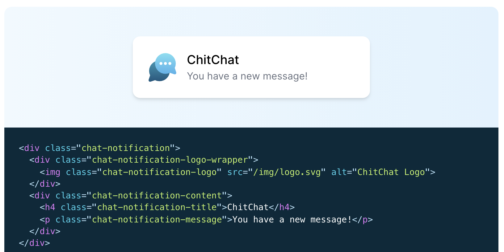
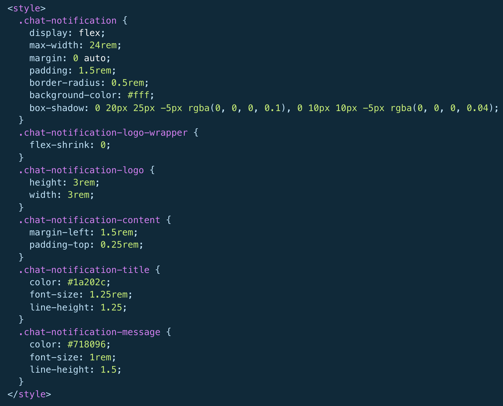
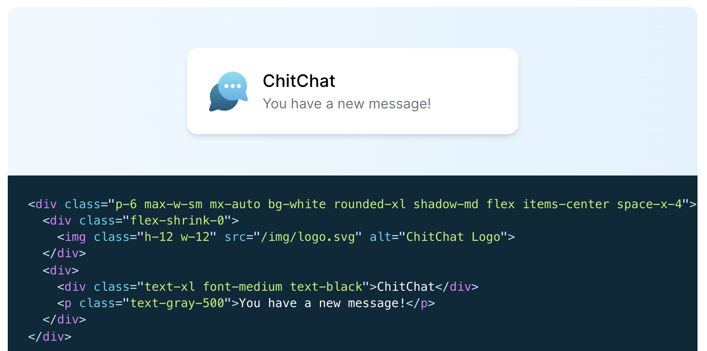
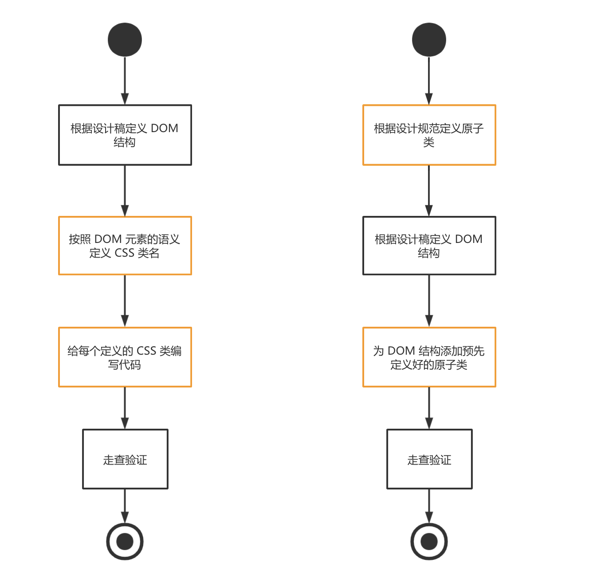
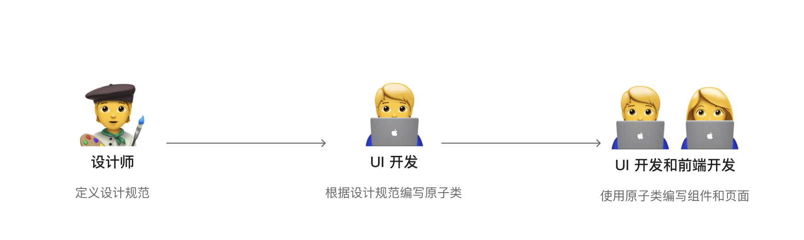

## 什么是原子类

> Atomic CSS is the approach to CSS architecture that favors small, single-purpose classes with names based on visual function.

> 原子化 CSS 是一种让 CSS 架构偏好更小、更单一目标、按视觉命名类的方法论

### 实践的例子

```css
.bgr-blue { 
  background-color: #357edd; 
}
```

`.bgr-blue` 类只有一个目的：把背景色变为蓝色，其命名也按照视觉上的作用，所以是一个原子类。

### 基本思想

原子类方法基于**让事物保持简单(Keep things simple)**的思想。在软件工程中，这是一个非常好的想法。

> Atomic CSS offers a straightforward, obvious, and simple methodology. Classes are immutable – they don’t change. This makes the application of CSS predictable and reliable as classes will always do exactly the same thing.           – Callum Jefferies

让 CSS 变得直接了当、明显、简单。类名变得更静态、可预测。

## 和其他 CSS 架构的方法论有什么区别？

业界使用较多的是 BEM 方案，强调让 CSS 类包含元素语义。

比如 logo 的元素，其类名就叫 `xxx-logo`，标题的元素，其类名就叫 `xxx-title`。类名和元素的视觉样式并没有关系。



在使用类命名了元素之后，再为每个类编写样式：



而采用原子类思想的 CSS 架构中，我们是从已有的原子类中挑选符合的，向 DOM 结构上添加。代码风格会更加倾向于拆分单一功能、与视觉相关的类。



比如`text-xl` 类代表卡片使用最大字号。`bg-white` 类代表卡片使用白色背景。等等类的作用一目了然。

## 只是命名方式的变化吗？

### 结论

在设计团队，原子类最大的作用是**将设计规范显式定义在代码中。**这可以让设计定义的规范影响到代码实现，而不仅仅是停留在设计稿里，从而提高最终代码实现的正确性。

### 对比流程

对比原子类和 BEM 方案编写 UI 稿和 UI 组件的开发过程：



对比两个方案的流程，原子类方案的特点是将定义类放到了编写 DOM 结构之前。**原子类的定义不按照设计稿，而是按照设计规范。**这可以让设计定义的规范影响到代码实现，而不仅仅是停留在设计稿里。

## 为什么说原子类更适合设计团队？

### Reason.1 原子类可以约束页面的样式符合设计规范

直接让开发同学编写样式没有任何设计规范约束，如果笔误就会错。

```html
<div class="card-article-title">标题文字</div>

<style type="text/css">
.card-article-title {
	font-size: 24px;
	line-height: 1.5;
	font-weight: bold;
}
</style>
```

使用原子类，开发同学必须要从已有的原子类中选择，和自己编写相比，更不容易出错。

```html
<div class="tad-h1">标题文字</div>
```

### Reason.2 原子类将样式实现的任务向设计侧迁移



### Reason.3 原子类使得开发和设计达成共识

在设计稿的增长过程中，会逐渐定义更多原子类。每个原子类的定义都来自设计的规范，并由开发实现，最终结果是被设计和开发共同认可。

### Reason.4 原子类是样式在设计和工程之间的一个坚实的中间层


- 自由 → 【设计】基于规范的自定义
- 结构化 → 【工程】更规范地应用

## 其他的好处

不考虑设计，对于工程本身，引入原子类有这些好处：

- 提高 CSS 类的复用性，减少无用代码，缩小项目体积

- 减少语义化命名类的思想负担

  > There are only two hard things in Computer Science: cache invalidation and naming things. – Phil Karlton

- 方便组件修改和调整样式

## 代价和弊端

- 因为类名失去了语义，代码可读性变差。
- 对于设计没有什么规范的项目很难应用。
- 类名变得更长。
- 需要开发同学学习设计规范，查询原子类。

## 开源工具库

原子类库当然可以自己按照项目的设计规范从头搭建。有一些开源的原子类工具库能够使得工作更简单的完成，包括不限于：

- [tailwindCSS](https://tailwindcss.com/)
- [iotaCSS](https://www.iotacss.com/)

## 使用建议

对于设计同学：

- 使得设计更规范化，不要无理由的突破定好的设计规范
- 设计规范考虑的需要更扎实，不要随便改变

对于开发同学：

- 需要关注原子类过大时候清理未用到的类的问题
- 需要学习成本
