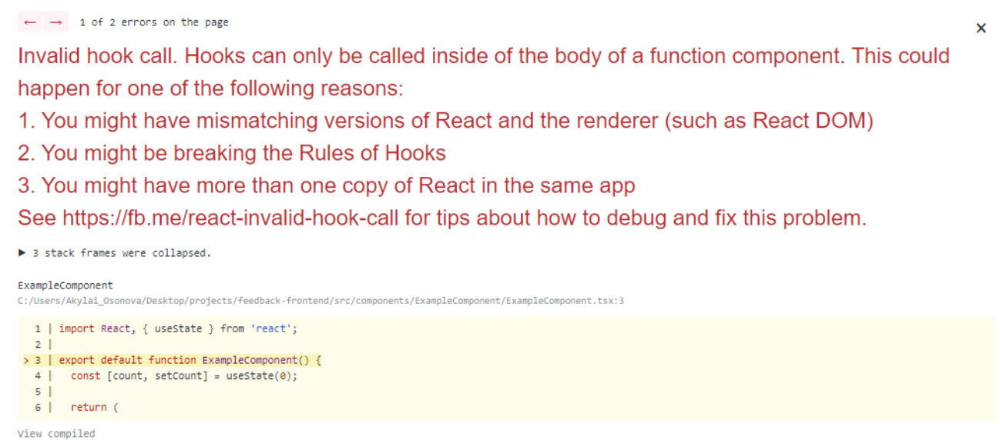
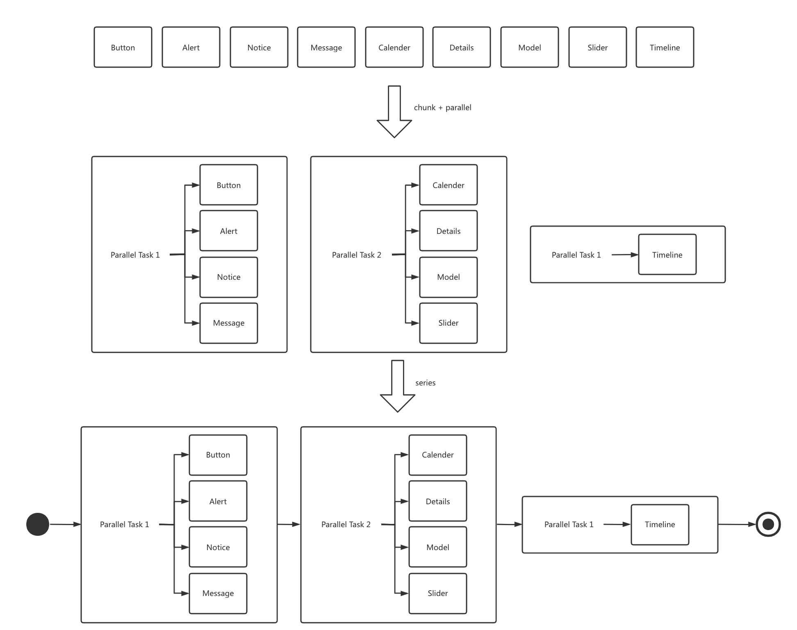

## 背景

从零开始打造一个 react 组件库，支持这些能力:

- 💅 支持 PostCSS ，写样式更爽
- 📄 迅速生成组件在线文档和示例
- 🚀 时间就是生命，搭项目要轻量，编译发布要快
- 🧑‍💻 给使用者最好的使用体验，dts 和 sourcemap 都得有，ESM 和 CJS 都要支持

## 开始

### 组织代码

撸出来项目结构：

```
.
├── script <- 一些编译打包的使用的脚本
├── src
│  ├── assets <- 组件用到的字体、图片资源等文件
│  ├── components <- react 组件
│  ├── hooks <- 通用 react hook
│  ├── stories <- 文档用例
│  ├── styles <- 原子样式类
│  └── utils <- 通用类和函数
└── test <- 单元测试
```

### 安装依赖

按照我们的目标，这里安装基础的依赖：

```jsx
npm i --save-dev react@17 react-dom@17 typescript postcss sass
```

注意这里**把 react 作为 devDependecies**，是为了防止组件库安装时组件库的 react 版本和项目的 react 版本产生冲突。 dependencies 中不同的 react 版本通常导致项目安装多个 react，容易引发以下错误：



参考: [Duplicate React Issue](https://reactjs.org/warnings/invalid-hook-call-warning.html#duplicate-react)

目前 react 仅仅作为 devDependencies，npm 在安装我们的库的时候不会去检查依赖。所以更优的一个方案是把 react 手动添加到 peerDependecies 中，这样他在忘记安装 react 的时候会看到 npm 的警告。

```jsx
"dependencies": {},
"peerDependencies": {
    "react": "^17.0.2",
    "react-dom": "^17.0.2"
},
"devDependencies": {
    "react": "^17.0.2",
    "react-dom": "^17.0.2"
}
```

### 编写组件

按照关注点分离的原则，一个组件应该包含：

```
button <- 文件夹名称就是组件名称
├── index.ts <- 模块打包入口
├── button.tsx <- 组件实现
├── style.scss <- 组件样式
└── type.ts <- 类型文件
```

这里我们单独做了一个模块的打包入口 `index.ts`，在之后我们会用工具去自动发现这些打包入口。

### 编写文档

我们的需求是要快要轻量，于是就选择了 [storybook](https://storybook.js.org/docs/react/get-started/introduction) 作为文档工具。storybook 最大的好处是他能把用例(story)生成文档，免除了专门编写文档。

假如我们有一个 `<Button>` 组件，我们编写一个用例:

```jsx
// button.stories.tsx

import React from 'react';

import { Button } from './button';

export default {
  component: Button,
  title: 'Components/Button',
}

export const Story = (args) => <Button {...args}>Button</Button>;

Story.parameters = { 
	docs: { 
		story: 'Primary UI component for user interaction' 
	} 
}
```

storybook 就会把这个用例变成文档:


没错只写了这么一点代码，包括可交互的 prop 表格、源码展示、提取 prop 默认值、提取prop description 都做好了，这是对我来说最圈粉的一点。

按照 storybook 的文档，安装也直接一行代码：

```jsx
npx sb init
```

然后就可以试试运行了：

```jsx
npm run start
```

但实际编译失败。排查问题是因为我们编写组件使用了 sass，需要修改 storybook webpack 配置：

```jsx
//.storybook/main.js

const path = require('path')

module.exports = {
+  // 配置 sass loader
+  webpackFinal: async (config, { configType }) => {
+    config.module.rules.push({
+      test: /\.scss$/,
+      use: ['style-loader', 'css-loader', 'sass-loader'],
+      include: path.resolve(__dirname, '../'),
+    });
+    return config;
+  },
  "stories": [
    "../src/**/*.stories.mdx",
    "../src/**/*.stories.@(js|jsx|ts|tsx)"
  ],
  "addons": [
    "@storybook/addon-links",
    "@storybook/addon-essentials"
  ]
}
```

再运行，就可以看见我们的组件 story 了。

storybook 的编译发布也很简单，一行命令就能编译出能够发布的静态文件：

```jsx
npx build-storybook
```

## 编译发布

先把打包发布流程跑起来。

首先我们是组件库，选择用最为大众的 rollup ，根据文章最开始定的功能点，先做一个能跑起来的打包配置。

先安装相关库：

```jsx
npm i --save-dev rollup @rollup/plugin-commonjs rollup-plugin-postcss @rollup/plugin-image rollup-plugin-ts
```

```jsx
// rollup.config.js

import commonjs from '@rollup/plugin-commonjs';
import postcss from 'rollup-plugin-postcss';
import image from '@rollup/plugin-image';
import ts from 'rollup-plugin-ts';

const components = {
  calender: "src/components/button/index.ts",
  notice: "src/components/notice/index.ts",
  //... 更多组件配置
};

export default Object.entries(components).map((componentModule) => {
  const [name, entry] = componentModule;

  return {
    input: { entry },
    output: [
      {
        dir: `lib/${name}`, // cjs 格式输出到 lib/button
        format: "cjs",
        sourcemap: true,
      },
      {
        dir: `es/${name}`, // esm 格式输出到 es/button
        format: "esm",
        sourcemap: true,
      },
    ],
    plugins: [
      image(),
      commonjs(),
      postcss(),
      ts(),
    ],
  };
});
```

再执行 rollup 即可编译

```jsx
npx rollup -c ./rollup.config.js
```

最后使用 npm 进行发布，我们的初版组件库就出来了～

```jsx
npm publish
```

### **自动获取模块**

我们的基础方案中是通过手工列出组件入口。这样手工维护是很麻烦的，所以我们这里使用了 [globjs](https://www.npmjs.com/package/glob) 来自动化获取模块：

```jsx
const glob = require('glob');
const path = require('path');

const componentsModule = glob
   // 组件编写规范: index 是组件编译模块入口文件
	.sync('src/components/**/index.?(ts|tsx|js|jsx)')
	.map(modulePath => {
			// 组件编写规范: 文件夹名称就是组件名称
			const moduleName = path.dirname(modulePath).split(path.sep).reverse()[0];
	    return { name: moduleName, entry: modulePath };
	});

return componentsModule.map({name, entry}=>({
	input: entry,
  output: [
      {
        dir: `lib/${name}`,
        format: 'cjs',
        sourcemap: true,
      },
      {
        dir: `es/${name}`,
        format: 'esm'
        sourcemap: true
      },
    ],
  // ...其他配置不变
}))
```

### **并发编译任务**

Node 的单线程异步模型对于 IO 密集的工作效率很高，但对于编译这种 CPU 密集的工作就表现一般了。

Rollup 对于多任务的处理也是基于 Node 单线程模型的串行执行，在多任务时效率比较一般。

Rollup 社区也讨论过多任务并发，但开发团队认为一些插件依赖外部数据，一些编译任务可能有前后依赖，所以目前没有相关 roadmap。[相关 issue](https://github.com/rollup/rollup/issues/3506)

存在有 16 个组件的情况下，总共花了 2分半的时间来编译：


在我们的 Case 中，每个编译任务没有互相关联，是完全可以做多进程的优化的。

出于个人技术偏好，我们引入了 [gulp](https://www.gulpjs.com.cn/) 来组织多进程任务:

```jsx
npm i gulp --save-dev
```

```jsx
// gulpfile.js

const { fork } = require('child_process');
const gulp = require('gulp');
const { chunk } = require('lodash');

// 构造编译任务列表
function getTasks() {
  const componentsModule = glob
    .sync("src/components/**/index.?(ts|tsx|js|jsx)")
    .map((modulePath) => {
      const moduleName = path.dirname(modulePath).split(path.sep).reverse()[0];
      return { name: moduleName, entry: modulePath };
    });

  return componentsModule.map((module) => () => 
		// fork 返回一个 Process，gulp 会将返回 Process 的任务处理成异步任务
		// ./rollup-make.js 是使用 rollup 进行编译任务的文件，源码在最后
		fork('./rollup-make', ['--entry', module.entry, '--name', module.name]);
	)
}

// 最多并发四个任务
const CONCURRENCY = 4;
// 按照并发度把任务分成多个并发的任务组
const taskGroups = chunk(getTasks(), CONCURRENCY)
	.map((chunk) => gulp.parallel(...chunk));
// 顺序执行任务组
exports.default = gulp.series(...taskGroups);
```

关于这个 gulp 组织并发任务的的逻辑，可以可视化表达成这样：



假设有9个编译任务，将任务 4 个为一组合成 1 个并行(parallel)任务，得到3个并行任务。再将 3 个并行任务组织成 1 个串行任务。

这样我们就能轻松的组织多进程任务啦，引入多进程后优化到了之前 1/3 的时间消耗：


`rollup-make.js` 参考

```jsx
// rollup-make.js

const rollup = require('rollup');

// 从命令行参数中获取编译参数
const { entry, name } = parse(process.argv);

// 开始编译
make({ entry, name });

async function make({ entry, name }) {
  const config = getRollupConfig({name, entry});

  const bundle = await rollup(config);

  return Promise.all(config.output.map(item => bundle.write(item)));
}

// 构造 rollup 配置
function getRollupConfig(options){
	return {
		input: {
				entry: options.entry, 
			},
	    output: [
	      {
	        dir: `lib/${opions.name}`,
	        format: 'cjs',
	        sourcemap: true,
	      },
	      {
	        dir: `es/${opions.name}`,
	        format: 'esm',
	        sourcemap: true
	      },
	    ],
	    plugins: [
		    image(),
		    commonjs(),
		    postcss({
		      use: ['sass'],
		    }),
		    ts()
	    ],
	    external: Object.keys(pkg.dependencies)
		},
	}
}
```

**使用更快的工具**

[esbuild](https://esbuild.github.io/getting-started/) 是一个最近也很流行的编译工具，其主打的特色就是快。

编写一个 `esbuild-make.js`:

```jsx
import { build } from 'esbuild';
import { sassPlugin } from 'esbuild-sass-plugin';

const { entry, name } = parse(process.argv);
main({ entry, name });

export async function main({ entry, name }) {
  const basicBuildConfig = {
    entryPoints: [entry],
    format: 'cjs',
    sourcemap: 'external',
    bundle: true,
    plugins: [
      sassPlugin(),
    ],
  };

  await Promise.all([
    build({
      format: 'cjs',
      outdir: `lib/${name}`,

      ...basicBuildConfig,
    }),
    build({
      format: 'esm',
      outdir: `es/${name}`,

      ...basicBuildConfig,
    }),
  ]);
}
```

再修改 `gulpfile.js`，用 `esbuild-make` 替换掉 `rollup-make` :

```jsx
return componentsModule.map((module) => () => 
-		fork('./rollup-make', ['--entry', module.entry, '--name', module.name]);
+   fork('./esbuild-make', ['--entry', module.entry, '--name', module.name]);
)
```

最后我们测试编译速度结果，相比于并发的 rollup，又优化了一半的时间：


果然是主打性能的编译工具，就是一个字“快”。但目前 esbuild 还在发展中，在体验中有些不完善的地方：

- 编译 typescript 仅仅是删除了所有类型语法，也不会生成 d.ts 声明文件。
- 社区生态不态丰富，插件比较少

但毋庸置疑只要 esbuild 能一直保持“快”这个核心优势，还是未来可期的。时间会让社区生态越来越完善，期待未来能够解决这些痛点。

## 总结

终于按照既定的目标完成了所有功能点。

再仔细想想，还有地方可以优化，比如加入代码规则 lint、changelog 生成、版本号生成、集成 CI 流水线等等。
