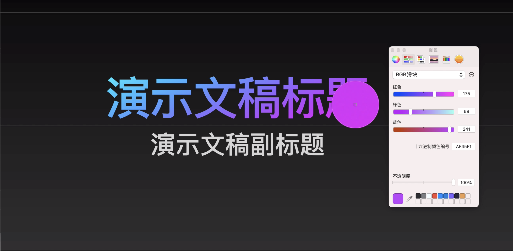
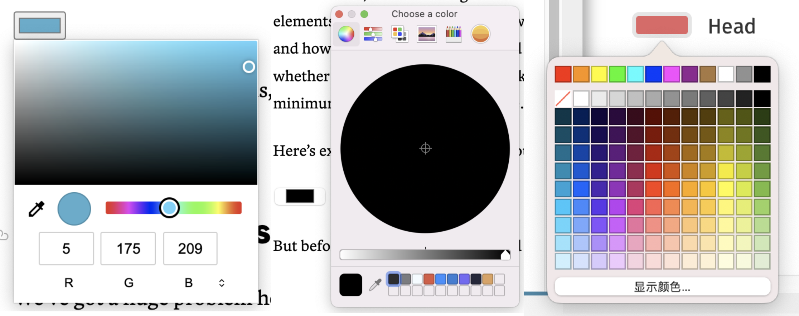
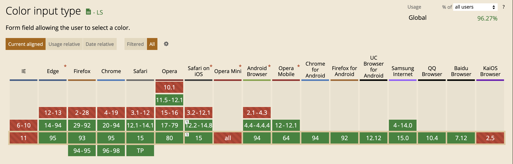

# EyeDropper API

## 介绍


> 💡 The EyeDropper API enables authors to use a browser-supplied eyedropper in the construction of custom color pickers.
EyeDropper 允许用户从 App 窗口或整个屏幕中提取色彩信息。

EyeDropper 在绝大部分文档、设计、创意类的软件中都有提供，然而 Web 一直缺失这方面的功能，许多创意类的 Web App 都很头疼。但现在 Google 的一项新提案将这个能力带到 Web 平台 ⇒ [The EyeDropper API](https://github.com/WICG/eyedropper-api).


> 💡 EyeDropper API 是 [Google PWA Capabilities Project](https://web.dev/fugu-status/) 的一个项目，目的是扩充 Web Apps 的能力。**Web apps should be able to do anything iOS/Android/desktop apps can.**

## 其他软件中的 EyeDropper

1. Figma

   

Figma 的 EyeDropper 能够在**当前画布**上的任意像素中选取颜色

1. Keynote

   

Keynote 的 EyeDropper 能够从**整个屏幕**上的任意像素选取颜色

## 如何使用

### Feature detection

确保特性在浏览器中启用

```jsx
if ('EyeDropper' in window) {
  // The API is available!
}
```

### Get color value

```jsx
try {
  const result = await eyeDropper.open();
  // The user selected a pixel, here is its color:
  const colorHexValue = result.sRGBHex;
} catch (err) {
  // The user escaped the eyedropper mode.
}
```

### Abort Control

使用 [AbortController API](https://developer.mozilla.org/zh-CN/docs/Web/API/AbortController) 控制色彩选择器

```jsx
const abortController = new AbortController();

try {
  const result = await eyeDropper.open({signal: abortController.signal});
  // ...
} catch (err) {
  // ...
}

// And then later, when the eyedropper mode needs to be stopped:
abortController.abort();
```

## Demo

### Color Game

[https://captainbrosset.github.io/eyedropper-demos/color-game.html](https://captainbrosset.github.io/eyedropper-demos/color-game.html)

### Color Swap

[https://captainbrosset.github.io/eyedropper-demos/photo-color-swap.html](https://captainbrosset.github.io/eyedropper-demos/photo-color-swap.html)

## 提案状态

[Current status](https://www.notion.so/ac3507d92a7f4dcfbfb2b686d5b48d0b)

## 隐私和安全标准

获取像素值是一件比较敏感的操作，在标准中出于对隐私和安全对考虑，做了以下限制：

- `open()` 方法只能在用户操作的响应中调用，比如按钮点击。
- 除非用户意图触发，任何色彩信息都不能被获取。
- 为了让用户能了解到 eyedropper 的意图，浏览器必须明确的进行鼠标模式转换、必须有延迟，必须有色盘。
- 用户可以在任何时间按 esc 退出 eyedropper mode。

## 和 `input color` 有何不同？

`<input type="color">` 也可以创造一个色彩输入控件。

色彩输入控件没有限制一定包含 EyeDropper，这是**语义上的差别**。此外，input color 的实现是没有标准的，不同浏览器、不同操作系统的实现不同，最后的结果千差万别。



从左到右: Chrome(Mac), Firefox(Mac), Safari


> 💡 测试你的浏览器怎么处理 input color:
> [- HTML: HyperText Markup Language | MDN](https://developer.mozilla.org/en-US/docs/Web/HTML/Element/input/color)


在支持度上，input color 显然是更好的：



## 参考

[Picking colors of any pixel on the screen with the EyeDropper API](https://web.dev/eyedropper/)

[AbortController - Web API 接口参考 | MDN](https://developer.mozilla.org/zh-CN/docs/Web/API/AbortController)

[GitHub - WICG/eyedropper-api](https://github.com/WICG/eyedropper-api)