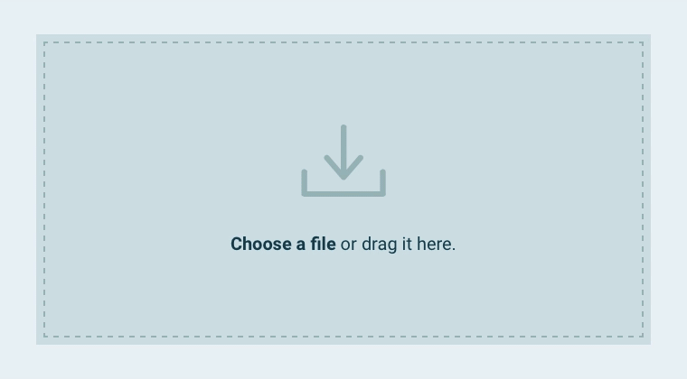
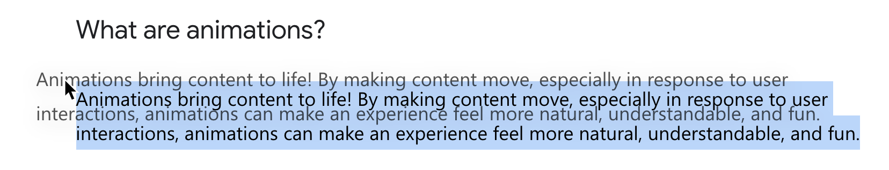

## DnD 是什么？

**HTML Drag and Drop API (HTML 拖放接口)**，提供了一套让 Web 应用程序方便地实现拖放功能的接口



## 可拖拽元素

- 带有 `draggable="true"` 的 HTML 元素，包括且不限于图片、文字、卡片等

- 没有特殊设置的网页文字和图片

  > 💡 浏览器中选中的文字都可以长按拖拽
  >
  > 

- 操作系统文件

## 拖拽图像

当使用拖放接口实现拖放，当拖拽发生时，会生成一个拖拽目标的半透明图像。点击可查看示例：

[拖拽图像演示](https://codepen.io/yelly/pen/NyXYrV)

此外，还可以通过 `setDragImage` API 来定义拖拽图像。

```jsx
function dragstart_handler(ev) {
  var img = new Image();
  img.src = 'example.gif';
  ev.dataTransfer.setDragImage(img, 10, 10);
}

window.addEventListener('DOMContentLoaded', () => {
    const element = document.getElementById("p1");
    element.addEventListener("dragstart", dragstart_handler);
 });

<p id="p1" draggable="true">This element is draggable.</p>
```

这个行为视觉上和桌面操作系统中文件管理器的行为非常相似，不是很亮眼，但效果自然、表达准确

## 承载数据传输

HTML 拖放 API 可以设置多种拖放数据，**可以适配各种媒体**，并且能够**突破单一的浏览器窗口限制**。这是 HTML 拖放 API 中最令人兴奋的一点。

[拖拽数据演示](https://youtu.be/EYMgUhn_Zdo)

拖拽数据演示

HTML 拖放 API 的数据基于 [DataTransfer](https://developer.mozilla.org/zh-CN/docs/Web/API/DataTransfer) 设计，可以在拖拽中承载**任意 MIME 类型**的数据：

- `text/plain` 纯文本 - 记事本
- `text/html` 富文本 - word
- `text/uri-list` 网页链接 - 浏览器标签页
- `application/json` JSON 格式化数据 - web App
- `image/png` 图片 - figma

```jsx
function dragstart_handler(ev) {
  // 添加纯文本数据
  ev.dataTransfer.setData("text/plain", ev.target.innerText);
	// 添加富文本数据
  ev.dataTransfer.setData("text/html", ev.target.outerHTML);
	// 添加网页链接
  ev.dataTransfer.setData("text/uri-list", ev.target.ownerDocument.location.href);
}
```

## 突破浏览器窗口

除了标准的 MIME 类型，HTML 拖放 API 还能够支持与操作系统文件系统互操作。在很多网盘类产品中，这个特性常常用来做推拽上传。

## 拖拽效果

[dropEffect](<https://developer.mozilla.org/zh-CN/docs/Web/API/DataTransfer/dropEffect>) 属性用来控制拖放操作中用户给予的反馈。它会影响到拖拽过程中浏览器显示的鼠标样式。标准的鼠标手形用法可以在设计中参考。

[dropEffect 效果演示](https://codepen.io/SitePoint/pen/epQPNP)

## 获取拖拽数据

要定一个放置区，需要实现 `ondragover` 和 `ondrop` 。

通过 `getData` 可以获取指定 MIME 的数据。

```jsx
function drop_handler(ev) {
   // 默认行为是阻止 drop， 所以要 preventDefault
	 ev.preventDefault();
	 const data = ev.dataTransfer.getData("text/plain");
}
function dragover_handler(ev) {
	 ev.preventDefault();
}

<div id="target" ondrop="drop_handler(event)" ondragover="dragover_handler(event)">Drop Zone</div>
```

## 基于动画的拖放

通过动画，我们也可以不使用 HTML 拖放 API ，而是基于 Pointer Events + 动画实现拖放功能：

[React Sortable hoc](http://clauderic.github.io/react-sortable-hoc/#/basic-configuration/basic-usage?_k=9q2roo)

这两者的区别如下：

|                | HTML 拖放 API      | 基于动画的拖放           |
| -------------- | ------------------ | ------------------------ |
| 成本           | 低                 | 高                       |
| 视觉效果       | 常规               | 好                       |
| 承载数据       | 可承载多种类型数据 | 一般不考虑承载多类型数据 |
| 突破浏览器窗口 | 能                 | 不能                     |
| 兼容性         | 比较好             | 比较好                   |
| 文件系统互操作 | 能                 | 不能                     |

总体来看，从视觉的角度，基于动画的拖放可能更好。从功能性角度，HTML 拖放 API 显然有明显优势。

## 总结

HTML 拖放 API 不仅可以实现拖放的交互，还可以承载多种数据传输、与文件系统交互的能力。兼容性比较好，在设计和实现拖拽的交互形式时可以大胆使用。实现成本比较低。也是少数能够突破浏览器窗口，与操作系统直接交互的技术标准。

## 参考

[Creating a Parking Game With the HTML Drag and Drop API](https://css-tricks.com/creating-a-parking-game-with-the-html-drag-and-drop-api/)

[Breaking down barriers using the DataTransfer API](https://web.dev/datatransfer/)
