## 为什么需要分布式？

- **Scalability**
- Fault tolerance/high availability
- Latency

### 基础概念

对于扩容这个问题，存在两种很基础的想法：

- vertical scaling：使用更强大的单台机器，应用依然采用单机架构
- horizontal scaling: 使用多台普通机器，应用采用分布式架构

因为成本问题，通常我们应用 horizontal scaling。

在分布式架构中，也有两种指导设计分布式数据的基础原理：

- **Replication** 每个节点都有相同的数据拷贝(replica)，当需要数据的时候，找任意一个节点即可
- **Partitioning** 将应用的数据划分为小块(partition)，按一定的规律存储在不同节点上

这两种原理的设计有不同的长处和缺陷，有时候在同一个应用中会共存，接下来我们会看到。

## Replication

> 💡 Replication means keeping a copy of the same data on multiple machines that are connected via a network.

以复制(Replication)为设计原则的分布式数据的主要是为了解决以下几个问题：

- 让数据对于用户尽可能的近（e.g. CDN）
- 即使一些节点失效，也能让整个系统继续工作
- 增大整个系统的查询吞吐量

显而易见，以 Replication 模式设计分布式应用的复杂点在于处理数据的**变更**(changes)。

### Leaders and Followers

leader-follower 是一种解决 replication 模式下数据变更一致性问题的方法。（政治不正确的旧名称是 master-slave）。

leader-follower 模式可以大致描述为：将节点分为 Leader 节点和 follower 节点。当发生数据写入时，必须由 leader 节点处理，当处理完毕后，leader 节点通知每一个 follwer 节点数据已发生变更，然后每一个 follower 节点去 fetch 最新的 replica。最终(eventually)实现数据写入的一致性。

> 💡 *replica* 指每一个节点存储的数据 copy

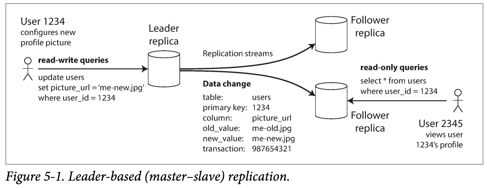

在大部分数据库的分布式实现中，都使用了这种架构，包括MySQL、PostgreSQL等等。

**同步还是异步**

在设计 leader-follower 架构中，一个值得讨论的设计点是：leader 是否要同步等待 follower 变更

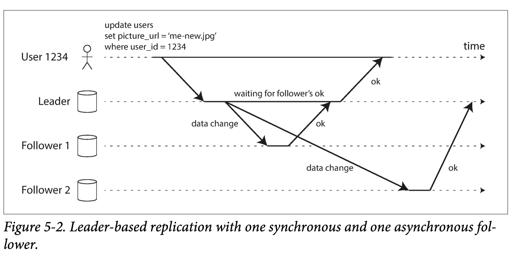

同步：

- 能够确保执行写事务后，所有节点都获得最新的 replica
- 用户和 leader 需要等待 follower 变更，导致执行很慢

异步：

- 不能确保事务执行完毕后，所有节点都获得最新的 replica
- 用户和 leader 不用等待，更快

**Handle Node Outages**

leader-follower 模式处理节点故障主要分为两种情况：

- follower 故障：根据 log 重新 fetch 数据即可，比较简单。
- leader 故障：**按照算法挑选一个 follower 节点出来成为新的 leader 节点；**其中有很多细节：
  - 检测 leader 失效：通常来说可以用 timeout
  - 挑选新 leader：挑选 leader 的算法以选择最可能拥有最新数据的节点出发。
  - 重新配置系统：配置所有 follower 节点将写的请求发给新 leader，这一点比较复杂，甚至有时候需要人工协助。

**Implementation of Replication Logs**

> 💡 Replication Logs 是 leader 发送给 followers，提醒 followers 更新 replica 的数据

有几种实现 Replication Logs 的方式：

- statement-based Log。比如 SQL 数据库，可以将触发写入的 SQL 表达式当作 Log
- Write-ahead Log (WAL)。数据库的日志文件本身就是**仅写入**的，所以可以将数据库的预写日志当作 logs 去传输
- Logical (row-based) log replication。记录以行为单位的变更。

### Problems with Replication Lag

leader-follower 通常用于读多写少的系统，这也是 Web 服务的常见模式。Web 服务出于延迟和用户体验考虑，一般来说都使用异步写入。异步写入会导致暂时的不一致性(inconsistencies)，造成复制延迟问题（Replication Lag）:

**Reading Your Own Writes**

当用户写完后立即查看，可能从一个未更新的 follower 节点读取，造成数据未更新，导致用户认为自己的请求没有被成功处理。

要解决这个问题需要 *read-after-write* 策略：

- 当读取一些用户可能更新的数据，从 leader 读。反正则从 follower 读。
  - 比如用户信息数据，基本上只能由用户本人改。那么用户本人的查询请求交给 leader 处理。
- Log 里记录数据变更时间，比较 client 时间戳和数据变更时间，如果时间短，从 leader 读；反之从 follower 读。
- 如果 replica 分布在多个数据中心，最好把同一用户的请求交给同一个数据中心处理。

**Monotonic Reads**

因为 followers 的更新是随机顺序发生的，用户的多次查询由不同的 follewer 处理，可能会看见数据的从新到旧变更(*moving backward in time*)

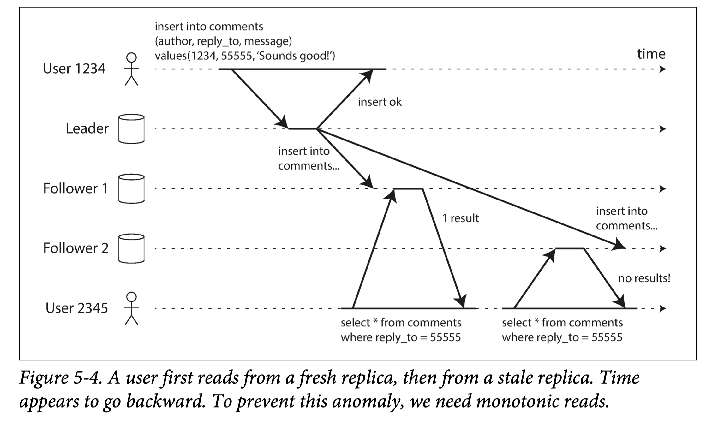

单调(monotonic)读策略是确保用户始终能观察到系统从旧到新变更，而不是反向。

一个最简单的实现就是让同一个用户始终从同一个 replica 去读取。

**Consistent Prefix Reads**

当写入的数据有因果关系（比如聊天记录），我们需要确保用户查询到的结果是按照写入顺序的。如果查询的结果顺序不对，结果就出错了。这个问题需要比较复杂的算法实现，需要单独讨论。

### Multi-Leader Replications

很自然的一个拓展就是让 leader-follower 架构支持多个 leader，可以显著提升写的 Scalability。常见的一个场景就是数据中心(datacenter)：

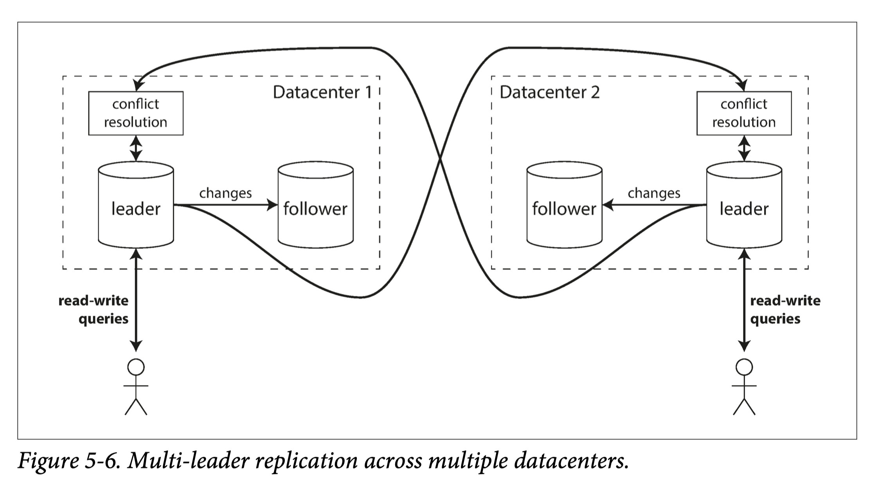

每个数据中心都包含一个 leader，整个系统由多个数据中心组成，用户可能被不同的数据中心服务。

此外，离线客户端写入也可以认为是一个 multi leader replications。

multi-leader 架构的问题主要是**写冲突(write conflict):**

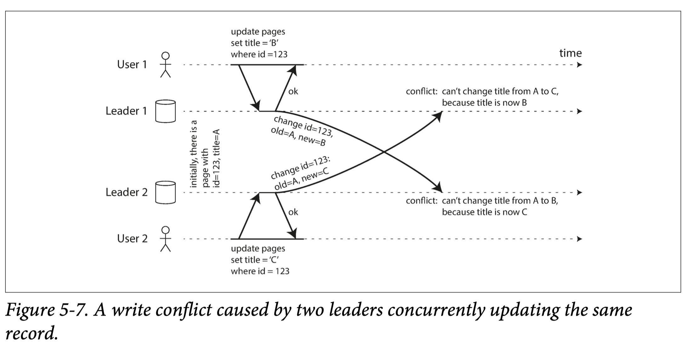

如图 5-7 当多个 lead 节点同时写入同一行时，会发生冲突。

要解决这个问题，有几种思路：

- 同步模式下，可以采用等待写入的方式来处理
- 避免冲突：让对同一行的写入由同一个 leader 处理
- 收敛至一致状态：遇到多个写入，用某种策略决定最终的值，比如最后写入胜利（LWW）
- 自定义冲突处理逻辑
  - 比如说实现类似 git 这种让用户自行解决

### Multi-Leader Replication Topologies

当系统中存在多个 leader，怎么规划其拓扑结构也是基于复制的分部系统的设计点：

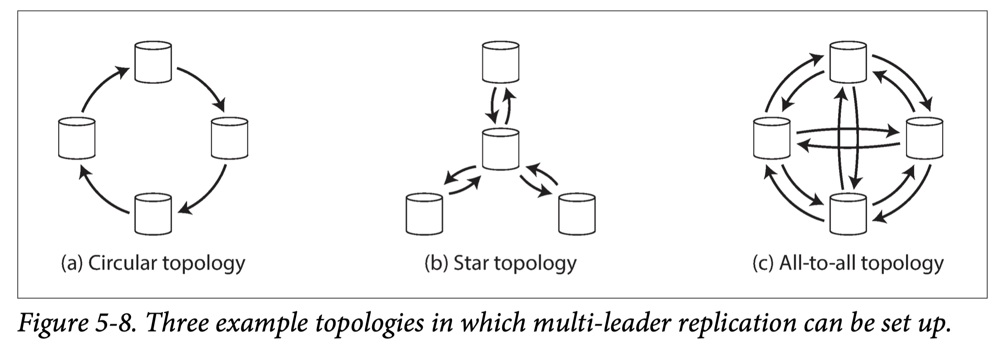

拓扑结构的设计主要与冲突避免解决、系统健壮性有关。比如环形结构虽然可以很自然的确保写入顺序，避免产生很多冲突，但单个节点的失效可能会导致严重的问题。all-to-all 的结构不能保证写入顺序，有更多的产生冲突的潜在风险，但能更好地容忍错误的发生。

**写入顺序为什么和冲突产生有关？**

以下图一个 all-to-all 结构的分布式系统为例：写请求可能会以不同的顺序到达某个 leader 节点，如果单纯按照请求到达顺序执行，就会产生问题，造成最终的冲突或者不一致。

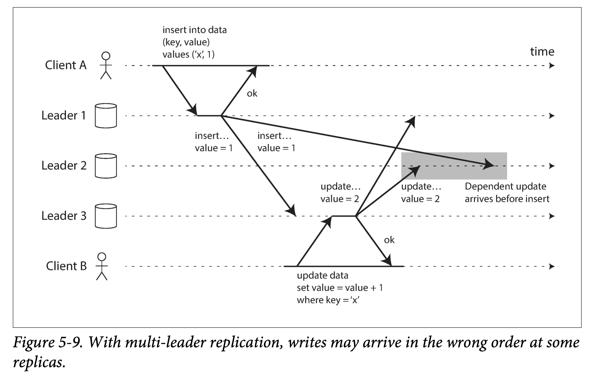

## Partition

the **partitions(划分)** are defined in such a way that each piece of data (each record, row, or document) belongs to exactly one partition.

The main reason for wanting to partition data is **scalabiliy.**

当数据量大的单个节点无法容纳，划分可以显著提升数据容量的 scalability

### Partitioning and Replication

Partitioning is usually combined with replication so that copies of each partition are stored on multiple nodes.

划分和复制通常是一起使用的。这样可以兼顾对同一个 partition 访问的 scalability。

> 一个 partition 指对整体数据的一个划分

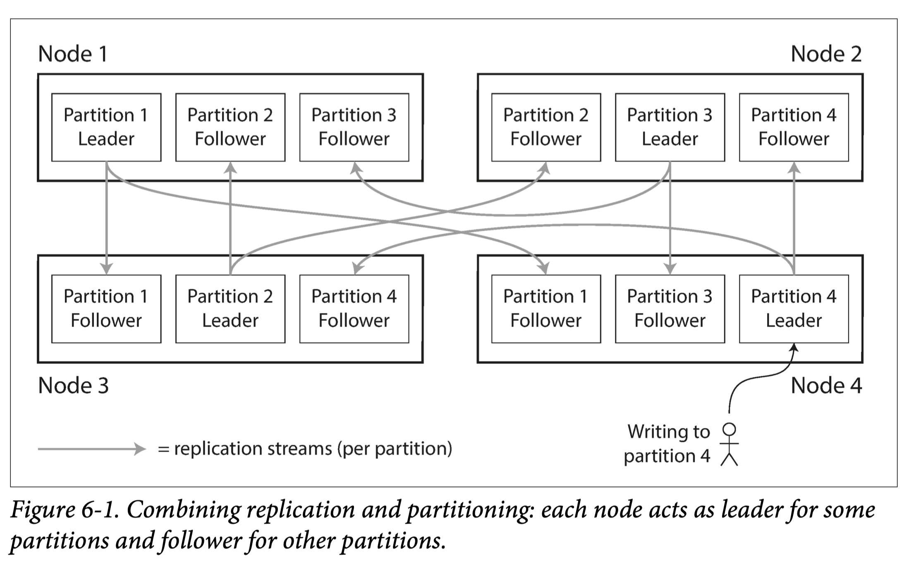

### Partitioning of Key-Value Data

> *skewed* - 指对数据进行不平均地划分
>
>
> *balanced* - 指对数据进行平均地划分
>
> *hot spot -* 因为数据不恰当划分造成的负载过高的单个节点，成为系统性能瓶颈

**Partitioning by Key Range**

单纯根据 key 的范围来划分，有点类似百科全书。

当选择 key pattern 不适当时，容易造成 hot spot。

- 比如 key 是时间戳，按一定时间范围划分 partition。多个时间相近的写入其实都会写进同一个 partition，造成 hot spot。

**Partitioning by Hash of Key**

在单纯以 key 来划分 partition 的基础上，加一个 hash 函数。根据 key hash 后的值进行数据划分。hash 函数被期待是能够返回一个尽量随机的结果，在统计学上就可以将 key 平均划分给各个 partition。同时也不能性能太差。

比如 MongoDB 使用 MD5 来实现。

这种方法解决了单纯依靠 key 值来进行划分导致的 hot spot 问题。

这种方法的问题是，将范围相近的 key 存进了随机的不同 partition，在范围查询的时候，需要从更多的 partition 中获取数据。在实践中，通常会把查询请求发给所有的 partition，性能损失很大。

**Skewed Workloads and Relieving Hot Spots**

在 web 应用中经常有这种情况：虽然每个 partition 被均匀的划分，但某一行数据被反复多次地读取，也会造成 hot spots。比如在 sns 应用中某个名人的信息会被更多次地读取。

针对这种情况，可以对这个 partition 创建更多的 replicate 来解决。

### Partitioning and Secondary Indexes

我们之前假设数据都以 key-value 存储和读取。但实际情况是我们不仅需要考虑通过 primary index 的数据查询，还要考虑 secondary index 来查询数据。因为 secondary index 不参与 partition 的划分过程，所以查找没有规律。针对这个问题一般有以下两种方法：

**Partitioning Secondary Indexes by Document**

每个分区单独建立自己的 secondary index，查询的时候需要对每个 partition 去查。

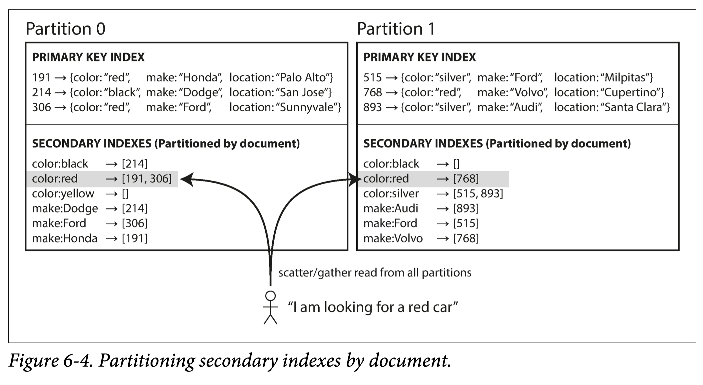

这种方案下，针对 secondary index 对查询也很昂贵

**Partitioning Secondary Indexes by Term**

建立全局的 secondary indexes，将 secondary index 也划分为不同的 partition 来存储。查询 secondary index 的操作只需要查存放该 index 的 partition，获取 primary key，再根据 primary key 找 partition。

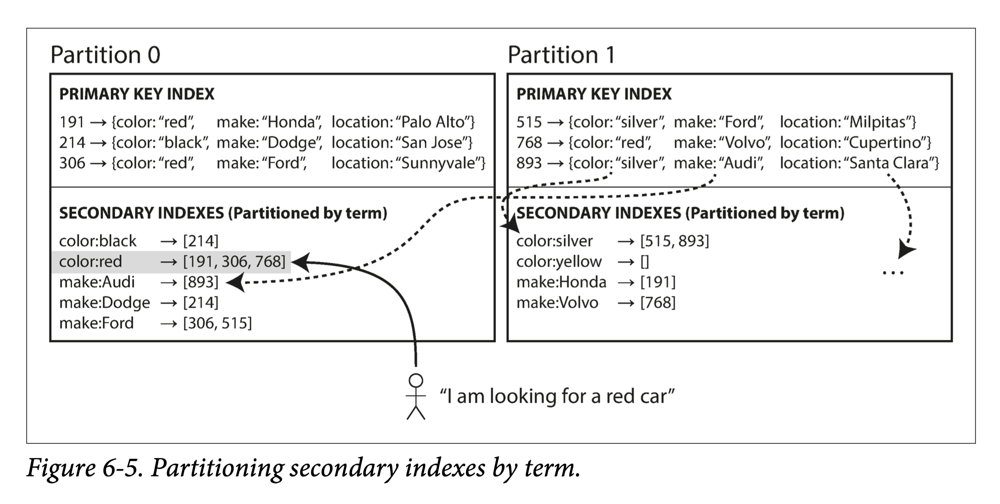

### Rebalancing Partitions

当节点数量因为一些原因需要发生变化，则会有 **rebalancing（再平衡）** 问题。Rebalancing 想要解决的是，当节点数量发生变化，系统依然满足：

- 节点的负载均衡
- 再平衡过程中，系统依然能够接收读写请求
- 只移动尽量少的数据

**反面教材: hash mod N**

简单粗暴的将key 进行 mod N 运算，N 为 partition 数量，结果是再平衡后数据应该存放的 partition 。这是一种很差的实现，因为 N 的改变会导致键的大量转移，而不是只移动尽量少的数据。

**Fixed number of partitions**

一种简单的思路是：创建比 node 数量更多的固定数量的 partitions，并将其均分到各个 node 中。当新的 node 被创建，移动几个 partions 到新的 node 中，直到系统再平衡。

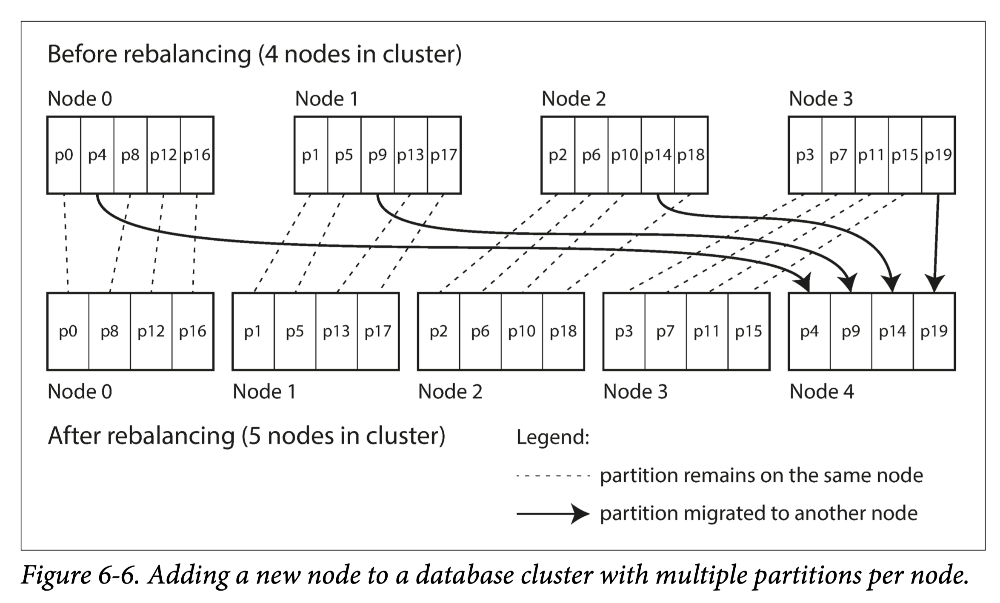

这种方法解决了 Mod N 方法中数据过多移动的问题，但产生了新的问题：

- 因为 partition 个数是固定的，所以在数据库创建时就需要创建最多数量的 partition
- 当数据集的大小难以预估时，很难确定需要建立多少 partition

**Dynamic partitioning**

为了优化 Fixed number of partitions 方法，我们可以像 B 树原理一样，建立动态数量的 partitions。当一个 partition 过大，自动分裂成两个 partitions，反之则合并。

**Partitioning proportionally to nodes**

在前面我们讨论的方法中，partitions 数量和 nodes 数量无关。还有一种相反的方法，强制让 partitions 数量和 nodes 数量成一个比例。当新的 node 进入系统，随机挑选一个 node 平分数据。这样性能最高，虽然看起来并不公平，但如果在数据量和 nodes 数量非常大的情况下，这种方法也是有效的。

### Request Routing

我们做好了 partitions 并能动态调整 node 和 partitions，但问题是怎么把用户的请求发给对应的 node 呢？这个问题广泛来说又被称为 *service discovery*。

对这个问题，有三种基础的思想：

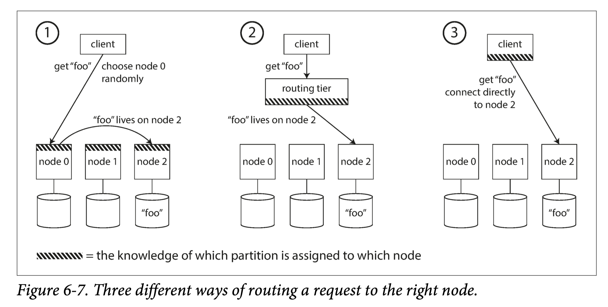

- 用户随机挑一个 node，如果这个 node 没有用户想要的数据，node 执行转发
- 设计一个中间层，转发用户的请求到对应的 node。常用的中间件 [Apache Zookeeper](https://zookeeper.apache.org/) 就是用来帮助记录服务的 metadata，从而实现这个转发的中间层。
- 让用户完全了解当前 node 和 partition 情况，直接发送给一个正确的 node

基于 zookeeper 的分布式服务发现架构如下图：

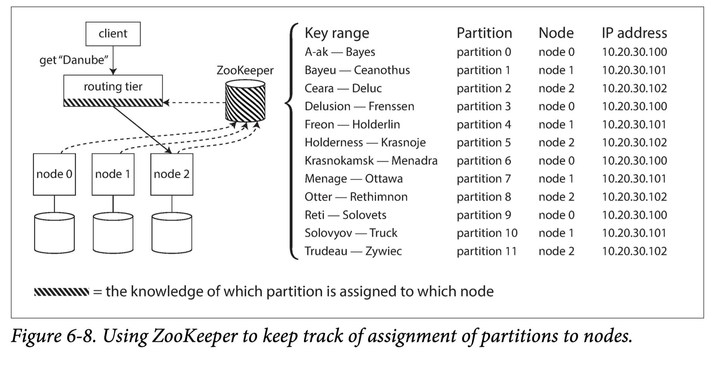
