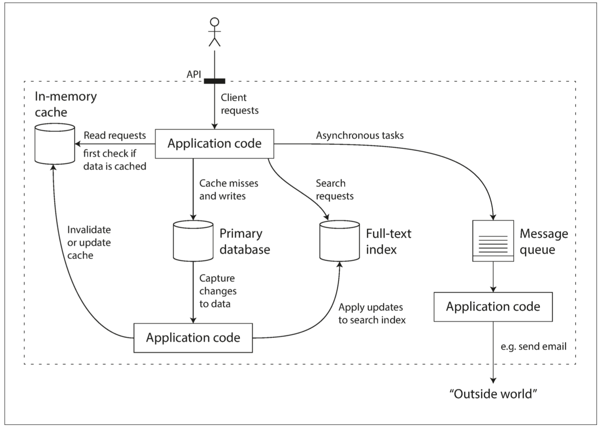
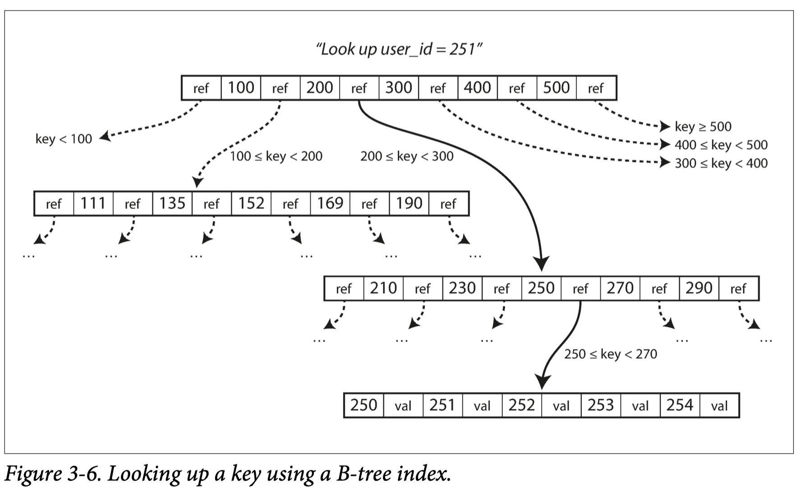
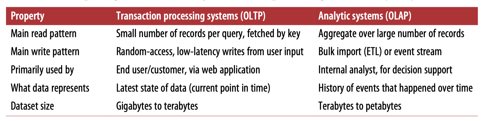
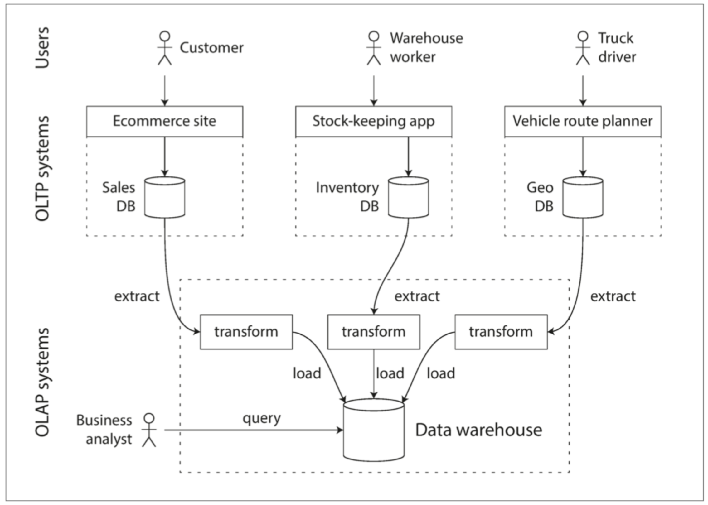
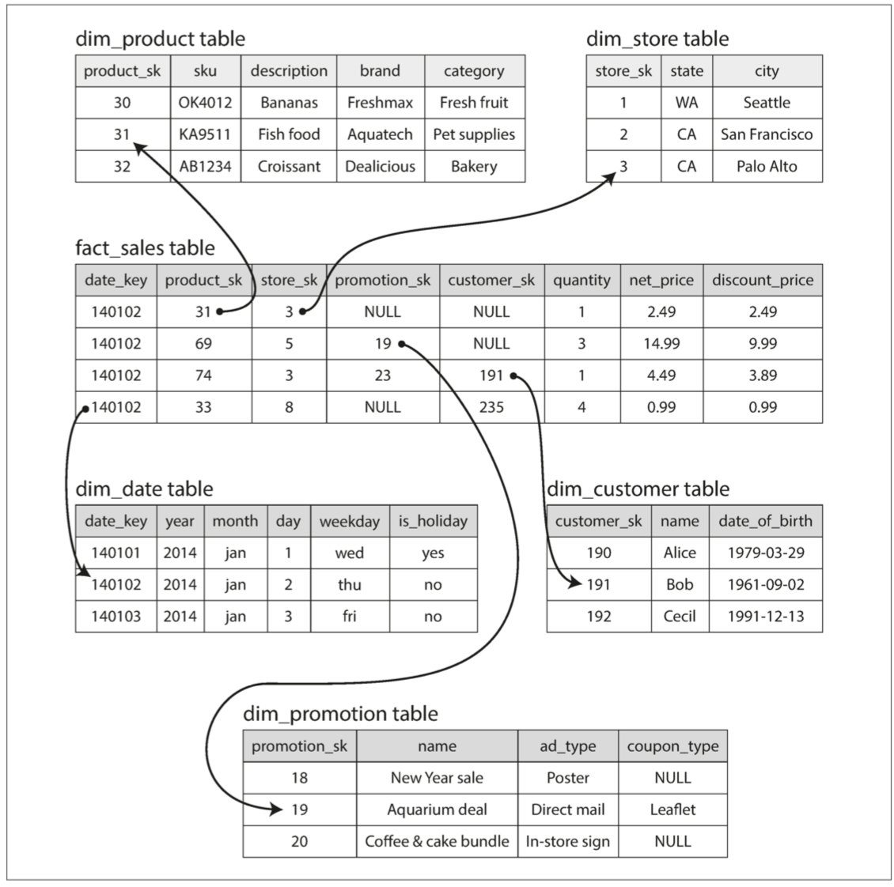
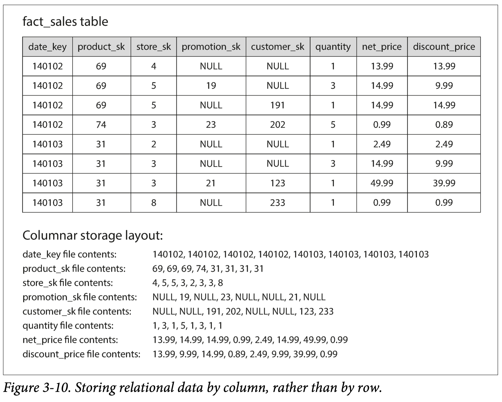
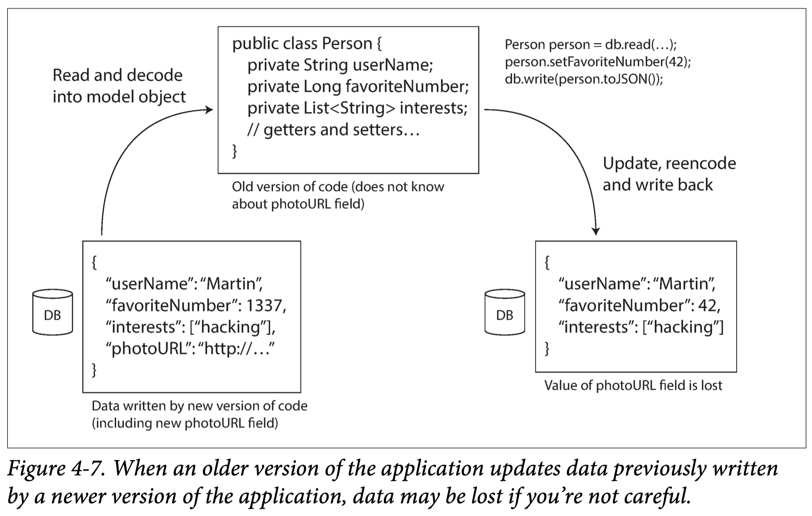

# 设计数据密集型应用 - 1 foundations of data systems

> 书籍：https://www.oreilly.com/library/view/designing-data-intensive-applications/9781491903063/

## 什么是数据密集型应用

Many applications today are *data-intensive*, as opposed to *compute-intensive*. Raw CPU power is rarely a limiting factor for these applications—bigger problems are usually the amount of data, the complexity of data, and the speed at which it is changing.

## 数据密集型应用的组成

A data-intensive application is typically built from standard building blocks that pro‐ vide commonly needed functionality. For example, many applications need to:

- Store data so that they, or another application, can find it again later (*databases*)
- Remember the result of an expensive operation, to speed up reads (*caches*)
- Allow users to search data by keyword or filter it in various ways (*search indexes*)
- Send a message to another process, to be handled asynchronously (*stream processing*)
- Periodically crunch a large amount of accumulated data (*batch processing*)



## 数据密集型应用的三个重要问题

### 可靠性 reliability

> 💡 “continuing to work correctly, even when things go wrong.”

What cause faults?

- hardware faults
  - Add redundancy to the individual hardware components
- software faults
  - Such faults are harder to anticipate, and because they are correlated across nodes, they tend to cause many more system failures than uncorrelated hardware faults
  - There is no quick solution to the problem of systematic faults in software. Some small methods can help: thorough testing; process isolation...
- Human Errors
  - Design systems in a way that minimizes opportunities for error.
  - Decouple the places where people make the most mistakes from the places where they can cause failures.
  - Test thoroughly at all levels, from unit tests to whole-system integration tests and manual tests

### 可伸缩性 scalability

> 💡 “If the system grows in a particular way, what are our options for coping with the growth?”

What is “**load**” on system ?

- Depends on system characteristics: requests per second to a web server, the ratio of reads to writes in a database..

What is “**performance**” on system ?

- In online systems, what’s usually important is  **response time**, which often be described in percentiles.

  - Tail latencies - p99 is used frequently

      

Measure scalability - how load impacts performance ?

### 可维护性  maintainability

> 💡 We can and should design software in such a way that it will hopefully minimize pain during maintenance, and thus avoid creating legacy software ourselves.

**Operability** 

- Make it easy for operations teams to keep the system running smoothly.

**Simplicity**

- Make it easy for new engineers to understand the system, by removing as much complexity as possible from the system. (Note this is not the same as simplicity of the user interface.)

**Evolvability**

- Make it easy for engineers to make changes to the system in the future, adapting it for unanticipated use cases as requirements change. Also known as extensibility, modifiability, or plasticity.

## Data Models & Query Language

> 💡 Data models are perhaps the most important part of developing software, because they have such a profound effect: not only on how the software is written, but also on how we think about the problem that we are solving.

这本书讲的 Data Model 主要是应用层数据库存储 

### Relational Model vs Document Model

Relational Model  - (SQL Data Model)

- strong in describe relations
- mismatch with OOP languages - ORM approache
- schema-on-write of document

Document Model - (NoSQL Data Model)

- strong in describe object
- JSON model impedance mismatch between the application code and the storage layer
- Schema-on-read of documen

### declarative query vs imperative query

声明式 - 数据库有更大的优化空间

指令式 - 程序员能做更精细的操控

### MapReduce Querying

一种用于在多台机器上运行的查询语言，类似声明式和指令式的集合。这种模式比较无状态，适合在集群上运行：

```jsx
db.observations.mapReduce(
  function map() {
    var year = this.observationTimestamp.getFullYear();
    var month = this.observationTimestamp.getMonth() + 1;
    emit(year + "-" + month, this.numAnimals);
  },
  function reduce(key, values) {
    return Array.sum(values);
  },
  {
    query: { family: "Sharks" },
    out: "monthlySharkReport",
  }
);
```

### graph model & query

主流来说，关系型数据库和文档型数据库最多。图比较少见，应用范围在特殊领域，先不看了。

## Storage & Retrival

### 开发者为什么需要了解数据存储和提取过程？

> Why should you, as an application developer, care how the database handles storage and retrieval internally? You’re probably not going to implement your own storage engine from scratch, but you do need to select a storage engine that is appropriate for your application, from the many that are available. In order to tune a storage engine to perform well on your kind of workload, you need to have a rough idea of what the storage engine is doing under the hood.

### Index

> 💡 Well-chosen indexes speed up read queries, but every index slows down writes.

**Hash Index**

通过 Hash 的方式以 keyValue 建立每一个 item 的地址。

- 散列表必须能放进内存。硬盘随机访问 IO 开销太高
- 范围查询效率不高。只能一个一个找

**SSTables and LSM-Trees**

SSTables → Sorted String Table，索引还是 keyValue 形式，但按键排序。这样做的好处是：

- 不需要把全部索引结构都 load 进内存。只需要比较要查询的目标，就可以就直接跳到要找的地方。
- 合并更方便，可以做类似归并合并的方法，节约内存，还快。

数组的实现没有办法做到的随机插入和删除。所以一般 SSTables 是用 (比如 AVL-Tree) 或者其他平衡树来实现。最经典的一个实现叫 [LSM-Trees](https://en.wikipedia.org/wiki/Log-structured_merge-tree)

**B-Tree**

最经典常用的索引数据结构。B-Tree 和 SSTables 一样都对 KeyValue 的索引进行排序，但查询方式是基于树：



B树结构将数据库分解成固定大小的 Page ，并且一次只能读取或写入一个页面。这种设计更接近于底层硬件，因为硬盘空间也是按固定大小的块来组织的。树的叶子就是一个 Page，查询、更新都是找到对应的叶子节点，修改后写回硬件即可。插入需要考虑到单个节点容纳不了的情况，一旦容纳不了就分裂成俩。

B树的更新可以会写回多个硬盘 Page，考虑可靠性，B-Trees 实现时一般会带一个 redo log，用来记录操作，在崩溃的时候用于复原。或者采用 copy-on-write 模式。

**Comparing B-Trees and LSM-Trees**

LSM:

- 写入性能更好，不用每次写回整个 Page

B-Tree:

- 每个键只会有一个位置出现，一致
- 没有压缩过程

### Transaction & Analytics

将数据存储和提取应用到场景中具体分析，行业中有两类非常典型的系统：

- (OLTP) online transaction processing

  根据用户输入，进行低时延地插入或更新少量记录，比如博客文章的评论，游戏中的动作，地址簿中的联系人等等

- (OLAP) online analytic processing

  分析查询需要扫描大量记录，每个记录只读取几列，并计算汇总统计信息。



**Data Warehousing**

数据仓库这个模式指通过一个独立的数据库分离 OLTP 和 OLAP 系统。因为 OLAP 性能开销大，为了不影响 OLTP 系统的运行，通过一个独立的数据库，定时去拉取每个 OLTP 的只读数据，最后独立地进行分析。因为通常 OLAP 的时延要求不高，所以这样完全没问题。这是一种互补的设计逻辑。



因为 OLTP 和 OLAP 的特征不同，市面上有很多专门为 OLAP 做的数据库，比如 SAP HANA。

**星型模式**

一种被广泛采用的数据库设计模式，比较适合同时适用 OLTP 和 OLAP 模式。

星型模式中中心是一个事实表(facts table)，代表 OLTP 的一个事务。每一列指向一个维度表(dimension tables)，代表 who, what, where, when, how, and why 等描述事实的维度信息。



在 OLAP 中，分析师通常只查几个维度的数据。然而在 OLTP，一个事务可能包含超级多的东西。这样的设计模式可以同时满足二者的需求。

### 列式存储

星型存储中事实表通常特别大（行数和列数），但一般查询的时候只查几列，很少 `SELECT *`。根据这种特点，可以采用列存储的方式来优化。



列存储模式还有很多细节，比如怎么压缩、怎么写入。暂时先不看了。

## Encoding

一个程序至少需要两种形式的数据：

- 在内存使用的对象、列表、树等，通过指针来使用
- 网络传输、写入文件的字节数据

专业词汇：

内存 → 字节: encoding, serialization, marshalling

字节 → 内存: decoding, deserialization, unmarshalling

常见的编码格式：

- 语言特定的格式，比如 `java.io.Serializable`

  与编程语言深度绑定，其他语言很难读取

- JSON，XML 和二进制变体

  人类可读，标准开放。但性能比较差，一般有二进制变体来优化，比如 mongodb 的 BSON

- Thrift 和 Protocal Buffers

  专门制定用来做互联网数据传输的格式

## 数据流

数据流是数据传输的一种形式。

### 数据库数据流

数据从一个发送进程，流向一个接收进程。有时候发送进程和接收进程是同一个进程。



### Web 服务

**当服务使用HTTP作为底层通信协议时，可称之为Web服务**。

Web 服务中最具有代表性的两种数据流是：REST 和 RPC

两种常见的数据流：浏览器和服务器之间到数据流、服务器和服务器之间的数据流（微服务）

在 Web 服务中的数据流，需要严格遵循 HTTP 协议的要求。
